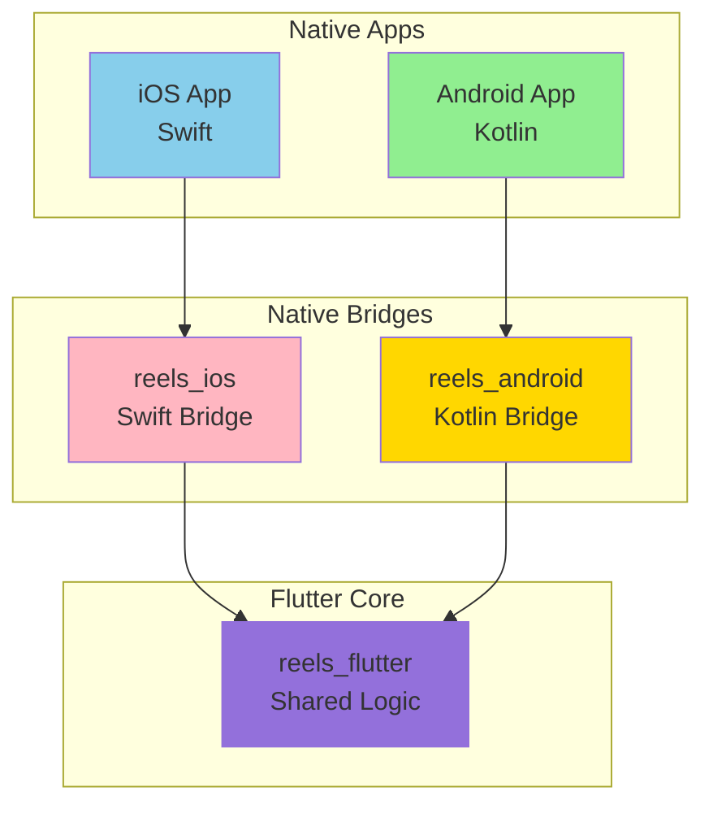
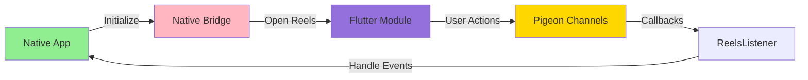
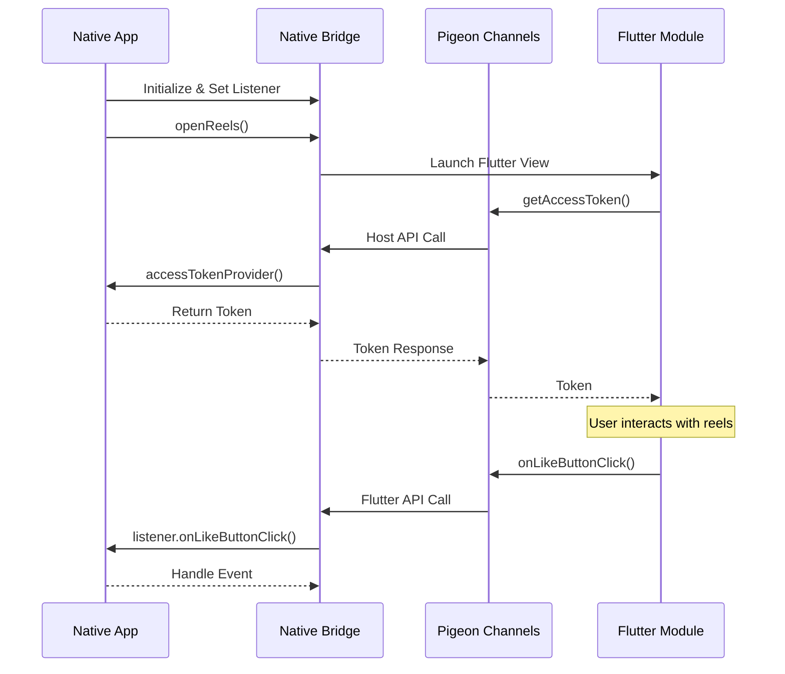

# 🎥 Reels SDK - Technical Documentation Hub

> [!info] Project Information
> **SDK Type:** Multi-Platform (iOS/Android) | **Version:** 1.0.0 | **Last Updated:** November 11, 2025

> [!tip] 🎯 Quick Overview
> **[[QUICK-OVERVIEW|📊 Quick Overview]]** - Concise summary with key metrics, architecture diagrams, and integration patterns

> [!note] 📘 Obsidian Setup
> **[[00-Obsidian-Setup-Guide|Obsidian Setup Guide]]** - Complete guide to set up Obsidian for viewing this documentation with proper diagram rendering and navigation

---

## 🎯 Quick Stats

| Metric | Value | Status |
|--------|-------|--------|
| **Platforms** | iOS 16.0+, Android SDK 21+ | ✅ Modern |
| **Core Technology** | Flutter 3.9.2+ | ✅ Latest |
| **iOS Bridge** | Swift 5.9+ | ✅ Native |
| **Android Bridge** | Kotlin 1.9+ | ✅ Native |
| **Communication** | Pigeon (Type-Safe) | ✅ Robust |
| **Architecture** | Clean Architecture | ✅ Best Practice |
| **Integration Methods** | Git + Local Folder | ✅ Flexible |
| **Distribution** | Private Git Repository | 🔐 Secure |

---

## 📊 Visual Dashboard

### Platform Architecture



### Communication Flow



---

## 🗺️ Documentation Structure

### 📈 Section 1: Overview

- [[01-Overview/01-SDK-Overview|🎥 SDK Overview]]
- [[01-Overview/02-Architecture-Overview|🏗️ Architecture Overview]]
- [[01-Overview/03-Technology-Stack|🛠️ Technology Stack]]
- [[01-Overview/04-Project-Structure|📁 Project Structure]]

### 📱 Section 2: Integration Guides

#### iOS Integration
- [[02-Integration/01-iOS-Integration-Guide|📱 iOS Integration Guide]]
- [[02-Integration/02-iOS-CocoaPods-Setup|🍫 iOS CocoaPods Setup]]
- [[02-Integration/03-iOS-Local-Development|🔧 iOS Local Development Setup]]
- [[02-Integration/04-iOS-Usage-Examples|💡 iOS Usage Examples]]

#### Android Integration
- [[02-Integration/05-Android-Integration-Guide|🤖 Android Integration Guide]]
- [[02-Integration/06-Android-Gradle-Setup|🐘 Android Gradle Setup]]
- [[02-Integration/07-Android-Local-Development|🔧 Android Local Development Setup]]
- [[02-Integration/08-Android-Usage-Examples|💡 Android Usage Examples]]

### 🏗️ Section 3: Architecture

- [[03-Architecture/01-Platform-Communication|🔄 Platform Communication (Pigeon)]]
- [[03-Architecture/02-Flutter-Engine-Lifecycle|🔄 Flutter Engine Lifecycle]]
- [[03-Architecture/03-Generation-Based-State-Management|🎯 Generation-Based State Management & Viewport Recycling]]

### 🔧 Section 4: Development

- [[04-Development/01-Development-Setup|⚙️ Development Setup]]
- [[04-Development/02-Pigeon-Code-Generation|🔄 Pigeon Code Generation]]
- [[04-Development/03-Testing-Strategy|🧪 Testing Strategy]]
- [[04-Development/04-Build-Scripts|📜 Build Scripts]]

### 📚 Section 5: API Reference

- [[05-API/01-iOS-API-Reference|📱 iOS API Reference]]
- [[05-API/02-Android-API-Reference|🤖 Android API Reference]]
- [[05-API/03-Flutter-Services|🎨 Flutter Services]]
- [[05-API/04-Platform-Events|📡 Platform Events]]

---

## 🎯 Key Features

> [!success] ✅ Strengths
> - **Multi-Platform:** Single Flutter codebase for iOS and Android
> - **Type-Safe Communication:** Pigeon-generated platform channels
> - **Clean Architecture:** Well-organized domain-driven design
> - **Flexible Integration:** Git-based or local folder import
> - **Native Performance:** Native bridges with Flutter rendering
> - **Production Ready:** Version 1.0.0 with comprehensive features
> - **Modern Tech Stack:** Latest Swift, Kotlin, and Flutter
> - **Smart State Management:** Generation-based caching for instant resume
> - **Memory Efficient:** Viewport-aware recycling (≤100MB regardless of video count)

> [!tip] 🎥 Core Functionality
> - **Vertical Video Reels:** TikTok-style swipeable video experience
> - **Engagement Features:** Like, share, comment buttons
> - **User Profiles:** Navigate to user profiles
> - **Product Integration:** Shopping features
> - **Analytics Tracking:** Built-in event tracking
> - **Screen State Monitoring:** Lifecycle tracking

> [!warning] ⚠️ Integration Considerations
> - **Platform Requirements:** iOS 16.0+, Android SDK 21+
> - **Flutter Dependency:** Requires Flutter SDK installation
> - **CocoaPods Required:** iOS integration needs CocoaPods
> - **Access Token Provider:** Apps must provide authentication tokens
> - **Event Handling:** Apps must implement ReelsListener callbacks

---

## 🚀 Quick Start

### iOS (Swift)

```swift
// 1. Initialize with access token provider
ReelsCoordinator.initialize(accessTokenProvider: { completion in
    completion(UserSession.shared.accessToken)
})

// 2. Set event listener
ReelsCoordinator.setListener(self)

// 3. Open reels screen
ReelsCoordinator.openReels(from: viewController)
```

### Android (Kotlin)

```kotlin
// 1. Initialize with access token provider
ReelsModule.initialize(
    accessTokenProvider = { UserSession.instance.accessToken }
)

// 2. Set event listener
ReelsModule.setListener(this)

// 3. Open reels screen
ReelsModule.openReels(context = this)
```

---

## 📦 Components Overview

### 1. Flutter Core (reels_flutter)

**Purpose:** Shared business logic and UI

**Key Features:**
- Clean Architecture (Domain/Data/Presentation layers)
- State Management (Provider pattern)
- Dependency Injection (GetIt)
- Video Playback (video_player, chewie)
- Platform Services (Pigeon-generated)

**Layers:**
- **Core:** Platform services, DI, Pigeon interfaces
- **Domain:** Entities, Use Cases, Repository interfaces
- **Data:** Data sources, Models, Repository implementations
- **Presentation:** Screens, Widgets, Providers

### 2. iOS Bridge (reels_ios)

**Purpose:** Swift wrapper for iOS apps

**Key Components:**
- **ReelsCoordinator:** Simple convenience API
- **ReelsModule:** Full-featured API with collect context
- **ReelsEngineManager:** Flutter engine lifecycle
- **ReelsPigeonHandler:** Platform communication handler
- **PigeonGenerated.swift:** Type-safe channels (auto-generated)

**Integration:** CocoaPods (Git or local folder)

### 3. Android Bridge (reels_android)

**Purpose:** Kotlin wrapper for Android apps

**Key Components:**
- **ReelsModule:** Public API entry point (singleton)
- **FlutterEngineManager:** Engine lifecycle management
- **FlutterReelsActivity:** Full-screen presentation
- **FlutterReelsFragment:** Embeddable component
- **FlutterPigeonHandler:** Platform communication
- **PigeonGenerated.kt:** Type-safe channels (auto-generated)

**Integration:** Gradle (Git or local folder)

---

## 🔄 Communication Architecture

### Pigeon-Generated Platform Channels



### Platform APIs

**Flutter → Native (Host API):**
- `getAccessToken()` - Request authentication token
- `getInitialCollect()` - Get collect context (iOS)

**Native → Flutter (Flutter API):**
- `onLikeButtonClick()` - Like button interactions
- `onShareButtonClick()` - Share button interactions
- `onAnalyticsEvent()` - Analytics tracking
- `onScreenStateChanged()` - Screen lifecycle
- `onVideoStateChanged()` - Video playback state
- `onSwipeLeft/Right()` - Navigation gestures
- `onUserProfileClick()` - Profile navigation

---

## 📋 Integration Comparison

### iOS Integration Methods

| Method | Use Case | Pros | Cons |
|--------|----------|------|------|
| **Git + CocoaPods** | Production | ✅ Version control<br/>✅ Easy updates | ⚠️ Requires Git access<br/>⚠️ Authentication issues |
| **Local Folder** | Development | ✅ No auth issues<br/>✅ Instant updates<br/>✅ Easy debugging | ⚠️ Manual version management |

### Android Integration Methods

| Method | Use Case | Pros | Cons |
|--------|----------|------|------|
| **Git + Gradle** | Production | ✅ Version control<br/>✅ Gradle managed | ⚠️ Requires Git access<br/>⚠️ Slower builds |
| **Local Folder** | Development | ✅ No auth issues<br/>✅ Fast builds<br/>✅ Easy debugging | ⚠️ Manual version management |

---

## 🛠️ Development Tools

### Initialization Scripts

- **init-ios.sh** - Initialize iOS integration
- **init-android.sh** - Initialize Android integration
- **verify-ios.sh** - Verify iOS SDK integrity
- **verify-android.sh** - Verify Android SDK integrity
- **clean-install-ios.sh** - Clean iOS setup
- **clean-install-android.sh** - Clean Android setup
- **release.sh** - Version release management

### Pigeon Code Generation

```bash
cd reels_flutter
flutter pub run pigeon --input pigeons/messages.dart
```

**Generated Files:**
- `lib/core/pigeon_generated.dart` (Flutter)
- `../reels_ios/Sources/ReelsIOS/PigeonGenerated.swift` (iOS)
- `../reels_android/.../PigeonGenerated.kt` (Android)

---

## 📈 SDK Metrics

| Metric | Value | Notes |
|--------|-------|-------|
| **SDK Size (iOS)** | ~300 KB | Swift bridge + Flutter source |
| **SDK Size (Android)** | ~370 KB | Kotlin bridge + Flutter source |
| **Min iOS Version** | 16.0 | Modern iOS support |
| **Min Android SDK** | 21 | Android 5.0+ |
| **Flutter Version** | 3.9.2+ | Latest stable |
| **Current Version** | 1.0.0 | Production ready |

---

## 🎤 Presentation Mode

### Quick Overview (Recommended)
**[[QUICK-OVERVIEW|📊 Quick Overview]]** - Presentation-ready document with:
- Architecture diagrams
- Integration comparison
- Code examples
- Communication flow
- Best practices

### Detailed Topic Guides

**For iOS Developers:**
1. [[02-Integration/01-iOS-Integration-Guide|iOS Integration Guide]]
2. [[02-Integration/04-iOS-Usage-Examples|iOS Usage Examples]]
3. [[05-API/01-iOS-API-Reference|iOS API Reference]]

**For Android Developers:**
1. [[02-Integration/05-Android-Integration-Guide|Android Integration Guide]]
2. [[02-Integration/08-Android-Usage-Examples|Android Usage Examples]]
3. [[05-API/02-Android-API-Reference|Android API Reference]]

**For Flutter Developers:**
1. [[03-Architecture/02-Flutter-Module|Flutter Module Architecture]]
2. [[05-API/03-Flutter-Services|Flutter Services]]
3. [[04-Development/02-Pigeon-Code-Generation|Pigeon Code Generation]]

---

## 🏷️ Tags

#flutter #reels-sdk #ios #android #swift #kotlin #pigeon #clean-architecture #add-to-app #technical-documentation #moc

---

**Version:** 1.0.0 | **Last Updated:** November 11, 2025 | **Maintained by:** ROOM Team
