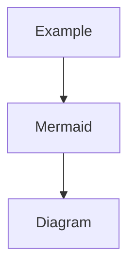
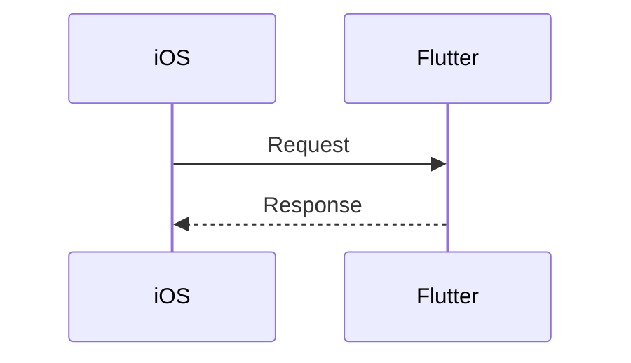
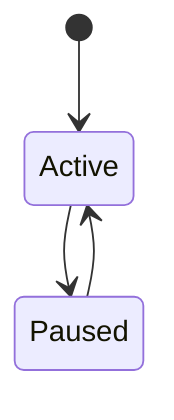
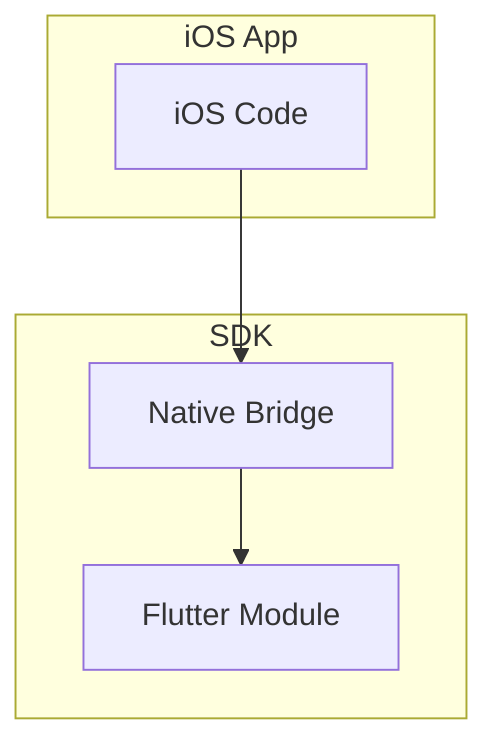
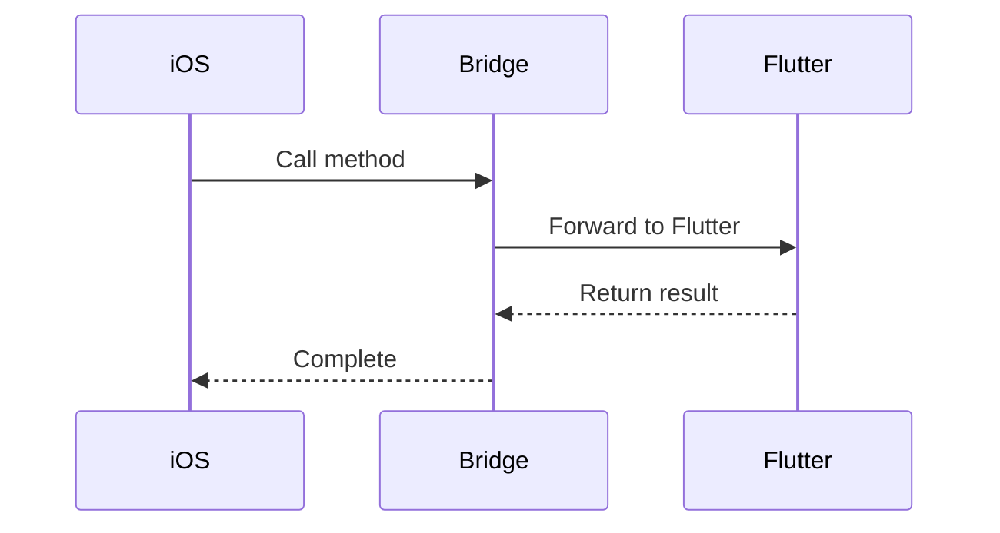
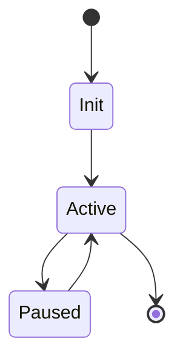
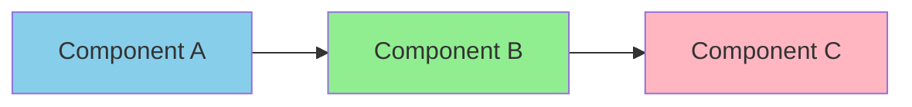

# 📘 Obsidian Setup Guide for Reels SDK Documentation

> [!info] Purpose
> This guide helps you set up Obsidian to view and edit the Reels SDK technical documentation with optimal rendering of diagrams, links, and formatting.

## Overview

The Reels SDK documentation is built using **Obsidian-compatible Markdown** with support for:
- ✅ Mermaid diagrams
- ✅ Internal wiki-style links
- ✅ Callouts and admonitions
- ✅ Code syntax highlighting
- ✅ Tables and formatting
- ✅ Tags and metadata

---

## Installation

### Step 1: Install Obsidian

1. **Download Obsidian:**
   - Visit: https://obsidian.md
   - Download the installer for your platform (macOS, Windows, Linux)

2. **Install:**
   - macOS: Drag to Applications folder
   - Windows: Run installer
   - Linux: Follow platform-specific instructions

3. **Launch Obsidian:**
   - Open the application
   - You'll see the vault picker screen

### Step 2: Open the Documentation Vault

1. **Open Folder as Vault:**
   ```
   Click "Open folder as vault"
   Navigate to: /path/to/reels-sdk/docs
   Click "Open"
   ```

   The `docs` folder is the Obsidian vault containing all technical documentation.

2. **Trust the Vault:**
   - Obsidian will ask if you trust the author of this vault
   - Click "Trust author and enable plugins"

3. **You're Ready!**
   - The MOC (Map of Content) file will open automatically
   - Start exploring the documentation

---

## Essential Settings

### Enable Key Features

#### 1. Enable Mermaid Diagrams

Mermaid diagrams are enabled by default in Obsidian. Verify:

**Settings → Editor → Enable Mermaid**
- ✅ Should be checked by default

#### 2. Configure Internal Links

**Settings → Files & Links → Use [[Wikilinks]]**
- ✅ Enable: "Use [[Wikilinks]]"
- Set "New link format": `Shortest path when possible`

#### 3. Enable Readable Line Length

**Settings → Editor → Readable line length**
- ✅ Enable for better readability
- Recommended for technical documentation

#### 4. Theme Setup (Optional)

**Settings → Appearance → Themes**

Recommended themes for technical documentation:
- **Light mode:** Minimal (built-in) or Sanctum
- **Dark mode:** Obsidian (default) or Atom

---

## Recommended Community Plugins

### Core Plugins (Built-in)

Enable these built-in plugins:

**Settings → Core plugins**

| Plugin | Purpose | Recommended |
|--------|---------|-------------|
| **Backlinks** | Show links to current note | ✅ Enable |
| **Graph view** | Visual map of notes | ✅ Enable |
| **Outgoing links** | Links from current note | ✅ Enable |
| **Outline** | Document structure | ✅ Enable |
| **Page preview** | Hover to preview | ✅ Enable |
| **Search** | Full-text search | ✅ Enable |
| **Tags pane** | Browse by tags | ✅ Enable |

### Community Plugins (Optional)

These enhance the experience but are not required:

**Settings → Community plugins → Browse**

| Plugin | Purpose | Benefit |
|--------|---------|---------|
| **Dataview** | Query documentation | Advanced filtering |
| **Table of Contents** | Auto TOC generation | Navigation |
| **Admonition** | Enhanced callouts | Better alerts |
| **ExcaliBrain** | Visual knowledge graph | Exploration |
| **Better Code Block** | Enhanced code view | Syntax features |

---

## Vault Structure

### Directory Layout

```
reels-sdk-vault/
├── 00-MOC-Reels-SDK.md              ← 🎯 START HERE (Main Hub)
├── 00-Obsidian-Setup-Guide.md       ← This file
├── QUICK-OVERVIEW.md                 ← Presentation mode
│
├── 01-Overview/                      ← SDK Introduction
│   ├── 01-SDK-Overview.md
│   ├── 02-Technology-Stack.md
│   └── ...
│
├── 02-Integration/                   ← Integration Guides
│   ├── 01-iOS-Integration-Guide.md
│   ├── 02-Android-Integration-Guide.md
│   └── ...
│
├── 03-Architecture/                  ← Technical Architecture
│   ├── 01-Platform-Communication.md
│   ├── 02-Flutter-Engine-Lifecycle.md
│   ├── 03-Generation-Based-State-Management.md
│   └── ...
│
├── 04-Development/                   ← Development Guides
│   └── ...
│
└── 05-API/                          ← API References
    └── ...
```

### Navigation Strategy

1. **Start with MOC:**
   - Open `00-MOC-Reels-SDK.md`
   - This is your main navigation hub

2. **Use Internal Links:**
   - Click `[[linked-documents]]` to navigate
   - Use `Cmd/Ctrl + Click` to open in new pane

3. **Use Graph View:**
   - Click graph icon in sidebar
   - Visual representation of documentation structure

4. **Use Search:**
   - `Cmd/Ctrl + Shift + F` for global search
   - Search across all documentation

---

## Viewing Diagrams

### Mermaid Diagrams

All Mermaid diagrams render automatically in **Reading View**.

**To view diagrams:**

1. **Switch to Reading View:**
   - Click book icon (top right)
   - Or: `Cmd/Ctrl + E`

2. **Toggle Between Modes:**
   - **Edit mode:** See Mermaid source code
   - **Reading mode:** See rendered diagram

**Example diagram types used:**







### Code Blocks

Code blocks have syntax highlighting in both modes:

```swift
// Swift code example
let reels = ReelsCoordinator.shared
reels.openReels(from: self)
```

```dart
// Dart code example
final provider = context.read<VideoProvider>();
await provider.loadVideos();
```

---

## Useful Keyboard Shortcuts

### Navigation

| Shortcut | Action |
|----------|--------|
| `Cmd/Ctrl + O` | Quick switcher (open file) |
| `Cmd/Ctrl + P` | Command palette |
| `Cmd/Ctrl + Shift + F` | Global search |
| `Cmd/Ctrl + E` | Toggle edit/reading mode |
| `Cmd/Ctrl + Click` | Open link in new pane |

### Editing

| Shortcut | Action |
|----------|--------|
| `Cmd/Ctrl + B` | Bold |
| `Cmd/Ctrl + I` | Italic |
| `Cmd/Ctrl + K` | Insert link |
| `Cmd/Ctrl + ]` | Indent |
| `Cmd/Ctrl + [` | Unindent |

### View

| Shortcut | Action |
|----------|--------|
| `Cmd/Ctrl + \` | Split vertically |
| `Cmd/Ctrl + Shift + \` | Split horizontally |
| `Cmd/Ctrl + W` | Close pane |

---

## Recommended Workflow

### For Developers (Consuming Documentation)

1. **Daily Workflow:**
   ```
   Open Obsidian → Open MOC
   ↓
   Navigate to relevant section
   ↓
   Switch to Reading View for diagrams
   ↓
   Copy code examples as needed
   ```

2. **Research Workflow:**
   ```
   Use Search (Cmd/Ctrl + Shift + F)
   ↓
   Find relevant documentation
   ↓
   Open in split view for comparison
   ↓
   Use backlinks to find related topics
   ```

3. **Integration Workflow:**
   ```
   Open iOS/Android Integration Guide
   ↓
   Split view with Usage Examples
   ↓
   Follow step-by-step with code examples
   ↓
   Reference API docs in third pane
   ```

### For Technical Writers (Editing Documentation)

1. **Adding New Documentation:**
   ```bash
   # Create new markdown file in appropriate folder
   touch /path/to/reels-sdk-vault/03-Architecture/New-Topic.md

   # Add frontmatter
   ---
   title: New Topic
   type: architecture
   tags: [architecture, new-feature]
   ---

   # Link from MOC
   # Edit 00-MOC-Reels-SDK.md to add link
   ```

2. **Adding Diagrams:**
   ```markdown
   # Use Mermaid for diagrams
   ```mermaid
   graph TB
       A[Component A] --> B[Component B]
   ```
   ```

3. **Using Callouts:**
   ```markdown
   > [!info] Information
   > This is an info callout

   > [!warning] Warning
   > This is a warning callout

   > [!tip] Tip
   > This is a tip callout
   ```

---

## Diagram Best Practices

### Mermaid Diagram Types

#### 1. Graph (Architecture)



**Use for:** System architecture, component relationships

#### 2. Sequence Diagram (Communication Flow)



**Use for:** Communication flows, API interactions

#### 3. State Diagram (Lifecycle)



**Use for:** State management, lifecycle flows

### Styling Diagrams

Add colors to Mermaid diagrams:



---

## Troubleshooting

### Issue 1: Mermaid Diagrams Not Rendering

**Symptoms:**
- See code instead of diagram
- "Mermaid parsing error" message

**Solutions:**

1. **Check Reading Mode:**
   - Switch to Reading View (`Cmd/Ctrl + E`)
   - Diagrams only render in Reading View

2. **Check Syntax:**
   - Verify Mermaid code syntax
   - Use online Mermaid editor to test: https://mermaid.live

3. **Restart Obsidian:**
   - Close and reopen Obsidian
   - Sometimes rendering gets stuck

### Issue 2: Links Not Working

**Symptoms:**
- Clicking `[[links]]` doesn't navigate
- "File not found" message

**Solutions:**

1. **Check File Path:**
   - Ensure target file exists in vault
   - Check for typos in link

2. **Check Link Format:**
   - Use format: `[[folder/file|Display Name]]`
   - Or: `[[file]]` for files in same folder

3. **Rebuild Link Cache:**
   - Settings → Files & Links → Rebuild

### Issue 3: Slow Performance

**Symptoms:**
- Obsidian feels sluggish
- High CPU usage

**Solutions:**

1. **Disable Unused Plugins:**
   - Settings → Community plugins
   - Disable plugins you don't use

2. **Reduce Indexed Files:**
   - Settings → Files & Links → Excluded files
   - Add patterns to exclude (e.g., `node_modules`)

3. **Restart Obsidian:**
   - Close and reopen

---

## Tips & Tricks

### 1. Quick Navigation

Use **Starred Files** for frequently accessed docs:
- Right-click file → "Star"
- Access via star icon in sidebar

### 2. Templates

Create templates for new documentation:

**Template example:**
```markdown
---
title:
type: architecture
tags: []
date: {{date}}
---

# {{title}}

> [!info] Overview
> Brief description

## Table of Contents

1. [Section 1](#section-1)
2. [Section 2](#section-2)

## Section 1

Content here...

## Related Documentation

- [[Link-to-related]]

---

Back to [[00-MOC-Reels-SDK|Main Hub]]
```

### 3. Daily Notes

Use for tracking documentation changes:
- Settings → Core plugins → Daily notes
- Enable daily notes
- Track what you document each day

### 4. Graph View Filters

Focus graph view on specific topics:
- Open Graph View
- Click "Filters" button
- Add tags: `tag:#architecture`
- See only architecture docs

---

## Export Options

### Exporting Documentation

#### 1. Export to PDF

**Settings → Export to PDF**
- Works per-file
- Includes Mermaid diagrams
- Good for sharing with stakeholders

#### 2. Export to Markdown

Files are already in Markdown format!
- Copy files directly
- Use with static site generators:
  - MkDocs
  - Docusaurus
  - GitBook
  - VitePress

#### 3. Publish Online

**Option A: Obsidian Publish (Paid)**
- Official publishing service
- https://obsidian.md/publish

**Option B: Static Site Generator (Free)**
- Use MkDocs Material
- Use Docusaurus
- Deploy to GitHub Pages

---

## External Resources

### Official Obsidian Resources

- **Official Site:** https://obsidian.md
- **Documentation:** https://help.obsidian.md
- **Forum:** https://forum.obsidian.md
- **Discord:** https://discord.gg/obsidianmd

### Mermaid Resources

- **Official Site:** https://mermaid.js.org
- **Live Editor:** https://mermaid.live
- **Documentation:** https://mermaid.js.org/intro/

### Markdown Resources

- **CommonMark Spec:** https://commonmark.org
- **GitHub Flavored Markdown:** https://github.github.com/gfm/

---

## Maintenance

### Keeping Documentation Up-to-Date

1. **Regular Reviews:**
   - Review docs monthly
   - Update outdated information
   - Add new features

2. **Link Checking:**
   - Use Obsidian's "Unlinked mentions"
   - Find broken links
   - Update file paths

3. **Diagram Updates:**
   - Update diagrams when architecture changes
   - Keep diagrams simple and focused
   - Use consistent styling

4. **Version Tracking:**
   - Update frontmatter dates
   - Note version in file
   - Link to changelog

---

## Getting Help

### Community Support

If you need help with Obsidian:

1. **Check Documentation:**
   - https://help.obsidian.md

2. **Search Forum:**
   - https://forum.obsidian.md
   - Many common questions answered

3. **Ask on Discord:**
   - https://discord.gg/obsidianmd
   - Active community

### SDK Documentation Issues

For issues with the Reels SDK documentation:

1. **Contact ROOM Team:**
   - Email: room-team@rakuten.com

2. **Report Issues:**
   - Git Repository: https://gitpub.rakuten-it.com/scm/~ahmed.eishon/reels-sdk

---

## Conclusion

You're now ready to explore and contribute to the Reels SDK documentation!

**Quick Start Checklist:**
- [ ] Obsidian installed
- [ ] Vault opened (`reels-sdk-vault`)
- [ ] Core plugins enabled
- [ ] MOC file opened
- [ ] Mermaid diagrams rendering
- [ ] Navigation working

**Start here:** [[00-MOC-Reels-SDK|Main Documentation Hub]]

---

**Version:** 1.0.0 | **Last Updated:** November 14, 2025 | **Maintained by:** ROOM Team

#obsidian #setup #documentation #guide
