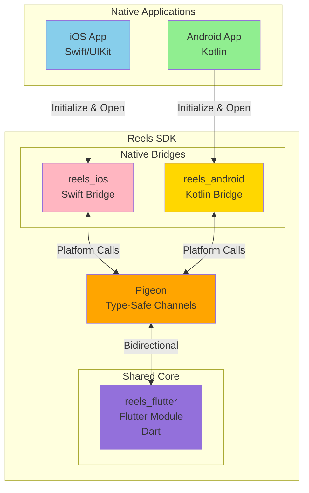
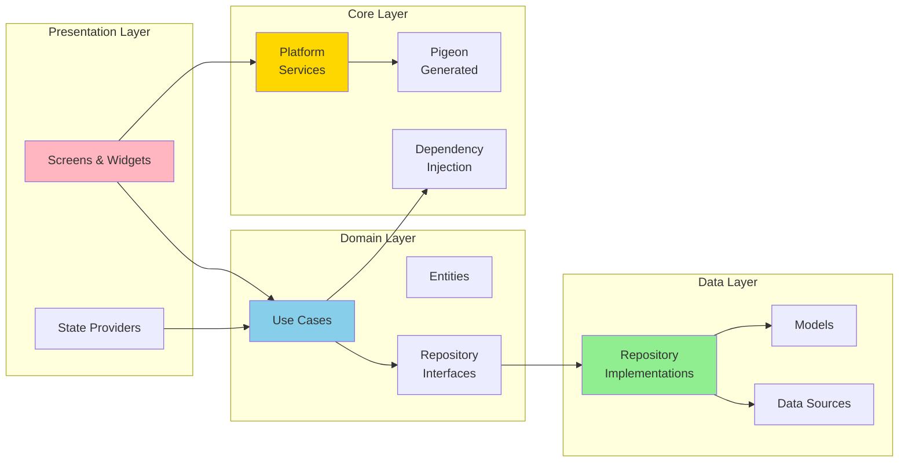
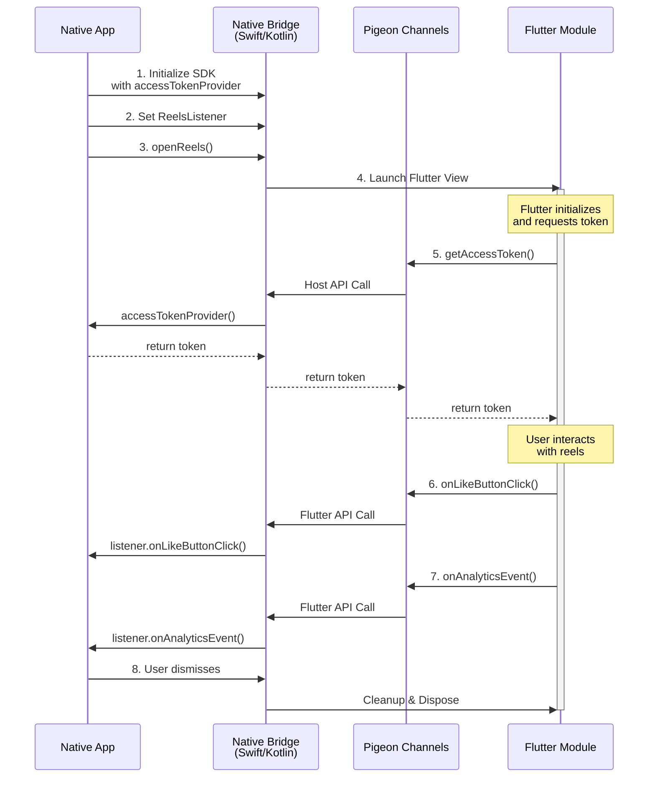
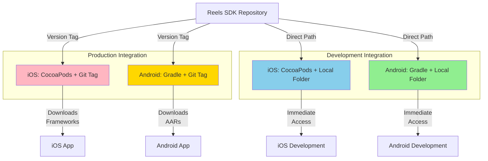
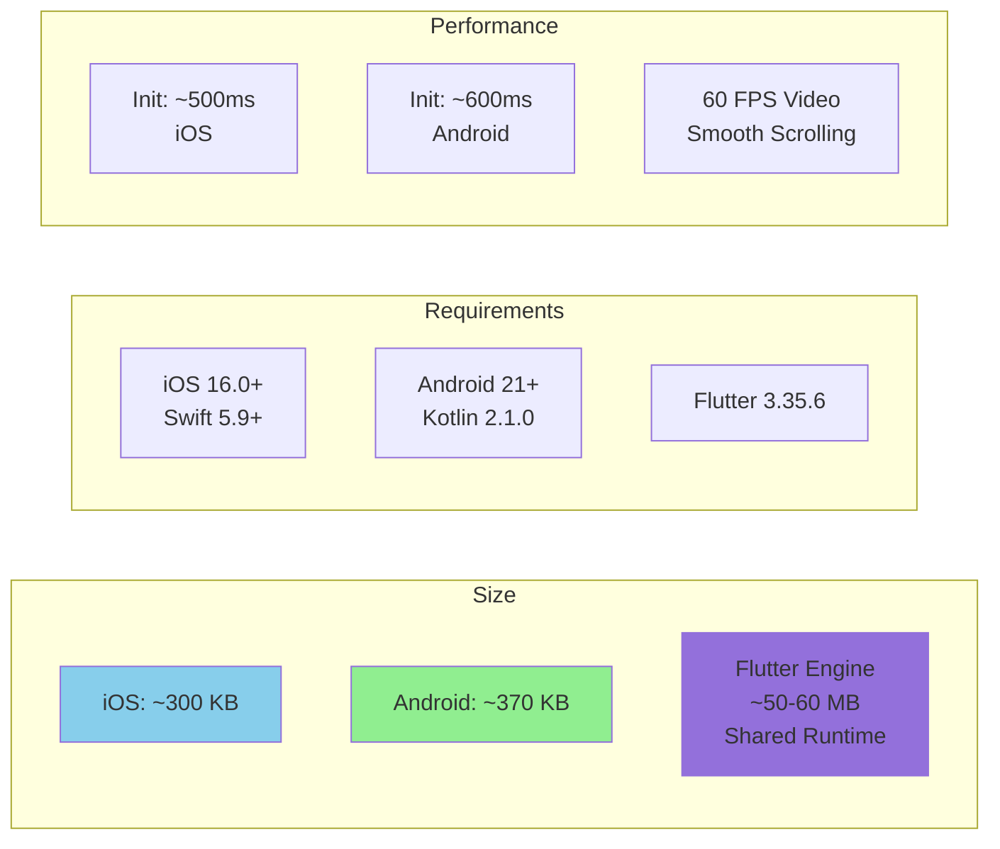
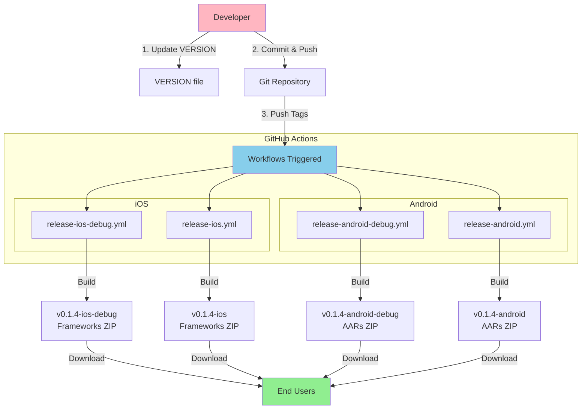

# Reels SDK - Overview

> **Version:** 0.1.4
> **Status:** Active Development
> **Platforms:** iOS 16.0+ | Android SDK 21+

## What is Reels SDK?

Reels SDK is a multi-platform video reels solution that provides a TikTok-style vertical video experience for iOS and Android applications. It uses Flutter's "Add-to-App" pattern to share core functionality between platforms while providing native Swift and Kotlin bridges for seamless integration.



## Key Features

### User Features
- **Vertical Video Feed** - TikTok-style swipeable video experience
- **Engagement Actions** - Like, share, and comment functionality
- **User Profiles** - Navigate to user profile pages
- **Product Integration** - Shopping features with product tags
- **Video Playback** - Smooth autoplay with controls

### Technical Features
- **Type-Safe Communication** - Pigeon-generated platform channels
- **Clean Architecture** - Domain-driven design with clear separation
- **Cross-Platform** - Single Flutter codebase for iOS and Android
- **Native Performance** - Native bridges ensure optimal performance
- **Analytics Support** - Built-in event tracking
- **State Management** - Generation-based state for independent screen instances

## Architecture at a Glance



## SDK Components

### 1. reels_flutter (Flutter Core)
**Purpose:** Shared UI and business logic

**Technologies:**
- Flutter 3.35.6
- Dart SDK ^3.9.2
- Provider (State Management)
- GetIt (Dependency Injection)
- Video Player & Chewie (Video Playback)
- Pigeon (Platform Communication)

### 2. reels_ios (iOS Bridge)
**Purpose:** Native Swift wrapper for iOS apps

**Technologies:**
- Swift 5.9+
- iOS 16.0+
- CocoaPods
- Pigeon-generated channels

**Key Files:**
- `ReelsModule.swift` - Main public API
- `ReelsCoordinator.swift` - Navigation coordinator
- `ReelsEngineManager.swift` - Flutter engine lifecycle
- `ReelsPigeonHandler.swift` - Platform communication
- `PigeonGenerated.swift` - Auto-generated type-safe channels

### 3. reels_android (Android Bridge)
**Purpose:** Native Kotlin wrapper for Android apps

**Technologies:**
- Kotlin 2.1.0
- Android SDK 21+ (Android 5.0+)
- Target SDK 35 (Android 15)
- Gradle 8.14
- Pigeon-generated channels

**Key Files:**
- `ReelsModule.kt` - Main public API
- `FlutterReelsActivity.kt` - Full-screen activity
- `FlutterReelsFragment.kt` - Embeddable fragment
- `FlutterEngineManager.kt` - Flutter engine lifecycle
- `FlutterMethodChannelHandler.kt` - Platform communication
- `PigeonGenerated.kt` - Auto-generated type-safe channels

## Platform Communication Flow



## Quick Start

### iOS (Swift)

```swift
import ReelsIOS

// 1. Initialize (in AppDelegate)
ReelsModule.initialize(
    accessTokenProvider: { completion in
        LoginManager.shared.getAccessToken { token in
            completion(token)
        }
    },
    debug: true
)

// 2. Set listener
ReelsModule.setListener(self)

// 3. Open reels
ReelsModule.openReels(
    from: viewController,
    initialRoute: "/",
    animated: true
)
```

### Android (Kotlin)

```kotlin
import com.rakuten.room.reels.ReelsModule

// 1. Initialize (in Application.onCreate)
ReelsModule.initialize(
    context = applicationContext,
    accessTokenProvider = { UserSession.accessToken },
    debug: true
)

// 2. Set listener
ReelsModule.setListener(this)

// 3. Open reels
ReelsModule.openReels(
    activity = this,
    initialRoute = "/",
    animated = true
)
```

## Integration Options



### Integration Comparison

| Method | Use Case | Advantages | Disadvantages |
|--------|----------|------------|---------------|
| **Git + CocoaPods/Gradle** | Production | ✅ Version control<br/>✅ Reproducible builds<br/>✅ CI/CD friendly | ⚠️ Requires Git auth<br/>⚠️ Slower updates |
| **Local Folder Import** | Development | ✅ No auth needed<br/>✅ Instant updates<br/>✅ Full debugging<br/>✅ Fast iteration | ⚠️ Manual version control<br/>⚠️ Requires local SDK |

## SDK Metrics



| Metric | iOS | Android |
|--------|-----|---------|
| **Bridge Size** | ~300 KB | ~370 KB |
| **Min Version** | iOS 16.0 | SDK 21 (Android 5.0) |
| **Target Version** | iOS 18 | SDK 35 (Android 15) |
| **Language** | Swift 5.9+ | Kotlin 2.1.0 |
| **Init Time** | ~500ms | ~600ms |
| **Memory** | ~50 MB | ~60 MB |

## Repository Structure

```
reels-sdk/
├── reels_flutter/              # Flutter module (shared)
│   ├── lib/
│   │   ├── presentation/       # UI layer
│   │   ├── domain/             # Business logic
│   │   ├── data/               # Data sources
│   │   └── core/               # DI, services, pigeon
│   ├── assets/                 # Mock data
│   └── pubspec.yaml
│
├── reels_ios/                  # iOS bridge
│   └── Sources/ReelsIOS/
│       ├── ReelsModule.swift
│       ├── ReelsCoordinator.swift
│       ├── ReelsEngineManager.swift
│       └── PigeonGenerated.swift
│
├── reels_android/              # Android bridge
│   └── src/main/java/com/rakuten/room/reels/
│       ├── ReelsModule.kt
│       ├── flutter/
│       └── pigeon/
│
├── scripts/                    # Build & release scripts
│   ├── sdk/ios/
│   ├── sdk/android/
│   └── dev/
│
├── docs/                       # Documentation
└── .github/workflows/          # CI/CD workflows
```

## Distribution Model



**Distribution Features:**
- ✅ Automated builds via GitHub Actions
- ✅ Separate Debug and Release artifacts
- ✅ No Flutter required for end users
- ✅ Fast installation (~30 seconds vs ~30 minutes)
- ✅ Version-tagged releases

## Next Steps

- **Integration:** See [iOS Integration Guide](../02-Integration/01-iOS-Integration-Guide.md) or [Android Integration Guide](../02-Integration/02-Android-Integration-Guide.md)
- **Architecture:** Learn about [Platform Communication](../03-Architecture/01-Platform-Communication.md) and [Architecture Overview](../03-Architecture/README.md)
- **Build Process:** Check [iOS Build Process](../04-Build-Process/01-iOS-Build.md) and [Android Build Process](../04-Build-Process/02-Android-Build.md)
- **Release Process:** Review [iOS Release](../05-Release-Process/01-iOS-Release.md) and [Android Release](../05-Release-Process/02-Android-Release.md)
- **Technology Stack:** Review [Technology Stack](./02-Technology-Stack.md) for detailed dependency information

