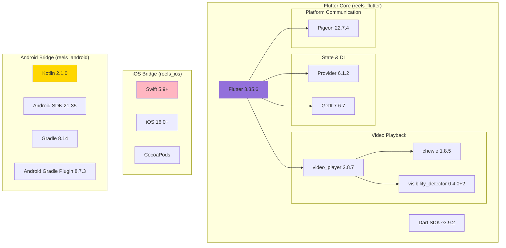
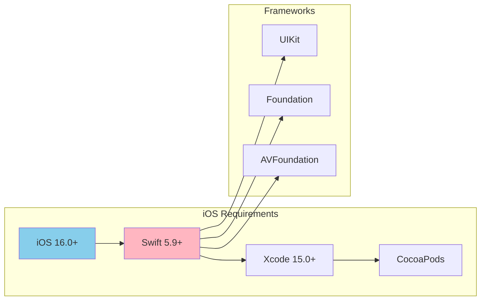
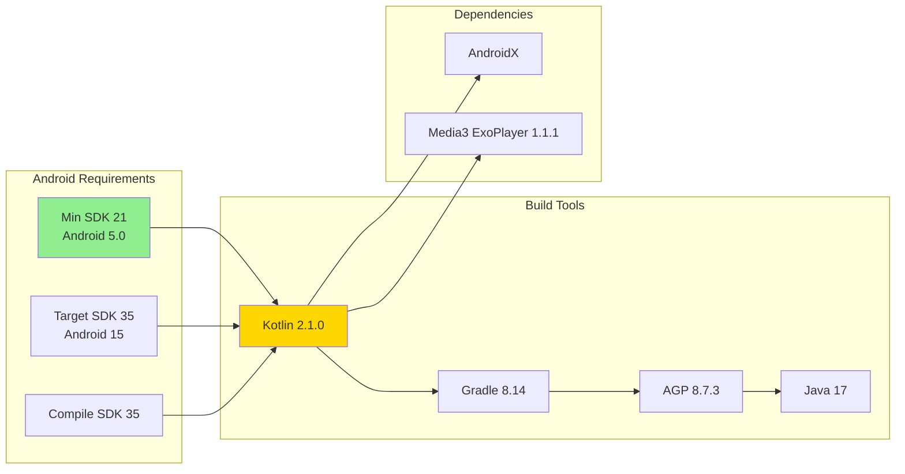
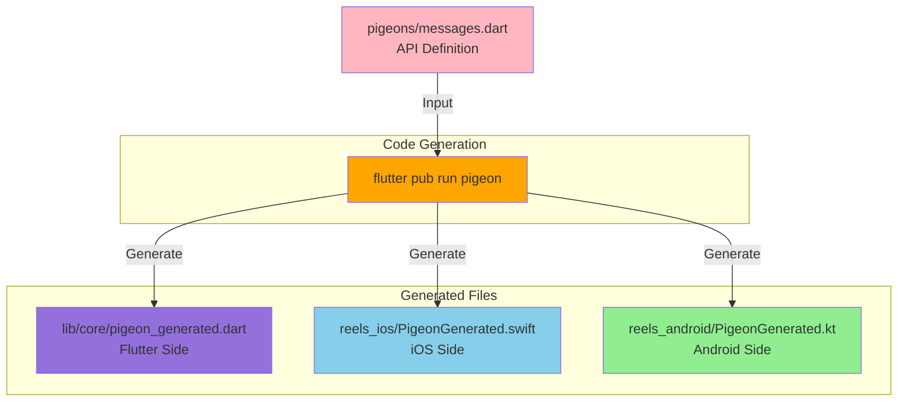
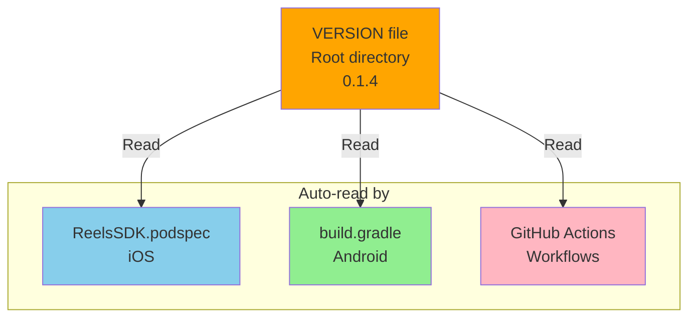
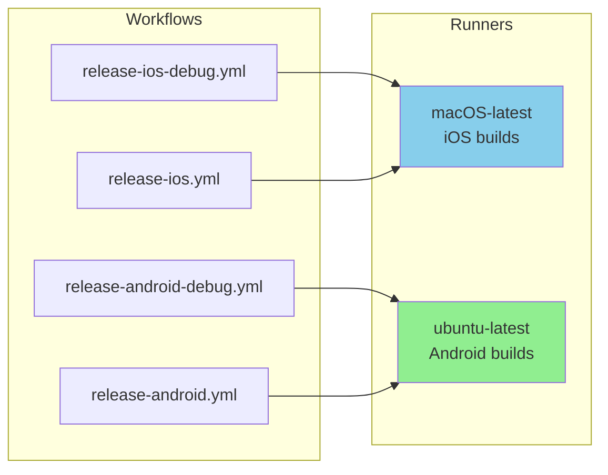
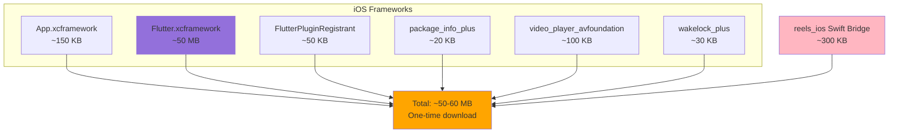
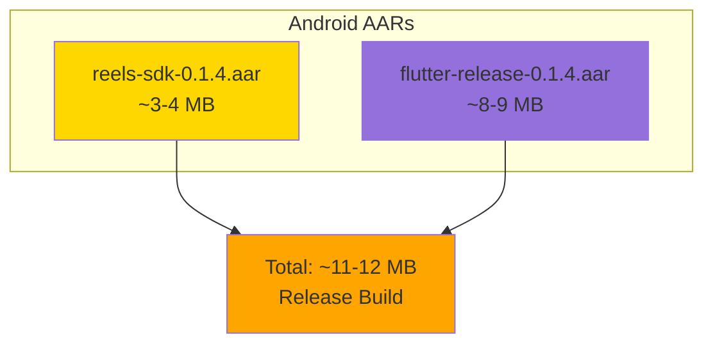
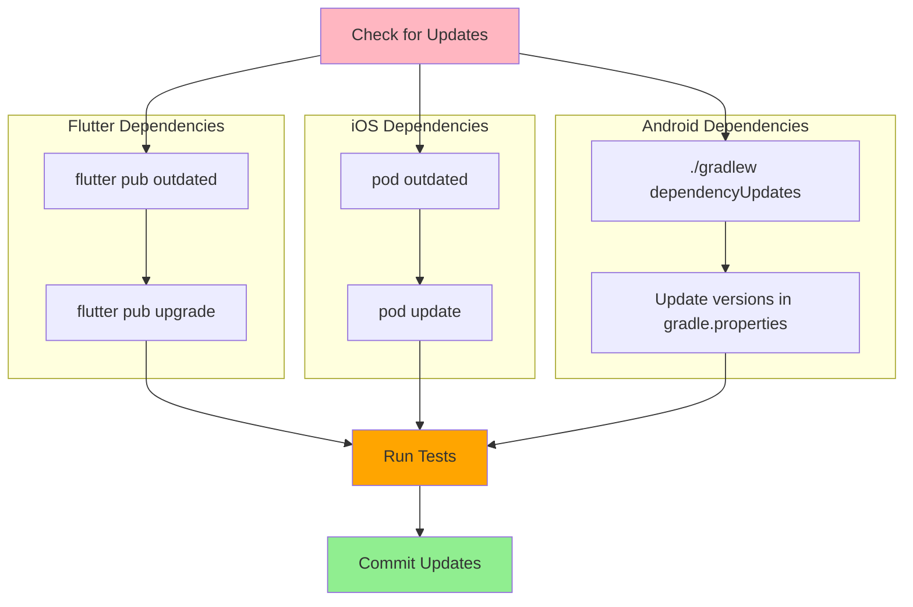

# Technology Stack

This document details all technologies, frameworks, and dependencies used in the Reels SDK.

## Technology Overview



## Flutter Module (reels_flutter)

### Core Framework

| Technology | Version | Purpose |
|------------|---------|---------|
| **Flutter SDK** | 3.35.6 | UI framework |
| **Dart SDK** | ^3.9.2 | Programming language (from pubspec.yaml) |

### Dependencies

#### State Management
```yaml
provider: ^6.1.2
```
- Purpose: Reactive state management
- Usage: Video state, UI state, app-wide state

#### Dependency Injection
```yaml
get_it: ^7.6.7
```
- Purpose: Service locator pattern
- Usage: Register and resolve services, repositories, use cases

#### Video Playback
```yaml
video_player: ^2.8.7
chewie: ^1.8.5
visibility_detector: ^0.4.0+2
```
- **video_player**: Core video playback functionality
- **chewie**: Video player UI controls and overlays
- **visibility_detector**: Detect when videos enter/exit viewport for autoplay

#### UI Components
```yaml
cupertino_icons: ^1.0.8
```
- Purpose: iOS-style icons
- Usage: Icon widgets throughout the app

### Dev Dependencies

#### Code Generation
```yaml
pigeon: ^22.7.4
```
- Purpose: Type-safe platform channel code generation
- Generates: Swift, Kotlin, and Dart communication code

#### Testing
```yaml
flutter_test: sdk: flutter
mockito: ^5.4.4
network_image_mock: ^2.1.1
build_runner: ^2.4.8
```
- **mockito**: Mocking framework for unit tests
- **network_image_mock**: Mock network images in tests
- **build_runner**: Code generation runner

#### Linting
```yaml
flutter_lints: ^5.0.0
```
- Purpose: Code quality and style enforcement
- Follows Flutter recommended lints

## iOS Bridge (reels_ios)

### Platform Requirements



| Component | Version/Requirement |
|-----------|---------------------|
| **iOS Deployment Target** | 16.0+ |
| **Swift Version** | 5.9+ |
| **Xcode** | 15.0+ |
| **CocoaPods** | Latest |

### iOS Frameworks Used
- **UIKit** - UI components and view controllers
- **Foundation** - Core data types and utilities
- **AVFoundation** - Video playback support (via Flutter)

### Podspec Configuration

```ruby
# ReelsSDK.podspec
Pod::Spec.new do |spec|
  spec.name                  = "ReelsSDK"
  spec.version               = File.read(File.join(__dir__, 'VERSION')).strip
  spec.ios.deployment_target = '16.0'
  spec.swift_version         = '5.9'

  # Vendored frameworks (downloaded from GitHub releases)
  spec.vendored_frameworks = [
    'Frameworks/App.xcframework',
    'Frameworks/Flutter.xcframework',
    'Frameworks/FlutterPluginRegistrant.xcframework',
    'Frameworks/package_info_plus.xcframework',
    'Frameworks/video_player_avfoundation.xcframework',
    'Frameworks/wakelock_plus.xcframework'
  ]
end
```

## Android Bridge (reels_android)

### Platform Requirements



| Component | Version |
|-----------|---------|
| **Min SDK** | 21 (Android 5.0) |
| **Target SDK** | 35 (Android 15) |
| **Compile SDK** | 35 |
| **Kotlin** | 2.1.0 |
| **Gradle** | 8.14 |
| **Android Gradle Plugin** | 8.7.3 |
| **Java** | 17 |

### Android Dependencies

```gradle
dependencies {
    // Flutter embedding
    implementation 'androidx.appcompat:appcompat:1.6.1'
    implementation 'androidx.constraintlayout:constraintlayout:2.1.4'

    // Material Design
    implementation 'com.google.android.material:material:1.11.0'

    // Media3 for video playback
    implementation 'androidx.media3:media3-exoplayer:1.1.1'

    // Flutter module (generated)
    implementation project(':flutter')
}
```

### Gradle Configuration

#### gradle.properties
```properties
# Android SDK versions
COMPILE_SDK_VERSION=35
TARGET_SDK_VERSION=35
MIN_SDK_VERSION=21
BUILD_TOOLS_VERSION=35.0.0

# Kotlin
KOTLIN_VERSION=2.1.0

# Gradle
GRADLE_VERSION=8.14
ANDROID_GRADLE_PLUGIN_VERSION=8.7.3
```

#### settings.gradle
```gradle
pluginManagement {
    repositories {
        google()
        mavenCentral()
        gradlePluginPortal()
    }
}

plugins {
    id 'com.android.library' version '8.7.3' apply false
    id 'org.jetbrains.kotlin.android' version '2.1.0' apply false
}
```

## Platform Communication (Pigeon)

### Overview



### Pigeon Configuration

**Version:** 22.7.4

**Purpose:** Generate type-safe, bidirectional platform channels

**Generated APIs:**

#### Host APIs (Flutter → Native)
- `ReelsFlutterTokenApi.getAccessToken()` - Request access token
- `ReelsFlutterContextApi.getInitialCollect()` - Get collect context
- `ReelsFlutterContextApi.getCurrentGeneration()` - Get screen generation
- `ReelsFlutterContextApi.isDebugMode()` - Check debug status

#### Flutter APIs (Native → Flutter)
- `ReelsFlutterAnalyticsApi.trackEvent()` - Track analytics
- `ReelsFlutterButtonEventsApi.onLikeButtonClick()` - Handle like
- `ReelsFlutterButtonEventsApi.onShareButtonClick()` - Handle share
- `ReelsFlutterStateApi.onScreenStateChanged()` - Screen lifecycle
- `ReelsFlutterStateApi.onVideoStateChanged()` - Video state
- `ReelsFlutterNavigationApi.onSwipeLeft/Right()` - Navigation
- `ReelsFlutterNavigationApi.onUserProfileClick()` - Profile click
- `ReelsFlutterLifecycleApi.resetState()` - Reset state
- `ReelsFlutterLifecycleApi.pauseAll()` - Pause resources
- `ReelsFlutterLifecycleApi.resumeAll()` - Resume resources

## Version Management

### SDK Version
**Current Version:** 0.1.4

Defined in: `VERSION` file at repository root

### Version Files Location



| Platform | File | Version Source |
|----------|------|----------------|
| **SDK** | `VERSION` | Single source of truth |
| **iOS** | `ReelsSDK.podspec` | Reads from `VERSION` |
| **Android** | `build.gradle` | Reads from `VERSION` |
| **CI/CD** | `.github/workflows/*.yml` | Reads from `VERSION` |

## Development Tools

### Required Tools

| Tool | Version | Purpose |
|------|---------|---------|
| **Flutter SDK** | 3.35.6 | Core development (CI/CD version) |
| **Dart SDK** | ^3.9.2 | Comes with Flutter |
| **Xcode** | 15.0+ | iOS development |
| **Android Studio** | Latest | Android development |
| **CocoaPods** | Latest | iOS dependency management |
| **Git** | Any | Version control |

### Optional Tools

| Tool | Purpose |
|------|---------|
| **VS Code** | Lightweight editor with Flutter extensions |
| **IntelliJ IDEA** | Alternative IDE with Flutter plugin |
| **GitHub CLI** | Release management |

## CI/CD Technology

### GitHub Actions



**Runners:**
- **macOS-latest** - iOS framework builds
- **ubuntu-latest** - Android AAR builds

**Tools Used:**
- Flutter action
- Java setup action
- Artifact upload action
- Release creation action

## Size Breakdown

### iOS Distribution



### Android Distribution



## Update Strategy

### Dependency Updates



### Version Compatibility Matrix

| Flutter | Dart SDK | iOS | Android | Gradle | Kotlin |
|---------|----------|-----|---------|--------|--------|
| 3.35.6 | ^3.9.2 | 16.0+ | 21+ | 8.14 | 2.1.0 |
