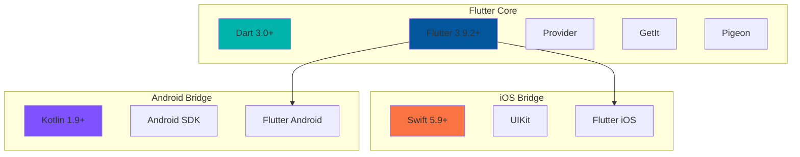
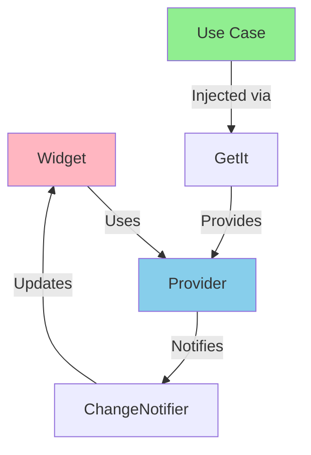
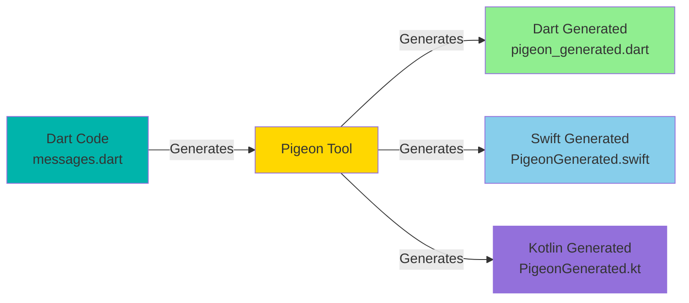
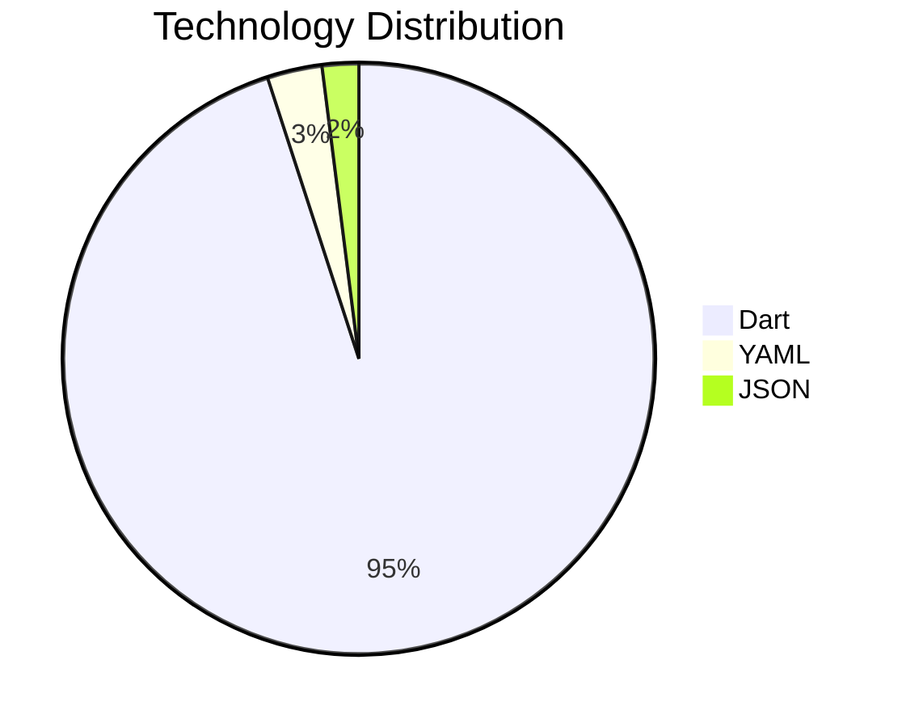
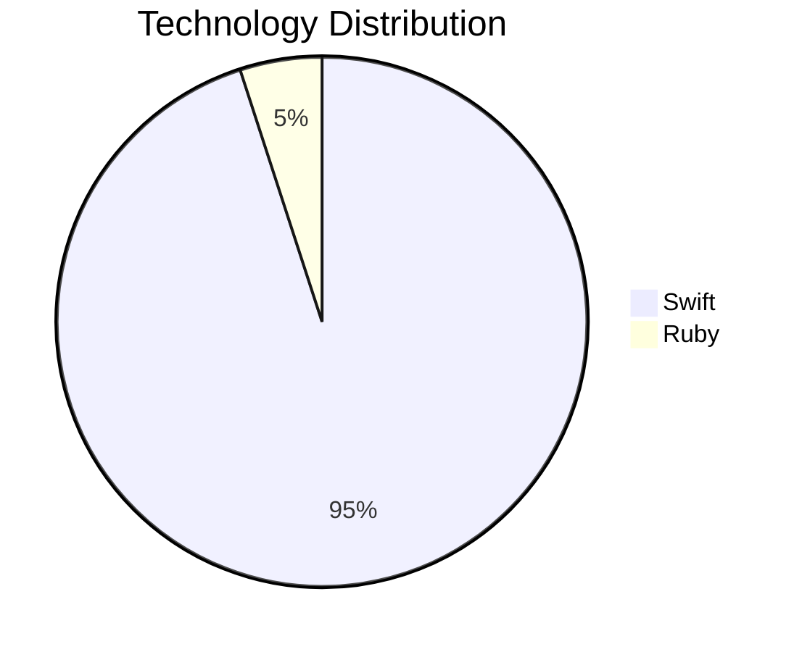
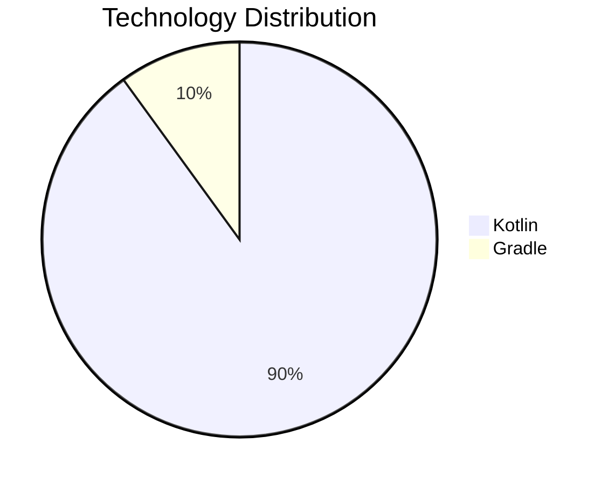

# 🛠️ Technology Stack

> [!info] Complete Technology Overview
> Comprehensive breakdown of all technologies, frameworks, and tools used in the Reels SDK

## Technology Overview



## Flutter Core Technologies

### Programming Language

| Technology | Version | Purpose |
|------------|---------|---------|
| **Dart** | 3.0+ | Flutter programming language |
| **Flutter SDK** | 3.9.2+ | Cross-platform UI framework |

### State Management

| Library | Version | Purpose | Status |
|---------|---------|---------|--------|
| **Provider** | ^6.0.0 | State management | ✅ Primary |
| **ChangeNotifier** | Built-in | Observable state | ✅ Active |

### Dependency Injection

| Library | Version | Purpose |
|---------|---------|---------|
| **GetIt** | ^7.6.0 | Service locator pattern |
| **get_it** | Latest | IoC container |

### Platform Communication

| Library | Version | Purpose |
|---------|---------|---------|
| **Pigeon** | ^11.0.0 | Type-safe platform channels |

### Video Playback

| Library | Version | Purpose |
|---------|---------|---------|
| **video_player** | ^2.8.0 | Flutter video player |
| **chewie** | ^1.7.0 | Video player UI |

### Utilities

| Library | Version | Purpose |
|---------|---------|---------|
| **logger** | Latest | Logging utility |
| **intl** | Latest | Internationalization |

## iOS Bridge Technologies

### Programming Language

| Technology | Version | Purpose |
|------------|---------|---------|
| **Swift** | 5.9+ | iOS native bridge |
| **Objective-C** | N/A | Interop only (minimal) |

### iOS Frameworks

| Framework | Purpose | Status |
|-----------|---------|--------|
| **UIKit** | UI framework | ✅ Primary |
| **Foundation** | Core utilities | ✅ Active |
| **AVFoundation** | Media framework | ✅ Active |
| **Flutter (iOS)** | Flutter engine | ✅ Required |

### iOS Dependencies

| Dependency | Version | Purpose |
|------------|---------|---------|
| **Flutter** | Dynamic | Flutter iOS engine |
| **FlutterPluginRegistrant** | Dynamic | Plugin registration |

### Build Tools

| Tool | Version | Purpose |
|------|---------|---------|
| **CocoaPods** | Latest | Dependency manager |
| **Xcode** | 15.0+ | IDE and build system |
| **Swift Package Manager** | N/A | Not used (CocoaPods only) |

## Android Bridge Technologies

### Programming Language

| Technology | Version | Purpose |
|------------|---------|---------|
| **Kotlin** | 1.9+ | Android native bridge |
| **Java** | 17 | Interop (minimal) |

### Android Frameworks

| Framework | Purpose | Status |
|-----------|---------|--------|
| **Android SDK** | Core Android APIs | ✅ Active |
| **AndroidX** | Jetpack libraries | ✅ Active |
| **Flutter (Android)** | Flutter engine | ✅ Required |

### Android Dependencies

```gradle
dependencies {
    implementation 'org.jetbrains.kotlin:kotlin-stdlib:1.9.x'
    implementation 'androidx.core:core-ktx:1.12.0'
    implementation 'androidx.appcompat:appcompat:1.6.1'

    // Flutter
    implementation 'io.flutter:flutter_embedding_debug:1.0.0-xxxxx'
}
```

### Build Tools

| Tool | Version | Purpose |
|------|---------|---------|
| **Gradle** | 8.0+ | Build automation |
| **Android Gradle Plugin** | 8.0+ | Android build plugin |
| **Kotlin Gradle Plugin** | 1.9+ | Kotlin compilation |

## Development Tools

### Version Control

| Tool | Purpose |
|------|---------|
| **Git** | Source control |
| **GitPub (Rakuten)** | Repository hosting |

### Scripts

```bash
# Automation scripts
scripts/
├── init-ios.sh              # iOS integration setup
├── init-android.sh          # Android integration setup
├── verify-ios.sh            # iOS SDK verification
├── verify-android.sh        # Android SDK verification
├── clean-install-ios.sh     # Clean iOS installation
├── clean-install-android.sh # Clean Android installation
└── release.sh               # Version management
```

### Code Generation

| Tool | Purpose | Input | Output |
|------|---------|-------|--------|
| **Pigeon** | Platform channels | pigeons/messages.dart | Generated Swift/Kotlin/Dart |

## Architecture Patterns

### Design Patterns

| Pattern | Layer | Purpose |
|---------|-------|---------|
| **Clean Architecture** | All | Separation of concerns |
| **MVVM** | Presentation | UI pattern |
| **Repository Pattern** | Data | Data abstraction |
| **Use Case Pattern** | Domain | Business logic |
| **Service Locator** | Core | Dependency injection |
| **Observer** | Presentation | State updates |

### Flutter Patterns



## Platform Communication Stack

### Pigeon Architecture



### Communication Protocols

| Direction | Protocol | Type |
|-----------|----------|------|
| **Flutter → Native** | Host API | Request/Response |
| **Native → Flutter** | Flutter API | Fire-and-forget |
| **Serialization** | Pigeon Codec | Type-safe binary |

## Testing Technologies

### Unit Testing (Flutter)

| Library | Purpose |
|---------|---------|
| **flutter_test** | Flutter testing framework |
| **mockito** | Mocking library |
| **test** | Dart test framework |

### Testing Structure

```dart
// Example test structure
test/
├── core/
│   └── services/           # Service tests
├── domain/
│   └── usecases/          # Use case tests
├── data/
│   └── repositories/      # Repository tests
└── presentation/
    └── providers/         # Provider tests
```

## Build Configuration

### iOS Build Settings

| Setting | Value | Notes |
|---------|-------|-------|
| **Minimum iOS** | 16.0 | Modern iOS only |
| **Swift Version** | 5.9 | Latest Swift |
| **Build System** | New Build System | Xcode default |
| **Bitcode** | Disabled | Flutter requirement |

### Android Build Settings

| Setting | Value | Notes |
|---------|-------|-------|
| **minSdkVersion** | 21 | Android 5.0+ |
| **targetSdkVersion** | 35 | Android 15 |
| **compileSdkVersion** | 35 | Latest SDK |
| **Java Version** | 17 | LTS version |
| **Kotlin JVM Target** | 1.8 | Compatibility |

## Technology Comparison

### Flutter Module (reels_flutter)



| Technology | Files | Purpose |
|------------|-------|---------|
| **Dart** | ~30 | Core logic |
| **pubspec.yaml** | 1 | Dependencies |
| **JSON** | 1 | Mock data |

### iOS Bridge (reels_ios)



| Technology | Files | Purpose |
|------------|-------|---------|
| **Swift** | 5 | Native bridge |
| **Ruby (Podspec)** | 1 | CocoaPods spec |

### Android Bridge (reels_android)



| Technology | Files | Purpose |
|------------|-------|---------|
| **Kotlin** | 7 | Native bridge |
| **Gradle** | 1 | Build config |

## External Services

### Not Used (But Supported by Apps)

The SDK itself does **NOT** include these services, but apps can integrate them for SDK events:

| Service | Purpose | Integration Point |
|---------|---------|-------------------|
| **Analytics** | Event tracking | ReelsListener callbacks |
| **Backend APIs** | Video data | App's responsibility |
| **Authentication** | Access tokens | App's accessTokenProvider |
| **Storage** | User preferences | App's storage layer |

## Version Requirements Summary

### Development Requirements

| Tool | Minimum Version | Recommended |
|------|----------------|-------------|
| **Flutter SDK** | 3.9.2 | Latest stable |
| **Dart** | 3.0.0 | Included with Flutter |
| **Xcode** | 15.0 | Latest |
| **Android Studio** | Latest | Latest |
| **CocoaPods** | 1.12.0+ | Latest |
| **Gradle** | 8.0+ | Latest |

### Runtime Requirements

| Platform | Minimum | Target | Notes |
|----------|---------|--------|-------|
| **iOS** | 16.0 | 18.x | Modern iOS |
| **Android** | 5.0 (SDK 21) | 15.0 (SDK 35) | Wide support |

## Technology Strengths

### ✅ Advantages

- **Type Safety:** Pigeon ensures compile-time safety
- **Code Sharing:** Single Flutter codebase for both platforms
- **Modern Stack:** Latest Swift, Kotlin, Flutter
- **Clean Architecture:** Maintainable and testable
- **Native Performance:** Native bridges, Flutter rendering
- **Flexible Integration:** Multiple integration methods
- **Production Ready:** Battle-tested technologies

### ⚠️ Considerations

- **Flutter Dependency:** Apps need Flutter SDK for building
- **SDK Size:** ~300-370 KB per platform
- **Engine Overhead:** Flutter engine adds ~50-60 MB memory
- **CocoaPods Required:** iOS needs CocoaPods (no SPM)
- **Build Complexity:** Flutter adds build steps

## Related Documentation

- [[01-SDK-Overview|SDK Overview]]
- [[04-Project-Structure|Project Structure]]
- [[03-Architecture/02-Flutter-Module|Flutter Module]]
- [[03-Architecture/03-iOS-Bridge|iOS Bridge]]
- [[03-Architecture/04-Android-Bridge|Android Bridge]]

---

Back to [[00-MOC-Reels-SDK|Main Hub]]

#technology #stack #dependencies #tools
