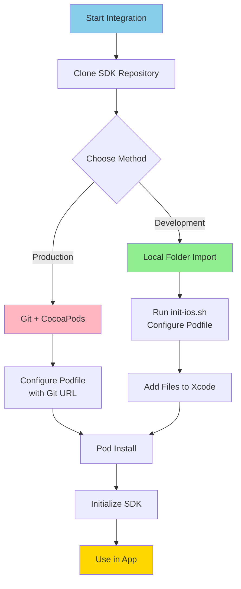

# 📱 iOS Integration Guide

> [!info] Complete iOS Integration
> Step-by-step guide to integrate Reels SDK into your iOS application using Swift

## Prerequisites

Before integrating the Reels SDK, ensure you have:

| Requirement | Version | Purpose |
|-------------|---------|---------|
| **iOS** | 16.0+ | Target platform |
| **Xcode** | 15.0+ | Development environment |
| **Swift** | 5.9+ | Programming language |
| **CocoaPods** | Latest | Dependency manager |
| **Flutter SDK** | 3.9.2+ | Build-time requirement |

## Integration Overview



## Integration Methods

### Method 1: Local Folder Import (Recommended for Development)

This method is **recommended** for active development as it provides immediate access to SDK changes and easier debugging.

#### Step 1: Clone the SDK

```bash
# Navigate to your workspace
cd ~/Workspace

# Clone the SDK repository
git clone https://gitpub.rakuten-it.com/scm/~ahmed.eishon/reels-sdk.git

# Navigate into the SDK
cd reels-sdk
```

#### Step 2: Run Initialization Script

```bash
# Run the iOS initialization script
./scripts/init-ios.sh /path/to/reels-sdk /path/to/your-ios-app

# Example:
./scripts/init-ios.sh ~/Workspace/reels-sdk ~/Workspace/MyApp
```

**What the script does:**
- ✅ Verifies Flutter installation
- ✅ Runs `flutter pub get` to generate `.ios` platform files
- ✅ Checks that all required files are present
- ✅ Provides step-by-step integration instructions

#### Step 3: Update Your Podfile

Add the following to your `Podfile`:

```ruby
# Path to the Flutter module
flutter_application_path = '/absolute/path/to/reels-sdk/reels_flutter'

# Load Flutter podhelper
load File.join(flutter_application_path, '.ios', 'Flutter', 'podhelper.rb')

target 'YourApp' do
  use_frameworks!

  # Your existing pods...
  # pod 'SomeLibrary'

  # Install Flutter pods
  install_all_flutter_pods(flutter_application_path)
end

post_install do |installer|
  # Flutter post install (REQUIRED)
  flutter_post_install(installer)

  # Your existing post_install code...
end
```

> [!warning] Important
> - Use **absolute paths** for `flutter_application_path`
> - Ensure the `.ios` directory exists in `reels_flutter` (created by `flutter pub get`)

#### Step 4: Add reels_ios Files to Xcode

1. **Remove existing reels_ios group** (if it exists):
   - Right-click on any old `reels_ios` group → Delete → Remove References

2. **Add files from external location:**
   - Right-click on your project in Xcode
   - Select "Add Files to YourApp"
   - Navigate to: `/path/to/reels-sdk/reels_ios/Sources/ReelsIOS`
   - Select all `.swift` files
   - **Important:** Choose "Create groups" (NOT "Create folder references")
   - Ensure your app target is checked
   - Click "Add"

**Files to add:**
- `ReelsCoordinator.swift`
- `ReelsModule.swift`
- `ReelsEngineManager.swift`
- `ReelsPigeonHandler.swift`
- `PigeonGenerated.swift`

#### Step 5: Install Pods

```bash
cd /path/to/your-ios-app
pod install
```

#### Step 6: Open Workspace

```bash
# Always use .xcworkspace (NOT .xcodeproj)
open YourApp.xcworkspace
```

#### Step 7: Build and Run

Build your project in Xcode. The SDK should compile successfully.

**Advantages of Local Folder Import:**
- ✅ No Git authentication issues
- ✅ Immediate access to SDK updates
- ✅ Easy debugging and code navigation
- ✅ Works in corporate environments with firewall restrictions
- ✅ Simpler setup for active development

### Method 2: Git + CocoaPods (Recommended for Production)

This method is recommended for **production builds** and CI/CD pipelines.

#### Step 1: Update Your Podfile

Add the following to your `Podfile`:

```ruby
target 'YourApp' do
  use_frameworks!

  # Reels SDK via Git
  # For Debug (development/testing):
  pod 'ReelsSDK', :git => 'https://github.com/ahmed-eishon/Reels-SDK.git', :tag => 'v0.1.3-ios-debug'

  # For Release (production):
  # pod 'ReelsSDK', :git => 'https://github.com/ahmed-eishon/Reels-SDK.git', :tag => 'v0.1.3-ios'

  # Your other pods...
end
```

**Tag Selection:**
- Use `v0.1.3-ios-debug` for development/testing (includes debug symbols)
- Use `v0.1.3-ios` for production builds (optimized)

#### Step 2: Install Pods

```bash
cd /path/to/your-ios-app
pod install
```

**What happens during installation:**
1. CocoaPods downloads pre-built frameworks from GitHub release
2. The podspec detects build type from the tag and downloads appropriate frameworks
3. 6 frameworks are installed (no suffixes, clean names)
4. No Flutter installation required!

#### Step 3: Build Your App

Your app will use the frameworks corresponding to the tag you specified:
- **v0.1.3-ios-debug tag** → Debug frameworks (with symbols and assertions)
- **v0.1.3-ios tag** → Release frameworks (optimized for production)
- Simply change the tag in your Podfile to switch between Debug and Release

#### Step 4: Update to New Versions

```ruby
# In Podfile, update the tag
pod 'ReelsSDK', :git => 'https://github.com/ahmed-eishon/Reels-SDK.git', :tag => 'v0.1.3-ios'
```

```bash
# Update pods
pod update ReelsSDK
```

**Advantages of Git + CocoaPods:**
- ✅ Version control via Git tags
- ✅ Easy updates with `pod update`
- ✅ CI/CD friendly
- ✅ Standard CocoaPods workflow
- ✅ Automatic Debug/Release framework selection
- ✅ No Flutter installation required
- ✅ Fast installation (~30 seconds)

**Disadvantages:**
- ⚠️ Requires Git authentication
- ⚠️ May have issues in corporate environments
- ⚠️ Slower iteration during development

## SDK Usage

### Step 1: Import the SDK

```swift
import ReelsIOS
```

### Step 2: Initialize the SDK

Initialize the SDK early in your app lifecycle (e.g., in `AppDelegate` or main view controller):

```swift
import UIKit
import ReelsIOS

@main
class AppDelegate: UIResponder, UIApplicationDelegate {

    func application(
        _ application: UIApplication,
        didFinishLaunchingWithOptions launchOptions: [UIApplication.LaunchOptionsKey: Any]?
    ) -> Bool {

        // Initialize Reels SDK with async access token provider
        ReelsCoordinator.initialize(accessTokenProvider: { completion in
            // Option 1: Async token fetch
            LoginManager.shared.getRoomAccessToken { token in
                completion(token)
            }

            // Option 2: Synchronous token
            // completion(UserSession.shared.accessToken)
        })

        return true
    }
}
```

### Step 3: Set Event Listener

Implement the `ReelsListener` protocol to receive callbacks:

```swift
import ReelsIOS

class MyViewController: UIViewController {

    override func viewDidLoad() {
        super.viewDidLoad()

        // Set listener to receive SDK events
        ReelsCoordinator.setListener(self)
    }
}

// MARK: - ReelsListener

extension MyViewController: ReelsListener {

    func onLikeButtonClick(videoId: String, isLiked: Bool, likeCount: Int64) {
        print("Video \(videoId) liked: \(isLiked), count: \(likeCount)")

        // Update your backend
        VideoAPI.updateLike(videoId: videoId, liked: isLiked) { result in
            switch result {
            case .success:
                print("Like updated successfully")
            case .failure(let error):
                print("Failed to update like: \(error)")
            }
        }
    }

    func onShareButtonClick(
        videoId: String,
        videoUrl: String,
        title: String,
        description: String,
        thumbnailUrl: String?
    ) {
        // Present native share sheet
        let activityItems: [Any] = [title, URL(string: videoUrl)!]

        let activityVC = UIActivityViewController(
            activityItems: activityItems,
            applicationActivities: nil
        )

        // For iPad
        if let popoverController = activityVC.popoverPresentationController {
            popoverController.sourceView = view
            popoverController.sourceRect = CGRect(x: view.bounds.midX, y: view.bounds.midY, width: 0, height: 0)
            popoverController.permittedArrowDirections = []
        }

        present(activityVC, animated: true)
    }

    func onAnalyticsEvent(eventName: String, properties: [String: String]) {
        // Track with your analytics service
        Analytics.track(eventName, properties: properties)

        print("Analytics event: \(eventName), properties: \(properties)")
    }
}
```

### Step 4: Open Reels Screen

#### Option A: Using ReelsCoordinator (Simple API)

```swift
import ReelsIOS

class MyViewController: UIViewController {

    @IBAction func openReelsTapped(_ sender: UIButton) {
        // Open reels screen
        ReelsCoordinator.openReels(
            from: self,
            itemId: nil,  // Optional: specific video ID
            animated: true,
            completion: {
                print("Reels screen presented")
            }
        )
    }

    // Or with specific video
    @IBAction func openSpecificVideoTapped(_ sender: UIButton) {
        ReelsCoordinator.openReels(
            from: self,
            itemId: "video123",
            animated: true
        )
    }
}
```

#### Option B: Using ReelsModule (Advanced API)

```swift
import ReelsIOS

class CollectDetailViewController: UIViewController {

    var collectObject: Collect?

    @IBAction func openReelsTapped(_ sender: UIButton) {
        // Open reels with collect context
        ReelsModule.openReels(
            from: self,
            collect: collectObject,  // Pass collect/item data
            initialRoute: "/",
            animated: true,
            completion: {
                print("Reels opened with collect context")
            }
        )
    }

    // Or create view controller manually
    @IBAction func pushReelsTapped(_ sender: UIButton) {
        let flutterVC = ReelsModule.createViewController(initialRoute: "/reels")
        navigationController?.pushViewController(flutterVC, animated: true)
    }
}
```

### Step 5: Cleanup (Optional)

Clean up resources when your app terminates:

```swift
class AppDelegate: UIResponder, UIApplicationDelegate {

    func applicationWillTerminate(_ application: UIApplication) {
        ReelsCoordinator.cleanup()
    }
}
```

## Common Integration Patterns

### Pattern 1: Simple Button Integration

```swift
class HomeViewController: UIViewController, ReelsListener {

    override func viewDidLoad() {
        super.viewDidLoad()
        ReelsCoordinator.setListener(self)
    }

    @IBAction func watchReelsTapped(_ sender: UIButton) {
        ReelsCoordinator.openReels(from: self)
    }

    // Implement ReelsListener methods...
}
```

### Pattern 2: Navigation Bar Button

```swift
class HomeViewController: UIViewController, ReelsListener {

    override func viewDidLoad() {
        super.viewDidLoad()

        ReelsCoordinator.setListener(self)

        // Add navigation bar button
        let reelsButton = UIBarButtonItem(
            title: "Reels",
            style: .plain,
            target: self,
            action: #selector(openReels)
        )
        navigationItem.rightBarButtonItem = reelsButton
    }

    @objc private func openReels() {
        ReelsCoordinator.openReels(from: self, animated: true)
    }

    // Implement ReelsListener methods...
}
```

### Pattern 3: Collect Context Integration

```swift
class CollectViewController: UIViewController, ReelsListener {

    var collectModel: CollectModel?

    override func viewDidLoad() {
        super.viewDidLoad()
        ReelsModule.setListener(self)
    }

    @IBAction func watchRelatedReels(_ sender: UIButton) {
        // Pass collect context to show related videos
        ReelsModule.openReels(
            from: self,
            collect: collectModel,  // The module will extract properties via reflection
            animated: true
        )
    }

    // Implement ReelsListener methods...
}
```

## Troubleshooting

### Issue 1: "Module 'ReelsIOS' not found"

**Solution:**
1. Ensure you ran `pod install`
2. Open `.xcworkspace`, not `.xcodeproj`
3. Clean build folder: Cmd+Shift+K
4. Rebuild project

### Issue 2: "No such module 'Flutter'"

**Solution:**
1. Verify Flutter pods are installed: check `Pods/` directory
2. Run `flutter pub get` in `reels_flutter` directory
3. Ensure `install_all_flutter_pods()` is in your Podfile
4. Re-run `pod install`

### Issue 3: Flutter engine crash on launch

**Solution:**
1. Ensure iOS 16.0+ deployment target
2. Check that `flutter_post_install(installer)` is in post_install block
3. Clean derived data: `rm -rf ~/Library/Developer/Xcode/DerivedData`
4. Rebuild

### Issue 4: Git authentication issues

**Solution:**
- Use **Local Folder Import** method instead
- This avoids Git authentication entirely

### Issue 5: "Could not find Flutter entrypoint"

**Solution:**
1. Ensure `.ios` directory exists in `reels_flutter`
2. Run: `cd reels_flutter && flutter pub get`
3. Verify `Flutter/podhelper.rb` exists
4. Re-run `pod install`

### Issue 6: Wrong build type installed

**Note:** ReelsSDK v0.1.3+ uses tag-based build selection:
- Tag `v0.1.3-ios-debug` installs Debug frameworks (6 frameworks, no suffixes)
- Tag `v0.1.3-ios` installs Release frameworks (6 frameworks, no suffixes)
- Simply change the tag in your Podfile to switch between Debug and Release
- Run `pod cache clean ReelsSDK --all` and `pod install` after changing tags

## Best Practices

### ✅ Do's

- ✅ Initialize SDK in `AppDelegate.didFinishLaunchingWithOptions`
- ✅ Set listener before opening reels
- ✅ Use async access token provider for better UX
- ✅ Implement all `ReelsListener` methods
- ✅ Handle errors gracefully
- ✅ Test on real devices, not just simulators
- ✅ Use local folder import for development
- ✅ Use Git + CocoaPods for production

### ❌ Don'ts

- ❌ Don't initialize multiple times
- ❌ Don't open reels without setting listener
- ❌ Don't use `.xcodeproj` (use `.xcworkspace`)
- ❌ Don't forget `flutter_post_install()`
- ❌ Don't use relative paths in Podfile
- ❌ Don't modify generated Pigeon code

## Version Updates

### Updating SDK (Local Folder)

```bash
# Navigate to SDK folder
cd /path/to/reels-sdk

# Pull latest changes
git pull origin master

# Checkout desired version
git checkout v1.1.0

# Re-run pod install in your iOS project
cd /path/to/your-ios-app
pod install
```

### Updating SDK (Git + CocoaPods)

```ruby
# Update Podfile with new tag
pod 'ReelsSDK', :git => '...', :tag => 'v1.1.0-ios'
```

```bash
# Update pods
pod update ReelsSDK
```

## Development Scripts

The SDK includes several utility scripts to streamline iOS development workflows.

### Available Scripts

#### 1. Clean Install Script

**Purpose:** Completely clean and regenerate all iOS/Flutter artifacts

**Usage:**
```bash
cd /path/to/reels-sdk
./scripts/clean-install-ios.sh
```

**What it does:**
- ✅ Cleans Flutter build artifacts
- ✅ Removes and regenerates `.ios` directory
- ✅ Runs `flutter pub get`
- ✅ Regenerates Pigeon platform channel code
- ✅ Verifies all iOS files and structure
- ✅ Checks CocoaPods installation

**When to use:**
- After switching branches
- After pulling major SDK updates
- When you have unexplained build issues
- After modifying Pigeon definitions

#### 2. Verify iOS Script

**Purpose:** Verify SDK structure and files are correct

**Usage:**
```bash
cd /path/to/reels-sdk
./scripts/verify-ios.sh
```

**What it does:**
- ✅ Checks VERSION file
- ✅ Validates ReelsSDK.podspec
- ✅ Verifies Swift Package structure
- ✅ Counts Swift source files
- ✅ Checks Flutter module
- ✅ Verifies Pigeon generated files

**When to use:**
- Before committing changes
- After making SDK modifications
- To troubleshoot integration issues
- As part of CI/CD pipeline

#### 3. Build Room-iOS Script (Incremental)

**Purpose:** Quick incremental build for development testing

**Usage:**
```bash
cd /path/to/reels-sdk
./scripts/build-room-ios.sh
```

**Configuration:**
```bash
# Option 1: Set environment variable
export ROOM_IOS_DIR=/path/to/room-ios/ROOM
./scripts/build-room-ios.sh

# Option 2: Auto-detect (assumes room-ios is sibling directory)
# Works if structure is:
# ~/workspace/
#   ├── reels-sdk/
#   └── room-ios/ROOM/
./scripts/build-room-ios.sh
```

**What it does:**
- ✅ Checks if Flutter frameworks exist (builds if missing)
- ✅ Builds room-ios app incrementally
- ✅ Shows last 30 lines of build output

**When to use:**
- During active development
- Quick iterative testing
- When you only changed Swift/Flutter code

#### 4. Clean Build Room-iOS Script

**Purpose:** Complete clean build for thorough testing

**Usage:**
```bash
cd /path/to/reels-sdk
./scripts/clean-build-room-ios.sh
```

**What it does:**
```
[1/4] Clean and build Flutter frameworks
  • flutter clean
  • flutter build ios-framework --debug

[2/4] Update CocoaPods dependencies
  • pod install

[3/4] Clean Xcode build
  • xcodebuild clean

[4/4] Build room-ios app
  • xcodebuild build
```

**When to use:**
- Before creating pull requests
- After major changes
- When incremental build fails
- To ensure clean state

### Script Comparison

| Script | Speed | Thoroughness | Use Case |
|--------|-------|--------------|----------|
| **clean-install-ios.sh** | Medium | Complete SDK cleanup | SDK updates, branch switching |
| **verify-ios.sh** | Fast | Verification only | Pre-commit checks, CI |
| **build-room-ios.sh** | Fast | Incremental build | Active development |
| **clean-build-room-ios.sh** | Slow | Complete rebuild | Pre-release, troubleshooting |

### Common Workflows

#### Daily Development Workflow

```bash
# Morning: Ensure SDK is up to date
cd /path/to/reels-sdk
git pull
./scripts/clean-install-ios.sh

# During development: Quick builds
./scripts/build-room-ios.sh

# Before committing: Verify
./scripts/verify-ios.sh
```

#### Troubleshooting Workflow

```bash
# Step 1: Clean everything
cd /path/to/reels-sdk
./scripts/clean-install-ios.sh

# Step 2: Clean build
./scripts/clean-build-room-ios.sh

# Step 3: If still failing, check structure
./scripts/verify-ios.sh

# Step 4: Check CocoaPods in host app
cd /path/to/your-ios-app
rm -rf Pods Podfile.lock
pod install
```

#### Pre-Release Workflow

```bash
# Complete verification
cd /path/to/reels-sdk
./scripts/clean-install-ios.sh
./scripts/verify-ios.sh
./scripts/clean-build-room-ios.sh

# If all pass: ready for release
git tag v1.x.x
git push --tags
```

### Tips

**Speed up builds:**
- Use `build-room-ios.sh` during development (incremental)
- Only use `clean-build-room-ios.sh` when necessary
- Keep `room-ios` as sibling directory for auto-detection

**Debugging script issues:**
```bash
# Run with verbose output
bash -x ./scripts/clean-install-ios.sh

# Check script variables
echo $ROOM_IOS_DIR

# Manually verify paths
ls -la /path/to/reels-sdk/reels_flutter/.ios/Flutter/
```

**Custom configurations:**
```bash
# Create alias for easier access
alias reels-build="cd ~/workspace/reels-sdk && ./scripts/build-room-ios.sh"
alias reels-clean="cd ~/workspace/reels-sdk && ./scripts/clean-build-room-ios.sh"

# Add to ~/.zshrc or ~/.bashrc for persistence
```

---

## Next Steps

- [[04-iOS-Usage-Examples|📖 iOS Usage Examples]]
- [[../05-API/01-iOS-API-Reference|📖 iOS API Reference]]
- [[../03-Architecture/03-iOS-Bridge|📖 iOS Bridge Architecture]]

---

Back to [[../00-MOC-Reels-SDK|Main Hub]]

#ios #integration #swift #cocoapods
