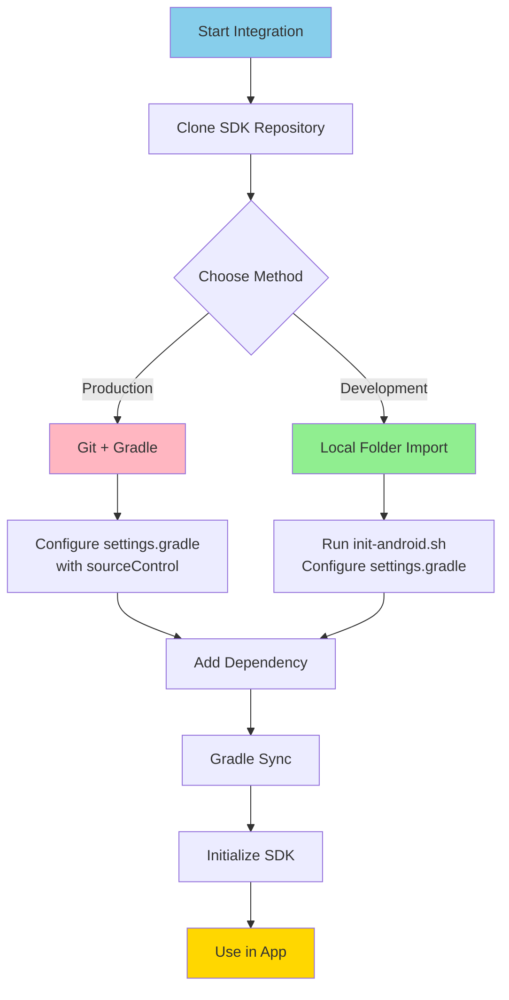

# 🤖 Android Integration Guide

> [!info] Complete Android Integration
> Step-by-step guide to integrate Reels SDK into your Android application using Kotlin

## Prerequisites

Before integrating the Reels SDK, ensure you have:

| Requirement | Version | Purpose |
|-------------|---------|---------|
| **Android SDK** | 21+ | Min platform (Android 5.0) |
| **Target SDK** | 35 | Latest Android |
| **Kotlin** | 1.9+ | Programming language |
| **Gradle** | 8.0+ | Build tool |
| **Android Studio** | Latest | Development environment |
| **Flutter SDK** | 3.9.2+ | Build-time requirement |
| **JDK** | 17 | Build requirement |

## Integration Overview



## Integration Methods

### Method 1: Local Folder Import (Recommended for Development)

This method is **recommended** for active development as it provides immediate access to SDK changes and faster builds.

#### Step 1: Clone the SDK

```bash
# Navigate to your workspace
cd ~/Workspace

# Clone the SDK repository
git clone https://gitpub.rakuten-it.com/scm/~ahmed.eishon/reels-sdk.git

# Navigate into the SDK
cd reels-sdk
```

#### Step 2: Run Initialization Script

```bash
# Run the Android initialization script
./scripts/init-android.sh /path/to/reels-sdk

# Example:
./scripts/init-android.sh ~/Workspace/reels-sdk
```

**What the script does:**
- ✅ Verifies Flutter installation
- ✅ Runs `flutter pub get` to generate `.android` platform files
- ✅ Checks that all required files are present
- ✅ Provides step-by-step integration instructions

#### Step 3: Update settings.gradle

Add the following to your `settings.gradle`:

```gradle
rootProject.name = 'YourApp'
include ':app'

// ===== Reels SDK - Local Folder Import =====

// Include reels_android module
include ':reels_android'
project(':reels_android').projectDir = new File('/absolute/path/to/reels-sdk/reels_android')

// Include Flutter module from reels-sdk
setBinding(new Binding([gradle: this]))
evaluate(new File(
    '/absolute/path/to/reels-sdk/reels_flutter/.android/include_flutter.groovy'
))

// ============================================
```

> [!warning] Important
> - Use **absolute paths** for both `reels_android` and `reels_flutter`
> - Ensure the `.android` directory exists in `reels_flutter` (created by `flutter pub get`)

#### Step 4: Add Dependency in app/build.gradle

```gradle
dependencies {
    // Your existing dependencies...

    // Reels SDK
    implementation project(':reels_android')
}
```

#### Step 5: Sync Gradle

```bash
cd /path/to/your-android-app
./gradlew clean build
```

Or in Android Studio: **File → Sync Project with Gradle Files**

#### Step 6: Build and Run

Build your project in Android Studio. The SDK should compile successfully.

**Advantages of Local Folder Import:**
- ✅ No Git authentication issues
- ✅ Immediate access to SDK updates
- ✅ Faster build times
- ✅ Easy debugging and code navigation
- ✅ Works in corporate environments with firewall restrictions
- ✅ Simpler setup for active development

### Method 2: Git + Gradle (Recommended for Production)

This method is recommended for **production builds** and CI/CD pipelines.

#### Step 1: Configure Git Repository in settings.gradle

Add to your `settings.gradle`:

```gradle
rootProject.name = 'YourApp'
include ':app'

// Configure source control for Reels SDK
sourceControl {
    gitRepository(uri("https://gitpub.rakuten-it.com/scm/~ahmed.eishon/reels-sdk.git")) {
        producesModule("com.rakuten.room:reels-sdk")
    }
}
```

#### Step 2: Add Dependency in app/build.gradle

```gradle
dependencies {
    // Reels SDK via Git
    implementation 'com.rakuten.room:reels-sdk:1.0.0'
}
```

#### Step 3: Sync Gradle

```bash
./gradlew clean build
```

#### Step 4: Update to New Versions

```gradle
// In app/build.gradle, update version
implementation 'com.rakuten.room:reels-sdk:1.1.0'
```

```bash
# Sync project
./gradlew clean build
```

**Advantages of Git + Gradle:**
- ✅ Version control via Git tags
- ✅ Easy updates with version number
- ✅ CI/CD friendly
- ✅ Standard Gradle workflow

**Disadvantages:**
- ⚠️ Requires Git authentication
- ⚠️ May have issues in corporate environments
- ⚠️ Slower build times

### Method 3: AAR Integration (Recommended for Released Versions)

This method is recommended for using **stable releases** without needing the SDK source code.

#### Step 1: Download Released AAR Files

Download the AAR package from the GitHub Releases page:

```bash
# Navigate to your project directory
cd /path/to/your-android-app

# Create libs directory if it doesn't exist
mkdir -p app/libs

# Download the release (replace VERSION with actual version, e.g., 0.1.4)
VERSION="0.1.4"

# For Debug builds (development/testing)
curl -L -o ReelsSDK-Android-Debug-${VERSION}.zip \
  "https://github.com/ahmed-eishon/Reels-SDK/releases/download/v${VERSION}-android-debug/ReelsSDK-Android-Debug-${VERSION}.zip"

# OR for Release builds (production)
curl -L -o ReelsSDK-Android-${VERSION}.zip \
  "https://github.com/ahmed-eishon/Reels-SDK/releases/download/v${VERSION}-android/ReelsSDK-Android-${VERSION}.zip"

# Extract the downloaded package
unzip ReelsSDK-Android-Debug-${VERSION}.zip
# or
# unzip ReelsSDK-Android-${VERSION}.zip

# Copy AAR files to your project
cp ReelsSDK-Android-Debug-${VERSION}/*.aar app/libs/
# or
# cp ReelsSDK-Android-${VERSION}/*.aar app/libs/
```

**What's included in the package:**
- `reels-sdk-debug-VERSION.aar` (Debug) or `reels-sdk-VERSION.aar` (Release) - Main SDK AAR
- `flutter-debug-VERSION.aar` (Debug) or `flutter-release-VERSION.aar` (Release) - Flutter runtime dependencies
- `README.md` - Integration instructions
- `.sha256` - Checksum file for verification

#### Step 2: Verify Checksums (Optional but Recommended)

```bash
# Verify package integrity
shasum -a 256 -c ReelsSDK-Android-Debug-${VERSION}.zip.sha256
# or
# shasum -a 256 -c ReelsSDK-Android-${VERSION}.zip.sha256
```

#### Step 3: Update build.gradle (Project Level)

Ensure your project-level `build.gradle` has the necessary repositories:

```gradle
// build.gradle (Project)
allprojects {
    repositories {
        google()
        mavenCentral()
    }
}
```

#### Step 4: Update build.gradle (App Level)

Add the following to your `app/build.gradle`:

```gradle
// app/build.gradle
android {
    compileSdk 35

    defaultConfig {
        minSdk 21
        targetSdk 35
        // ... other config
    }

    // Add flatDir repository for local AAR files
    repositories {
        flatDir {
            dirs 'libs'
        }
    }
}

dependencies {
    // For Debug builds
    debugImplementation(name: 'reels-sdk-debug-0.1.4', ext: 'aar')
    debugImplementation(name: 'flutter-debug-0.1.4', ext: 'aar')

    // For Release builds
    releaseImplementation(name: 'reels-sdk-0.1.4', ext: 'aar')
    releaseImplementation(name: 'flutter-release-0.1.4', ext: 'aar')

    // OR use implementation for both (not recommended)
    // implementation(name: 'reels-sdk-0.1.4', ext: 'aar')
    // implementation(name: 'flutter-release-0.1.4', ext: 'aar')

    // Required Android dependencies
    implementation 'androidx.appcompat:appcompat:1.6.1'
    implementation 'androidx.constraintlayout:constraintlayout:2.1.4'
    implementation 'com.google.android.material:material:1.11.0'
}
```

> [!tip] Debug vs Release AAR
> - **Debug AAR**: Use during development for better logging and debugging
> - **Release AAR**: Use in production for optimized performance
> - Use `debugImplementation` and `releaseImplementation` to automatically switch between them

#### Step 5: Clean Settings.gradle

If you were previously using local folder import or Git + Gradle, remove those configurations from `settings.gradle`:

```gradle
// settings.gradle - Remove these lines if present:

// OLD: Local folder import
// include ':reels_android'
// project(':reels_android').projectDir = new File('/path/to/reels-sdk/reels_android')
// evaluate(new File('/path/to/reels-sdk/reels_flutter/.android/include_flutter.groovy'))

// OLD: Git + Gradle
// sourceControl {
//     gitRepository(uri("...")) {
//         producesModule("com.rakuten.room:reels-sdk")
//     }
// }
```

Your `settings.gradle` should only contain:

```gradle
rootProject.name = 'YourApp'
include ':app'
```

#### Step 6: Sync and Build

```bash
# Clean and rebuild
./gradlew clean
./gradlew build

# Or run from Android Studio
# File → Sync Project with Gradle Files
# Build → Clean Project
# Build → Rebuild Project
```

#### Step 7: Verify Installation

Check that the AARs are properly included:

```bash
# List dependencies
./gradlew app:dependencies | grep reels

# Should show:
# debugImplementation - reels-sdk-debug-0.1.4.aar
# debugImplementation - flutter-debug-0.1.4.aar
# releaseImplementation - reels-sdk-0.1.4.aar
# releaseImplementation - flutter-release-0.1.4.aar
```

**Advantages of AAR Integration:**
- ✅ No Git authentication required
- ✅ Faster build times (pre-compiled)
- ✅ Stable versioned releases
- ✅ No SDK source code needed
- ✅ Smaller repository size
- ✅ Works in air-gapped environments
- ✅ Easy to version control AAR files

**Disadvantages:**
- ⚠️ Manual download and update process
- ⚠️ Cannot debug into SDK source code
- ⚠️ Need to re-download for updates

**When to use AAR Integration:**
- ✅ Production apps using stable releases
- ✅ Corporate environments with restricted Git access
- ✅ CI/CD pipelines with local artifact caching
- ✅ Teams not actively developing the SDK

## SDK Usage

### Step 1: Import the SDK

```kotlin
import com.rakuten.room.reels.ReelsModule
import com.rakuten.room.reels.flutter.ReelsListener
import com.rakuten.room.reels.pigeon.ShareData
```

### Step 2: Initialize the SDK

Initialize the SDK early in your app lifecycle (in `Application` class or main `Activity`):

#### Option A: In Application Class (Recommended)

```kotlin
import android.app.Application
import com.rakuten.room.reels.ReelsModule

class MyApplication : Application() {

    override fun onCreate() {
        super.onCreate()

        // Initialize Reels SDK with access token provider
        ReelsModule.initialize(
            context = this,
            accessTokenProvider = {
                // Return access token (can be synchronous or async)
                UserSession.instance.accessToken
            }
        )
    }
}
```

Don't forget to add your Application class to `AndroidManifest.xml`:

```xml
<application
    android:name=".MyApplication"
    android:icon="@mipmap/ic_launcher"
    android:label="@string/app_name"
    android:theme="@style/AppTheme">
    <!-- Your activities... -->
</application>
```

#### Option B: In Activity (Alternative)

```kotlin
import androidx.appcompat.app.AppCompatActivity
import android.os.Bundle
import com.rakuten.room.reels.ReelsModule

class MainActivity : AppCompatActivity() {

    override fun onCreate(savedInstanceState: Bundle?) {
        super.onCreate(savedInstanceState)
        setContentView(R.layout.activity_main)

        // Initialize SDK
        ReelsModule.initialize(
            context = applicationContext,
            accessTokenProvider = {
                UserSession.instance.accessToken
            }
        )
    }
}
```

### Step 3: Set Event Listener

Implement the `ReelsListener` interface to receive callbacks:

```kotlin
import com.rakuten.room.reels.ReelsModule
import com.rakuten.room.reels.flutter.ReelsListener
import com.rakuten.room.reels.pigeon.ShareData
import android.content.Intent
import android.util.Log

class MainActivity : AppCompatActivity(), ReelsListener {

    override fun onCreate(savedInstanceState: Bundle?) {
        super.onCreate(savedInstanceState)
        setContentView(R.layout.activity_main)

        // Set listener to receive SDK events
        ReelsModule.setListener(this)
    }

    // MARK: - ReelsListener Implementation

    override fun onLikeButtonClick(videoId: String, isLiked: Boolean, likeCount: Long) {
        Log.d("Reels", "Video $videoId liked: $isLiked, count: $likeCount")

        // Update your backend
        VideoAPI.updateLike(videoId, isLiked) { result ->
            when (result) {
                is Result.Success -> Log.d("Reels", "Like updated successfully")
                is Result.Error -> Log.e("Reels", "Failed to update like: ${result.error}")
            }
        }
    }

    override fun onShareButtonClick(shareData: ShareData) {
        // Present native share dialog
        val shareIntent = Intent(Intent.ACTION_SEND).apply {
            type = "text/plain"
            putExtra(Intent.EXTRA_TEXT, "${shareData.title}\n${shareData.videoUrl}")
            putExtra(Intent.EXTRA_SUBJECT, shareData.title)
        }

        startActivity(Intent.createChooser(shareIntent, "Share Video"))
    }

    override fun onAnalyticsEvent(eventName: String, properties: Map<String, String>) {
        // Track with your analytics service
        Analytics.track(eventName, properties)

        Log.d("Reels", "Analytics event: $eventName, properties: $properties")
    }
}
```

### Step 4: Open Reels Screen

#### Option A: Full-Screen Activity (Recommended)

```kotlin
import com.rakuten.room.reels.ReelsModule

class MainActivity : AppCompatActivity(), ReelsListener {

    override fun onCreate(savedInstanceState: Bundle?) {
        super.onCreate(savedInstanceState)
        setContentView(R.layout.activity_main)

        ReelsModule.setListener(this)

        // Open reels button
        findViewById<Button>(R.id.openReelsButton).setOnClickListener {
            ReelsModule.openReels(
                context = this,
                itemId = null  // Optional: specific video ID
            )
        }

        // Open specific video
        findViewById<Button>(R.id.openVideoButton).setOnClickListener {
            ReelsModule.openReels(
                context = this,
                itemId = "video123"
            )
        }
    }

    // Implement ReelsListener methods...
}
```

#### Option B: Embedded Fragment

```kotlin
import com.rakuten.room.reels.ReelsModule

class MainActivity : AppCompatActivity(), ReelsListener {

    override fun onCreate(savedInstanceState: Bundle?) {
        super.onCreate(savedInstanceState)
        setContentView(R.layout.activity_main)

        ReelsModule.setListener(this)

        // Embed reels as a fragment
        val reelsFragment = ReelsModule.createReelsFragment(initialRoute = "/")

        supportFragmentManager
            .beginTransaction()
            .replace(R.id.fragmentContainer, reelsFragment)
            .commit()
    }

    // Implement ReelsListener methods...
}
```

**Layout for Fragment:**

```xml
<!-- activity_main.xml -->
<FrameLayout
    android:id="@+id/fragmentContainer"
    android:layout_width="match_parent"
    android:layout_height="match_parent" />
```

### Step 5: Cleanup (Optional)

Clean up resources when appropriate:

```kotlin
override fun onDestroy() {
    super.onDestroy()
    ReelsModule.cleanup()
}
```

## Common Integration Patterns

### Pattern 1: Simple Button Integration

```kotlin
class HomeActivity : AppCompatActivity(), ReelsListener {

    override fun onCreate(savedInstanceState: Bundle?) {
        super.onCreate(savedInstanceState)
        setContentView(R.layout.activity_home)

        ReelsModule.setListener(this)

        findViewById<Button>(R.id.watchReelsButton).setOnClickListener {
            ReelsModule.openReels(context = this)
        }
    }

    // Implement ReelsListener methods...
}
```

### Pattern 2: Menu Item Integration

```kotlin
class HomeActivity : AppCompatActivity(), ReelsListener {

    override fun onCreate(savedInstanceState: Bundle?) {
        super.onCreate(savedInstanceState)
        setContentView(R.layout.activity_home)

        ReelsModule.setListener(this)
    }

    override fun onCreateOptionsMenu(menu: Menu): Boolean {
        menuInflater.inflate(R.menu.home_menu, menu)
        return true
    }

    override fun onOptionsItemSelected(item: MenuItem): Boolean {
        return when (item.itemId) {
            R.id.action_reels -> {
                ReelsModule.openReels(context = this)
                true
            }
            else -> super.onOptionsItemSelected(item)
        }
    }

    // Implement ReelsListener methods...
}
```

### Pattern 3: Floating Action Button

```kotlin
class HomeActivity : AppCompatActivity(), ReelsListener {

    override fun onCreate(savedInstanceState: Bundle?) {
        super.onCreate(savedInstanceState)
        setContentView(R.layout.activity_home)

        ReelsModule.setListener(this)

        findViewById<FloatingActionButton>(R.id.fab_reels).setOnClickListener {
            ReelsModule.openReels(context = this)
        }
    }

    // Implement ReelsListener methods...
}
```

### Pattern 4: ViewPager/TabLayout Integration

```kotlin
class MainActivity : AppCompatActivity(), ReelsListener {

    override fun onCreate(savedInstanceState: Bundle?) {
        super.onCreate(savedInstanceState)
        setContentView(R.layout.activity_main)

        ReelsModule.setListener(this)

        setupViewPager()
    }

    private fun setupViewPager() {
        val viewPager = findViewById<ViewPager2>(R.id.viewPager)
        val adapter = MainPagerAdapter(this)

        // Add reels fragment as a tab
        adapter.addFragment(HomeFragment(), "Home")
        adapter.addFragment(ReelsModule.createReelsFragment(), "Reels")
        adapter.addFragment(ProfileFragment(), "Profile")

        viewPager.adapter = adapter
    }

    // Implement ReelsListener methods...
}
```

## Troubleshooting

### Issue 1: "Unresolved reference: ReelsModule"

**Solution:**
1. Ensure you added the dependency in `app/build.gradle`
2. Sync Gradle: File → Sync Project with Gradle Files
3. Clean and rebuild: Build → Clean Project → Rebuild Project

### Issue 2: "No signature of method: build_xxx.include_flutter()"

**Solution:**
1. Verify `.android` directory exists in `reels_flutter`
2. Run: `cd reels_flutter && flutter pub get`
3. Ensure `include_flutter.groovy` exists
4. Use correct path in `settings.gradle`

### Issue 3: Flutter engine crash on launch

**Solution:**
1. Ensure minSdkVersion is 21 or higher
2. Check that Flutter dependencies are resolved
3. Clean build: `./gradlew clean`
4. Invalidate caches: File → Invalidate Caches / Restart

### Issue 4: Git authentication issues

**Solution:**
- Use **Local Folder Import** method instead
- This avoids Git authentication entirely

### Issue 5: "Duplicate class" errors

**Solution:**
1. Ensure you're not including Flutter dependencies twice
2. Check that you only have one `:reels_android` include
3. Clean project: `./gradlew clean`

## Permissions

The SDK requires the following permissions (automatically added):

```xml
<!-- Already included in SDK's AndroidManifest.xml -->
<uses-permission android:name="android.permission.INTERNET" />
<uses-permission android:name="android.permission.ACCESS_NETWORK_STATE" />
```

If your app needs additional permissions (e.g., for camera, storage), add them to your app's `AndroidManifest.xml`.

## ProGuard / R8 Rules

If using ProGuard or R8, add these rules:

```proguard
# Flutter
-keep class io.flutter.** { *; }
-keep class io.flutter.app.** { *; }
-keep class io.flutter.plugin.**  { *; }
-keep class io.flutter.util.** { *; }
-keep class io.flutter.view.** { *; }
-keep class io.flutter.embedding.** { *; }

# Reels SDK
-keep class com.rakuten.room.reels.** { *; }
-keepclassmembers class com.rakuten.room.reels.** { *; }

# Pigeon
-keepattributes Signature
-keepattributes *Annotation*
```

## Best Practices

### ✅ Do's

- ✅ Initialize SDK in `Application.onCreate()`
- ✅ Set listener before opening reels
- ✅ Use application context for initialization
- ✅ Implement all `ReelsListener` methods
- ✅ Handle errors gracefully
- ✅ Test on real devices, not just emulators
- ✅ Use local folder import for development
- ✅ Use Git + Gradle for production

### ❌ Don'ts

- ❌ Don't initialize multiple times
- ❌ Don't open reels without setting listener
- ❌ Don't use activity context for initialization
- ❌ Don't forget to handle lifecycle events
- ❌ Don't modify generated Pigeon code
- ❌ Don't include Flutter dependencies manually

## Version Updates

### Updating SDK (Local Folder)

```bash
# Navigate to SDK folder
cd /path/to/reels-sdk

# Pull latest changes
git pull origin master

# Checkout desired version
git checkout v1.1.0

# Sync Gradle in your Android project
cd /path/to/your-android-app
./gradlew clean build
```

### Updating SDK (Git + Gradle)

```gradle
// Update version in app/build.gradle
implementation 'com.rakuten.room:reels-sdk:1.1.0'
```

```bash
# Sync project
./gradlew clean build
```

## Build Configuration

### Minimum build.gradle Configuration

**app/build.gradle:**

```gradle
android {
    compileSdk 35

    defaultConfig {
        applicationId "com.yourcompany.yourapp"
        minSdk 21
        targetSdk 35
        versionCode 1
        versionName "1.0"
    }

    compileOptions {
        sourceCompatibility JavaVersion.VERSION_17
        targetCompatibility JavaVersion.VERSION_17
    }

    kotlinOptions {
        jvmTarget = "17"
    }
}

dependencies {
    implementation project(':reels_android')
    // or
    // implementation 'com.rakuten.room:reels-sdk:1.0.0'
}
```

## Next Steps

- [[08-Android-Usage-Examples|📖 Android Usage Examples]]
- [[../05-API/02-Android-API-Reference|📖 Android API Reference]]
- [[../03-Architecture/04-Android-Bridge|📖 Android Bridge Architecture]]

---

Back to [[../00-MOC-Reels-SDK|Main Hub]]

#android #integration #kotlin #gradle
