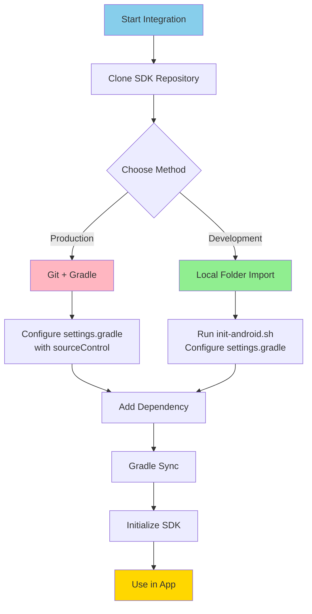
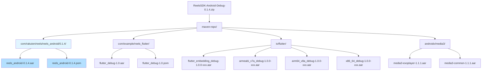

# 🤖 Android Integration Guide

> [!info] Complete Android Integration
> Step-by-step guide to integrate Reels SDK into your Android application using Kotlin

## Prerequisites

Before integrating the Reels SDK, ensure you have:

| Requirement | Version | Purpose |
|-------------|---------|---------|
| **Android SDK** | 21+ | Min platform (Android 5.0) |
| **Target SDK** | 35 | Latest Android |
| **Kotlin** | 1.9+ | Programming language |
| **Gradle** | 8.0+ | Build tool |
| **Android Studio** | Latest | Development environment |
| **Flutter SDK** | 3.35.6 | Build-time requirement (CI/CD version) |
| **JDK** | 17 | Build requirement |

## Integration Overview



## Integration Methods

### Method 1: Local Folder Import (Recommended for Development)

This method is **recommended** for active development as it provides immediate access to SDK changes and faster builds.

#### Step 1: Clone the SDK

```bash
# Navigate to your workspace
cd ~/Workspace

# Clone the SDK repository
git clone https://gitpub.rakuten-it.com/scm/~ahmed.eishon/reels-sdk.git

# Navigate into the SDK
cd reels-sdk
```

#### Step 2: Run Initialization Script

```bash
# Run the Android initialization script
./scripts/init-android.sh /path/to/reels-sdk

# Example:
./scripts/init-android.sh ~/Workspace/reels-sdk
```

**What the script does:**
- ✅ Verifies Flutter installation
- ✅ Runs `flutter pub get` to generate `.android` platform files
- ✅ Checks that all required files are present
- ✅ Provides step-by-step integration instructions

#### Step 3: Update settings.gradle

Add the following to your `settings.gradle`:

```gradle
rootProject.name = 'YourApp'
include ':app'

// ===== Reels SDK - Local Folder Import =====

// Include reels_android module
include ':reels_android'
project(':reels_android').projectDir = new File('/absolute/path/to/reels-sdk/reels_android')

// Include Flutter module from reels-sdk
setBinding(new Binding([gradle: this]))
evaluate(new File(
    '/absolute/path/to/reels-sdk/reels_flutter/.android/include_flutter.groovy'
))

// ============================================
```

> [!warning] Important
> - Use **absolute paths** for both `reels_android` and `reels_flutter`
> - Ensure the `.android` directory exists in `reels_flutter` (created by `flutter pub get`)

#### Step 4: Add Dependency in app/build.gradle

```gradle
dependencies {
    // Your existing dependencies...

    // Reels SDK
    implementation project(':reels_android')
}
```

#### Step 5: Sync Gradle

```bash
cd /path/to/your-android-app
./gradlew clean build
```

Or in Android Studio: **File → Sync Project with Gradle Files**

#### Step 6: Build and Run

Build your project in Android Studio. The SDK should compile successfully.

**Advantages of Local Folder Import:**
- ✅ No Git authentication issues
- ✅ Immediate access to SDK updates
- ✅ Faster build times
- ✅ Easy debugging and code navigation
- ✅ Works in corporate environments with firewall restrictions
- ✅ Simpler setup for active development

### Method 2: Git + Gradle (Recommended for Production)

This method is recommended for **production builds** and CI/CD pipelines.

#### Step 1: Configure Git Repository in settings.gradle

Add to your `settings.gradle`:

```gradle
rootProject.name = 'YourApp'
include ':app'

// Configure source control for Reels SDK
sourceControl {
    gitRepository(uri("https://gitpub.rakuten-it.com/scm/~ahmed.eishon/reels-sdk.git")) {
        producesModule("com.rakuten.room:reels-sdk")
    }
}
```

#### Step 2: Add Dependency in app/build.gradle

```gradle
dependencies {
    // Reels SDK via Git
    implementation 'com.rakuten.room:reels-sdk:1.0.0'
}
```

#### Step 3: Sync Gradle

```bash
./gradlew clean build
```

#### Step 4: Update to New Versions

```gradle
// In app/build.gradle, update version
implementation 'com.rakuten.room:reels-sdk:1.1.0'
```

```bash
# Sync project
./gradlew clean build
```

**Advantages of Git + Gradle:**
- ✅ Version control via Git tags
- ✅ Easy updates with version number
- ✅ CI/CD friendly
- ✅ Standard Gradle workflow

**Disadvantages:**
- ⚠️ Requires Git authentication
- ⚠️ May have issues in corporate environments
- ⚠️ Slower build times

### Method 3: Maven Repository Integration (Recommended for Released Versions)

This method is **recommended for production use** with stable releases. The SDK is distributed as a complete Maven repository with proper dependency management, allowing Gradle to automatically resolve all transitive dependencies.

#### Maven Repository Structure



#### Step 1: Download Released Maven Package

Download the Maven repository package from the GitHub Releases page:

```bash
# Navigate to your project directory
cd /path/to/your-android-app

# Download the release (replace VERSION with actual version, e.g., 0.1.4)
VERSION="0.1.4"

# For Debug builds (development/testing)
curl -L -o ReelsSDK-Android-Debug-${VERSION}.zip \
  "https://github.com/ahmed-eishon/Reels-SDK/releases/download/v${VERSION}-android-debug/ReelsSDK-Android-Debug-${VERSION}.zip"

# OR for Release builds (production)
curl -L -o ReelsSDK-Android-${VERSION}.zip \
  "https://github.com/ahmed-eishon/Reels-SDK/releases/download/v${VERSION}-android/ReelsSDK-Android-${VERSION}.zip"

# Extract the downloaded package to your project's parent directory
unzip ReelsSDK-Android-Debug-${VERSION}.zip -d ..
# or
# unzip ReelsSDK-Android-${VERSION}.zip -d ..
```

> [!tip] Latest Release (v0.1.4)
> The v0.1.4 release includes:
> - ✅ Multimodal navigation support (nested native/Flutter screens)
> - ✅ Root listener pattern for complex navigation flows
> - ✅ Generation-based state management
> - ✅ Profile navigation fixes
>
> **Download links:**
> - Debug: https://github.com/ahmed-eishon/Reels-SDK/releases/download/v0.1.4-android-debug/ReelsSDK-Android-Debug-0.1.4.zip
> - Release: https://github.com/ahmed-eishon/Reels-SDK/releases/download/v0.1.4-android/ReelsSDK-Android-0.1.4.zip

**What's included in the package:**
- `maven-repo/` - Complete Maven repository with:
  - `com.rakuten.reels:reels_android` - Native Android API (main SDK interface) with correct groupId structure
  - `com.example.reels_flutter:flutter_debug` or `flutter_release` - Flutter module
  - `io.flutter:flutter_embedding_*` - Flutter engine artifacts
  - `io.flutter:armeabi_v7a_*`, `arm64_v8a_*`, `x86_64_*` - Architecture-specific Flutter engines
  - `androidx.media3:*` - Media player dependencies
  - All transitive dependencies with proper POM files
- `README.md` - Integration instructions
- `.sha256` - Checksum file for verification

> [!important] Maven GroupId Structure
> The SDK uses `com.rakuten.reels:reels_android` as the Maven coordinate. This corresponds to the directory structure `com/rakuten/reels/reels_android/` in the Maven repository. The groupId includes the full package path to avoid conflicts and follow Maven best practices.

#### Step 2: Verify Checksums (Optional but Recommended)

```bash
# Verify package integrity
shasum -a 256 -c ReelsSDK-Android-Debug-${VERSION}.zip.sha256
# or
# shasum -a 256 -c ReelsSDK-Android-${VERSION}.zip.sha256
```

#### Step 3: Configure Maven Repository

Add the local Maven repository to your project. You can add it in either `settings.gradle` (recommended) or project-level `build.gradle`:

**Option A: settings.gradle (Recommended for Gradle 7.0+)**

```gradle
// settings.gradle
dependencyResolutionManagement {
    repositoriesMode.set(RepositoriesMode.FAIL_ON_PROJECT_REPOS)
    repositories {
        google()
        mavenCentral()

        // ReelsSDK local Maven repository
        maven {
            url = uri("file://${rootProject.projectDir}/../ReelsSDK-Android-Debug-0.1.4/maven-repo")
        }

        // Flutter engine repository (required for Flutter dependencies)
        maven {
            url = uri("https://storage.googleapis.com/download.flutter.io")
        }
    }
}

rootProject.name = 'YourApp'
include ':app'
```

**Option B: build.gradle (Project level) for older Gradle versions**

```gradle
// build.gradle (Project)
allprojects {
    repositories {
        google()
        mavenCentral()

        // ReelsSDK local Maven repository
        maven {
            url "file://${rootProject.projectDir}/../ReelsSDK-Android-Debug-0.1.4/maven-repo"
        }

        // Flutter engine repository (required for Flutter dependencies)
        maven {
            url "https://storage.googleapis.com/download.flutter.io"
        }
    }
}
```

> [!tip] Repository Path
> - Adjust the path based on where you extracted the SDK package
> - The path should point to the `maven-repo` directory inside the extracted package
> - Use `file://` protocol for local filesystem paths
> - Use relative paths (`../`) for portability across different machines

#### Step 4: Add SDK Dependency

Add the ReelsSDK dependency to your `app/build.gradle`:

```gradle
// app/build.gradle
android {
    compileSdk 35

    defaultConfig {
        minSdk 21
        targetSdk 35
        // ... other config
    }
}

dependencies {
    // ReelsSDK - Native Android API
    // This single dependency brings in all required Flutter and native dependencies transitively
    debugImplementation 'com.rakuten.reels:reels_android:0.1.4'

    // OR for Release builds
    // releaseImplementation 'com.rakuten.reels:reels_android:0.1.4'
}
```

> [!tip] Transitive Dependencies
> - You only need to declare `com.rakuten.reels:reels_android` as a dependency
> - Gradle automatically resolves all Flutter dependencies, engine artifacts, and media player libraries through the POM file
> - No need to manually add Flutter or Media3 dependencies

#### Step 5: Clean Settings.gradle (If Migrating)

If you were previously using local folder import or Git + Gradle, remove those configurations:

```gradle
// settings.gradle - Remove these lines if present:

// OLD: Local folder import
// include ':reels_android'
// project(':reels_android').projectDir = new File('/path/to/reels-sdk/reels_android')
// evaluate(new File('/path/to/reels-sdk/reels_flutter/.android/include_flutter.groovy'))

// OLD: Git + Gradle
// sourceControl {
//     gitRepository(uri("...")) {
//         producesModule("com.rakuten.room:reels-sdk")
//     }
// }
```

#### Step 6: Sync and Build

```bash
# Clean and rebuild
./gradlew clean
./gradlew build

# Or run from Android Studio
# File → Sync Project with Gradle Files
# Build → Clean Project
# Build → Rebuild Project
```

#### Step 7: Verify Installation

Check that the SDK and its dependencies are properly resolved:

```bash
# List dependencies
./gradlew app:dependencies --configuration debugCompileClasspath | grep -A 20 "reels_android"

# Should show dependency tree like:
# debugImplementation - com.rakuten.reels:reels_android:0.1.4
# +--- com.example.reels_flutter:flutter_debug:1.0
# +--- io.flutter:flutter_embedding_debug:1.0.0-xxx
# +--- io.flutter:arm64_v8a_debug:1.0.0-xxx
# +--- androidx.media3:media3-exoplayer:1.1.1
# \--- ... (other transitive dependencies)
```

#### Maven Integration Precautions

Based on production deployment experience, here are critical precautions to avoid common Maven integration issues:

> [!warning] GroupId Structure Must Match Directory Structure
> **Critical**: Maven groupId must match the actual directory structure in the repository.
>
> **❌ Wrong Structure (causes "Could not find" errors):**
> ```
> POM declares: groupId = "com.rakuten.reels"
> But directory is: com/rakuten/reels_android/
> → Gradle looks for: com/rakuten/reels/reels_android/ (doesn't exist!)
> ```
>
> **✅ Correct Structure:**
> ```
> POM declares: groupId = "com.rakuten.reels"
> Directory is: com/rakuten/reels/reels_android/
> → Gradle finds: com/rakuten/reels/reels_android/0.1.4/reels_android-0.1.4.aar ✓
> ```
>
> **How we fixed this:**
> - Debug workflow uses `groupId = 'com.rakuten.reels'` (matching release workflow)
> - Directory structure is `com/rakuten/reels/reels_android/0.1.4/`
> - Maven coordinates: `com.rakuten.reels:reels_android:0.1.4`

> [!warning] Shell Copy Commands and Trailing Slashes
> **Critical**: When copying Maven directories, trailing slashes affect behavior.
>
> **❌ Wrong (flattens structure):**
> ```bash
> # If com/rakuten/ already exists, this copies CONTENTS of reels/ into com/rakuten/
> cp -r ~/.m2/repository/com/rakuten/reels "$PACKAGE_DIR/maven-repo/com/rakuten/"
> #                                                                              ^ trailing slash!
> # Result: com/rakuten/reels_android/ (missing reels directory level!)
> ```
>
> **✅ Correct (preserves structure):**
> ```bash
> # This copies the reels/ DIRECTORY itself into com/rakuten/
> cp -r ~/.m2/repository/com/rakuten/reels "$PACKAGE_DIR/maven-repo/com/rakuten"
> #                                                                              ^ no trailing slash
> # Result: com/rakuten/reels/reels_android/ (correct structure!)
> ```
>
> **Lesson learned**: Always remove trailing slashes when copying directories to preserve structure.

> [!tip] Verify Maven Structure Before Release
> Always verify the Maven directory structure matches the POM groupId before publishing:
>
> ```bash
> # After building, verify structure:
> find ~/.m2/repository/com/rakuten/reels -name "*.aar" -o -name "*.pom"
>
> # Should show:
> # ~/.m2/repository/com/rakuten/reels/reels_android/0.1.4/reels_android-0.1.4.aar
> # ~/.m2/repository/com/rakuten/reels/reels_android/0.1.4/reels_android-0.1.4.pom
>
> # Verify in package:
> unzip -l ReelsSDK-Android-Debug-0.1.4.zip | grep "reels_android.*\.aar"
>
> # Should show:
> # ReelsSDK-Android-Debug-0.1.4/maven-repo/com/rakuten/reels/reels_android/0.1.4/reels_android-0.1.4.aar
> ```

> [!important] Alignment Between Debug and Release Workflows
> Debug and Release workflows must use identical groupId and artifactId:
>
> **In `build.gradle`:**
> ```gradle
> publishing {
>     publications {
>         release(MavenPublication) {
>             groupId = 'com.rakuten.reels'  // Must match
>             artifactId = 'reels_android'
>         }
>
>         debug(MavenPublication) {
>             groupId = 'com.rakuten.reels'  // Same as release!
>             artifactId = 'reels_android'
>         }
>     }
> }
> ```
>
> This ensures consumers can easily switch between debug and release versions by changing only the variant.

**Advantages of Maven Integration:**
- ✅ No Git authentication required
- ✅ Automatic dependency resolution via Gradle
- ✅ Transitive dependency management (no manual dependency tracking)
- ✅ Faster build times (pre-compiled AARs)
- ✅ Stable versioned releases
- ✅ No SDK source code needed
- ✅ Works in air-gapped/corporate environments
- ✅ Standard Maven repository structure
- ✅ Easy version upgrades (change version number only)

**Disadvantages:**
- ⚠️ Manual download and extraction required
- ⚠️ Cannot debug into SDK source code
- ⚠️ Need to re-download for updates
- ⚠️ Larger initial download size (includes all dependencies)

**When to use Maven Integration:**
- ✅ Production apps using stable releases
- ✅ Corporate environments with restricted Git access
- ✅ CI/CD pipelines with artifact caching
- ✅ Teams not actively developing the SDK
- ✅ Projects that need reproducible builds with locked versions

## SDK Usage

### Step 1: Import the SDK

```kotlin
import com.rakuten.room.reels.ReelsModule
import com.rakuten.room.reels.flutter.ReelsListener
import com.rakuten.room.reels.pigeon.ShareData
```

### Step 2: Initialize the SDK

Initialize the SDK early in your app lifecycle (in `Application` class or main `Activity`):

#### Option A: In Application Class (Recommended)

```kotlin
import android.app.Application
import com.rakuten.room.reels.ReelsModule

class MyApplication : Application() {

    override fun onCreate() {
        super.onCreate()

        // Initialize Reels SDK with access token provider
        ReelsModule.initialize(
            context = this,
            accessTokenProvider = {
                // Return access token (can be synchronous or async)
                UserSession.instance.accessToken
            }
        )
    }
}
```

Don't forget to add your Application class to `AndroidManifest.xml`:

```xml
<application
    android:name=".MyApplication"
    android:icon="@mipmap/ic_launcher"
    android:label="@string/app_name"
    android:theme="@style/AppTheme">
    <!-- Your activities... -->
</application>
```

#### Option B: In Activity (Alternative)

```kotlin
import androidx.appcompat.app.AppCompatActivity
import android.os.Bundle
import com.rakuten.room.reels.ReelsModule

class MainActivity : AppCompatActivity() {

    override fun onCreate(savedInstanceState: Bundle?) {
        super.onCreate(savedInstanceState)
        setContentView(R.layout.activity_main)

        // Initialize SDK
        ReelsModule.initialize(
            context = applicationContext,
            accessTokenProvider = {
                UserSession.instance.accessToken
            }
        )
    }
}
```

### Step 3: Set Event Listener

Implement the `ReelsListener` interface to receive callbacks:

```kotlin
import com.rakuten.room.reels.ReelsModule
import com.rakuten.room.reels.flutter.ReelsListener
import com.rakuten.room.reels.pigeon.ShareData
import android.content.Intent
import android.util.Log

class MainActivity : AppCompatActivity(), ReelsListener {

    override fun onCreate(savedInstanceState: Bundle?) {
        super.onCreate(savedInstanceState)
        setContentView(R.layout.activity_main)

        // Set listener to receive SDK events
        ReelsModule.setListener(this)
    }

    // MARK: - ReelsListener Implementation

    override fun onLikeButtonClick(videoId: String, isLiked: Boolean, likeCount: Long) {
        Log.d("Reels", "Video $videoId liked: $isLiked, count: $likeCount")

        // Update your backend
        VideoAPI.updateLike(videoId, isLiked) { result ->
            when (result) {
                is Result.Success -> Log.d("Reels", "Like updated successfully")
                is Result.Error -> Log.e("Reels", "Failed to update like: ${result.error}")
            }
        }
    }

    override fun onShareButtonClick(shareData: ShareData) {
        // Present native share dialog
        val shareIntent = Intent(Intent.ACTION_SEND).apply {
            type = "text/plain"
            putExtra(Intent.EXTRA_TEXT, "${shareData.title}\n${shareData.videoUrl}")
            putExtra(Intent.EXTRA_SUBJECT, shareData.title)
        }

        startActivity(Intent.createChooser(shareIntent, "Share Video"))
    }

    override fun onAnalyticsEvent(eventName: String, properties: Map<String, String>) {
        // Track with your analytics service
        Analytics.track(eventName, properties)

        Log.d("Reels", "Analytics event: $eventName, properties: $properties")
    }

    override fun onUserProfileClick(userId: String, userName: String) {
        // ✅ IMPORTANT: Use the userId parameter, NOT cached data
        // Navigate to the clicked user's profile
        openUserProfile(userId.toLong(), userName)

        Log.d("Reels", "User profile clicked: $userId ($userName)")
    }
}
```

### Step 4: Open Reels Screen

#### Option A: Full-Screen Activity (Recommended)

```kotlin
import com.rakuten.room.reels.ReelsModule

class MainActivity : AppCompatActivity(), ReelsListener {

    override fun onCreate(savedInstanceState: Bundle?) {
        super.onCreate(savedInstanceState)
        setContentView(R.layout.activity_main)

        ReelsModule.setListener(this)

        // Open reels button
        findViewById<Button>(R.id.openReelsButton).setOnClickListener {
            ReelsModule.openReels(
                context = this,
                itemId = null  // Optional: specific video ID
            )
        }

        // Open specific video
        findViewById<Button>(R.id.openVideoButton).setOnClickListener {
            ReelsModule.openReels(
                context = this,
                itemId = "video123"
            )
        }
    }

    // Implement ReelsListener methods...
}
```

#### Option B: Embedded Fragment

```kotlin
import com.rakuten.room.reels.ReelsModule

class MainActivity : AppCompatActivity(), ReelsListener {

    override fun onCreate(savedInstanceState: Bundle?) {
        super.onCreate(savedInstanceState)
        setContentView(R.layout.activity_main)

        ReelsModule.setListener(this)

        // Embed reels as a fragment
        val reelsFragment = ReelsModule.createReelsFragment(initialRoute = "/")

        supportFragmentManager
            .beginTransaction()
            .replace(R.id.fragmentContainer, reelsFragment)
            .commit()
    }

    // Implement ReelsListener methods...
}
```

**Layout for Fragment:**

```xml
<!-- activity_main.xml -->
<FrameLayout
    android:id="@+id/fragmentContainer"
    android:layout_width="match_parent"
    android:layout_height="match_parent" />
```

### Step 5: Cleanup (Optional)

Clean up resources when appropriate:

```kotlin
override fun onDestroy() {
    super.onDestroy()
    ReelsModule.cleanup()
}
```

## Common Integration Patterns

### Pattern 1: Simple Button Integration

```kotlin
class HomeActivity : AppCompatActivity(), ReelsListener {

    override fun onCreate(savedInstanceState: Bundle?) {
        super.onCreate(savedInstanceState)
        setContentView(R.layout.activity_home)

        ReelsModule.setListener(this)

        findViewById<Button>(R.id.watchReelsButton).setOnClickListener {
            ReelsModule.openReels(context = this)
        }
    }

    // Implement ReelsListener methods...
}
```

### Pattern 2: Menu Item Integration

```kotlin
class HomeActivity : AppCompatActivity(), ReelsListener {

    override fun onCreate(savedInstanceState: Bundle?) {
        super.onCreate(savedInstanceState)
        setContentView(R.layout.activity_home)

        ReelsModule.setListener(this)
    }

    override fun onCreateOptionsMenu(menu: Menu): Boolean {
        menuInflater.inflate(R.menu.home_menu, menu)
        return true
    }

    override fun onOptionsItemSelected(item: MenuItem): Boolean {
        return when (item.itemId) {
            R.id.action_reels -> {
                ReelsModule.openReels(context = this)
                true
            }
            else -> super.onOptionsItemSelected(item)
        }
    }

    // Implement ReelsListener methods...
}
```

### Pattern 3: Floating Action Button

```kotlin
class HomeActivity : AppCompatActivity(), ReelsListener {

    override fun onCreate(savedInstanceState: Bundle?) {
        super.onCreate(savedInstanceState)
        setContentView(R.layout.activity_home)

        ReelsModule.setListener(this)

        findViewById<FloatingActionButton>(R.id.fab_reels).setOnClickListener {
            ReelsModule.openReels(context = this)
        }
    }

    // Implement ReelsListener methods...
}
```

### Pattern 4: ViewPager/TabLayout Integration

```kotlin
class MainActivity : AppCompatActivity(), ReelsListener {

    override fun onCreate(savedInstanceState: Bundle?) {
        super.onCreate(savedInstanceState)
        setContentView(R.layout.activity_main)

        ReelsModule.setListener(this)

        setupViewPager()
    }

    private fun setupViewPager() {
        val viewPager = findViewById<ViewPager2>(R.id.viewPager)
        val adapter = MainPagerAdapter(this)

        // Add reels fragment as a tab
        adapter.addFragment(HomeFragment(), "Home")
        adapter.addFragment(ReelsModule.createReelsFragment(), "Reels")
        adapter.addFragment(ProfileFragment(), "Profile")

        viewPager.adapter = adapter
    }

    // Implement ReelsListener methods...
}
```

## Troubleshooting

### Issue 1: "Unresolved reference: ReelsModule"

**Solution:**
1. Ensure you added the dependency in `app/build.gradle`
2. Sync Gradle: File → Sync Project with Gradle Files
3. Clean and rebuild: Build → Clean Project → Rebuild Project

### Issue 2: "No signature of method: build_xxx.include_flutter()"

**Solution:**
1. Verify `.android` directory exists in `reels_flutter`
2. Run: `cd reels_flutter && flutter pub get`
3. Ensure `include_flutter.groovy` exists
4. Use correct path in `settings.gradle`

### Issue 3: Flutter engine crash on launch

**Solution:**
1. Ensure minSdkVersion is 21 or higher
2. Check that Flutter dependencies are resolved
3. Clean build: `./gradlew clean`
4. Invalidate caches: File → Invalidate Caches / Restart

### Issue 4: Git authentication issues

**Solution:**
- Use **Local Folder Import** method instead
- This avoids Git authentication entirely

### Issue 5: "Duplicate class" errors

**Solution:**
1. Ensure you're not including Flutter dependencies twice
2. Check that you only have one `:reels_android` include
3. Clean project: `./gradlew clean`

## Permissions

The SDK requires the following permissions (automatically added):

```xml
<!-- Already included in SDK's AndroidManifest.xml -->
<uses-permission android:name="android.permission.INTERNET" />
<uses-permission android:name="android.permission.ACCESS_NETWORK_STATE" />
```

If your app needs additional permissions (e.g., for camera, storage), add them to your app's `AndroidManifest.xml`.

## ProGuard / R8 Rules

If using ProGuard or R8, add these rules:

```proguard
# Flutter
-keep class io.flutter.** { *; }
-keep class io.flutter.app.** { *; }
-keep class io.flutter.plugin.**  { *; }
-keep class io.flutter.util.** { *; }
-keep class io.flutter.view.** { *; }
-keep class io.flutter.embedding.** { *; }

# Reels SDK
-keep class com.rakuten.room.reels.** { *; }
-keepclassmembers class com.rakuten.room.reels.** { *; }

# Pigeon
-keepattributes Signature
-keepattributes *Annotation*
```

## Profile Navigation Implementation

### Critical: Use Event Parameters, Not Cached Data

When implementing `onUserProfileClick()`, it's essential to use the `userId` and `userName` parameters from the event itself, **not** any cached data from your app.

#### ✅ Correct Implementation

```kotlin
override fun onUserProfileClick(userId: String, userName: String) {
    // ✅ Use the parameters from the event
    openUserProfile(userId.toLong(), userName)
}
```

#### ❌ Incorrect Implementation

```kotlin
override fun onUserProfileClick(userId: String, userName: String) {
    // ❌ DON'T use cached item/content data
    cachedItemData?.owner?.let {
        openUserProfile(it.id, it.name)  // WRONG!
    }
}
```

### Why This Matters

Consider this navigation flow:

1. User opens reels for content owned by **User A** (opens reels screen f1)
2. In f1, user sees a video created by **User B**
3. User clicks **User B's** profile button in the video
4. Expected: Opens **User B's** profile ✅
5. If using cached `itemData.owner`: Opens **User A's** profile ❌

**Root Cause**: Cached item/content data refers to the owner of the content that was initially selected to open the reels screen (User A), NOT the creator of the video whose profile button was clicked (User B).

**Solution**: Always use the `userId` parameter from `onUserProfileClick()` - it contains the correct user ID for the profile that was actually clicked.

### Complete Example

```kotlin
class MyFragment : Fragment(), ReelsListener {

    private var currentItemData: ItemModel? = null  // Cached item/content data

    fun openReelsForItem(item: ItemModel) {
        this.currentItemData = item  // Cache for other purposes

        // Register listener and open reels
        ReelsModule.setListener(this)
        ReelsModule.openReels(context = requireContext(), itemId = item.id)
    }

    // ✅ CORRECT: Use event parameters directly
    override fun onUserProfileClick(userId: String, userName: String) {
        // Use the userId from the event - this is the clicked user
        navigateToUserProfile(userId.toLong(), userName)
    }

    // ❌ INCORRECT: Don't use cached data
    // override fun onUserProfileClick(userId: String, userName: String) {
    //     // DON'T do this - uses cached item owner, not clicked user
    //     currentItemData?.owner?.let {
    //         navigateToUserProfile(it.id, it.name)
    //     }
    // }
}
```

### Testing Profile Navigation

Test these scenarios to ensure correct implementation:

1. **Single-level navigation**: Open reels for content → View video → Click profile button
   - Should open the video creator's profile, not the initial content owner's profile

2. **Multi-level navigation**: Open reels (User A) → Click profile button (User B) → Open reels → Click profile button (User C)
   - Each profile click should navigate to the correct user's profile

3. **Same user videos**: Open reels for User A's content → View User A's video → Click User A's profile
   - Should work correctly even when video creator matches the initial content owner

## Best Practices

### ✅ Do's

- ✅ Initialize SDK in `Application.onCreate()`
- ✅ Set listener before opening reels
- ✅ Use application context for initialization
- ✅ Implement all `ReelsListener` methods
- ✅ Use event parameters in `onUserProfileClick()`, not cached data
- ✅ Handle errors gracefully
- ✅ Test on real devices, not just emulators
- ✅ Test multi-level profile navigation flows
- ✅ Use local folder import for development
- ✅ Use Git + Gradle for production

### ❌ Don'ts

- ❌ Don't initialize multiple times
- ❌ Don't open reels without setting listener
- ❌ Don't use activity context for initialization
- ❌ Don't use cached item/content data in `onUserProfileClick()`
- ❌ Don't forget to handle lifecycle events
- ❌ Don't modify generated Pigeon code
- ❌ Don't include Flutter dependencies manually

## Version Updates

### Updating SDK (Local Folder)

```bash
# Navigate to SDK folder
cd /path/to/reels-sdk

# Pull latest changes
git pull origin master

# Checkout desired version
git checkout v1.1.0

# Sync Gradle in your Android project
cd /path/to/your-android-app
./gradlew clean build
```

### Updating SDK (Git + Gradle)

```gradle
// Update version in app/build.gradle
implementation 'com.rakuten.room:reels-sdk:1.1.0'
```

```bash
# Sync project
./gradlew clean build
```

## Build Configuration

### Minimum build.gradle Configuration

**app/build.gradle:**

```gradle
android {
    compileSdk 35

    defaultConfig {
        applicationId "com.yourcompany.yourapp"
        minSdk 21
        targetSdk 35
        versionCode 1
        versionName "1.0"
    }

    compileOptions {
        sourceCompatibility JavaVersion.VERSION_17
        targetCompatibility JavaVersion.VERSION_17
    }

    kotlinOptions {
        jvmTarget = "17"
    }
}

dependencies {
    implementation project(':reels_android')
    // or
    // implementation 'com.rakuten.room:reels-sdk:1.0.0'
}
```

## Next Steps

- [[08-Android-Usage-Examples|📖 Android Usage Examples]]
- [[../05-API/02-Android-API-Reference|📖 Android API Reference]]
- [[../03-Architecture/04-Android-Bridge|📖 Android Bridge Architecture]]

---

Back to [[../00-MOC-Reels-SDK|Main Hub]]

#android #integration #kotlin #gradle
