# Architecture Overview

This document provides a comprehensive overview of the Reels SDK architecture, design patterns, and key architectural decisions.

## High-Level Architecture

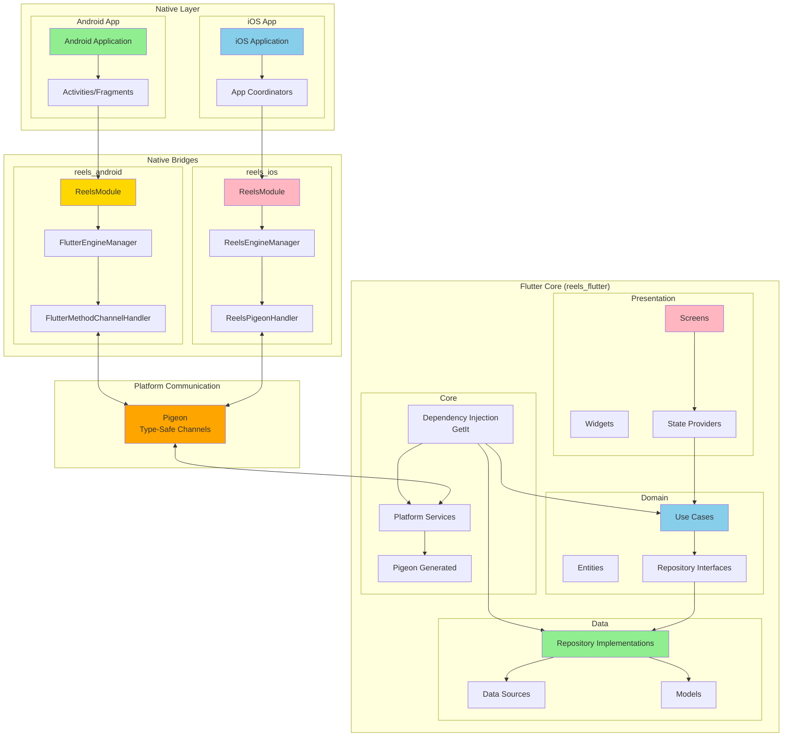

## Architectural Patterns

### 1. Clean Architecture

The Flutter core follows Clean Architecture principles with clear layer separation:

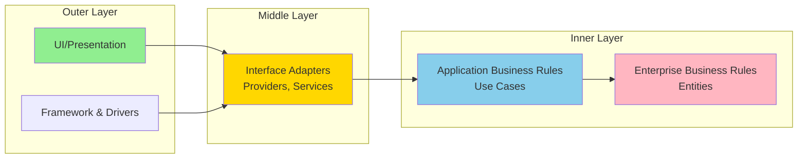

**Benefits:**
- Clear separation of concerns
- Testable business logic
- Independent of frameworks
- Database/UI agnostic

### 2. Add-to-App Pattern

Flutter's Add-to-App pattern enables integration into existing native apps:

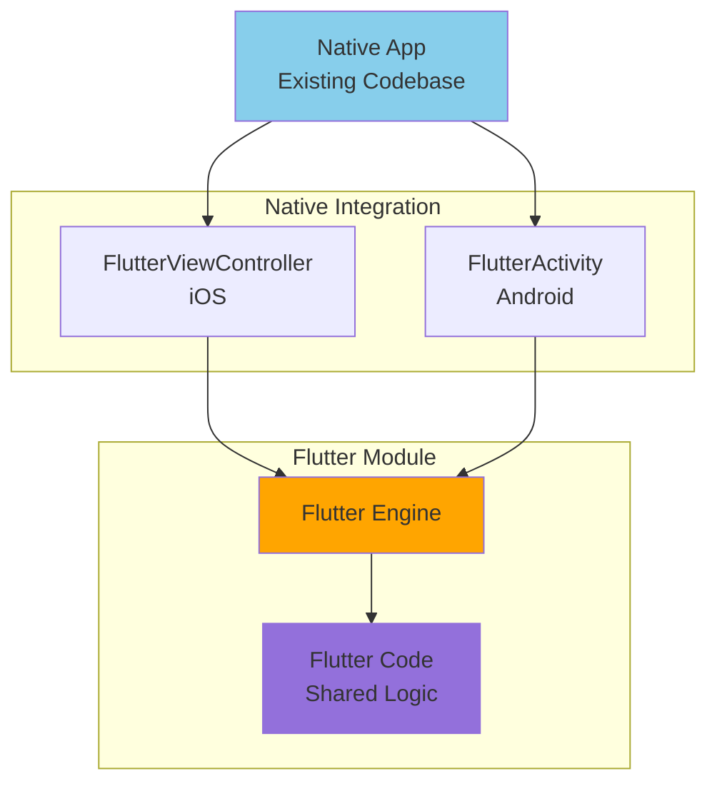

**Advantages:**
- Gradual migration
- Shared codebase across platforms
- Native performance
- Existing app integration

### 3. Coordinator Pattern (iOS)

iOS bridge uses the Coordinator pattern for navigation:

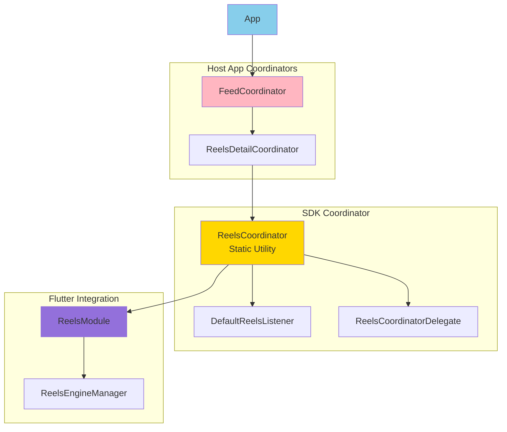

**Benefits:**
- Clean navigation flow
- Proper lifecycle management
- Follows iOS best practices
- Reusable navigation logic

### 4. Module Pattern (Android)

Android bridge uses a Singleton Module pattern:

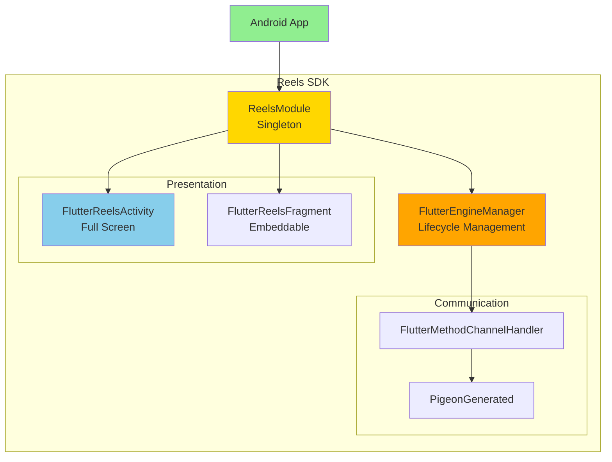

**Benefits:**
- Simple API surface
- Centralized state
- Easy initialization
- Multiple presentation options

## Data Flow

### Request Flow (Native → Flutter)

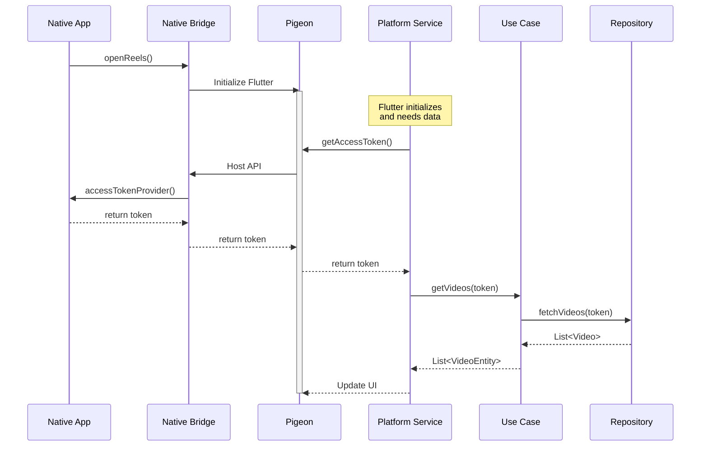

### Event Flow (Flutter → Native)

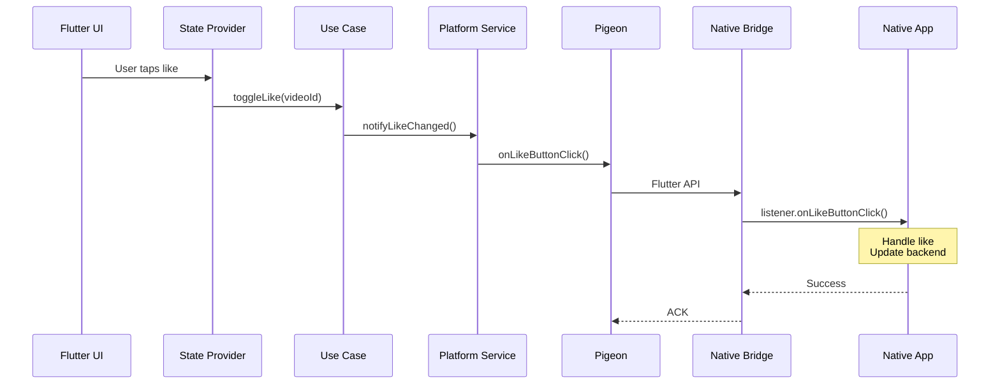

## Layer Responsibilities

### Presentation Layer

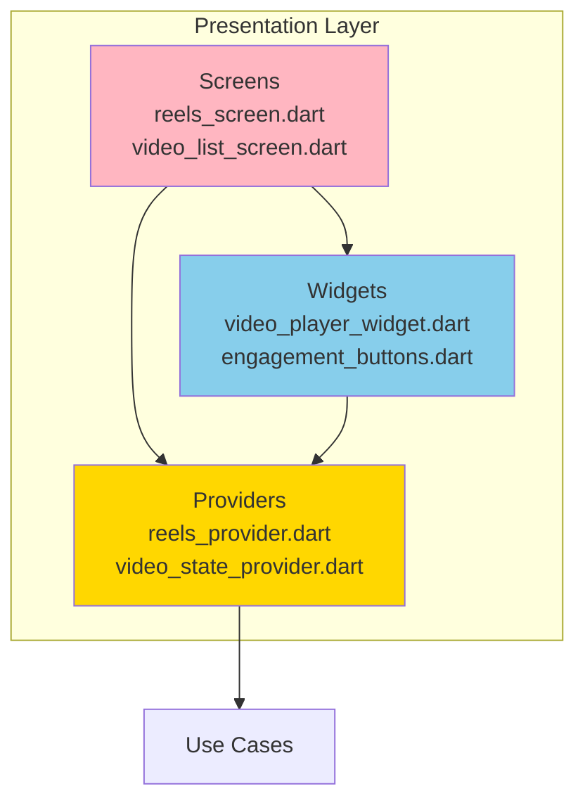

**Responsibilities:**
- Display UI
- Handle user input
- Manage UI state
- Trigger use cases
- No business logic

### Domain Layer

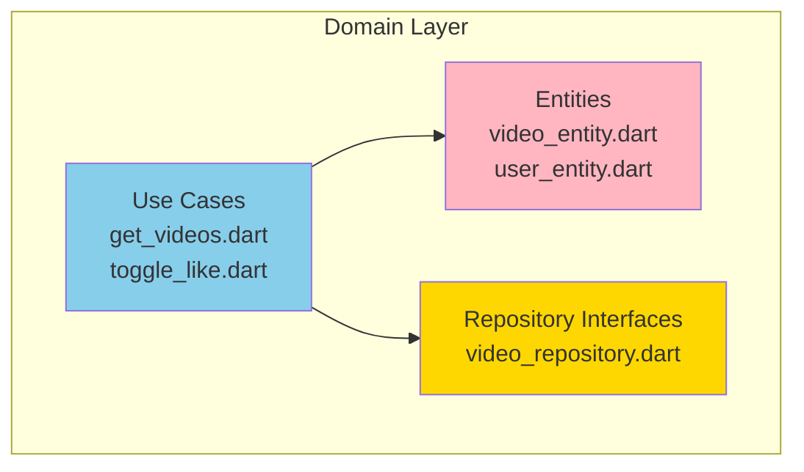

**Responsibilities:**
- Business logic
- Business entities
- Repository contracts
- Platform independent
- No framework dependencies

### Data Layer

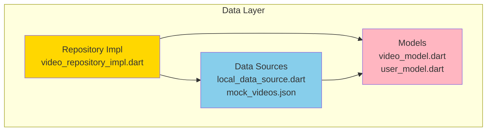

**Responsibilities:**
- Data retrieval
- Data transformation
- Repository implementation
- Data source abstraction
- Model mapping

### Core Layer

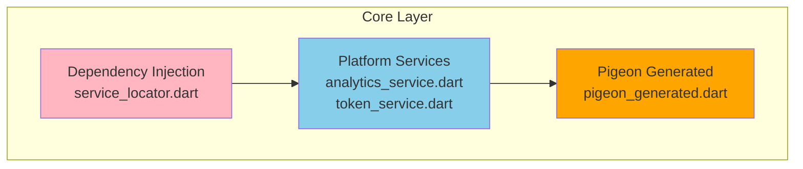

**Responsibilities:**
- Service registration
- Platform communication
- Cross-cutting concerns
- Framework integration

## State Management

### Provider Architecture

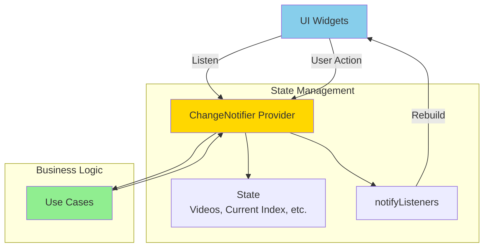

### Generation-Based State

See [Generation-Based State Management](./03-Generation-Based-State-Management.md) for details.

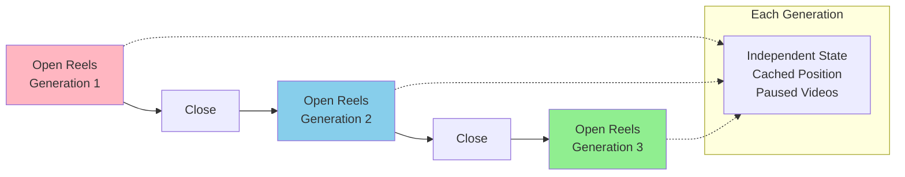

## Engine Lifecycle

See [Flutter Engine Lifecycle](./02-Flutter-Engine-Lifecycle.md) for details.

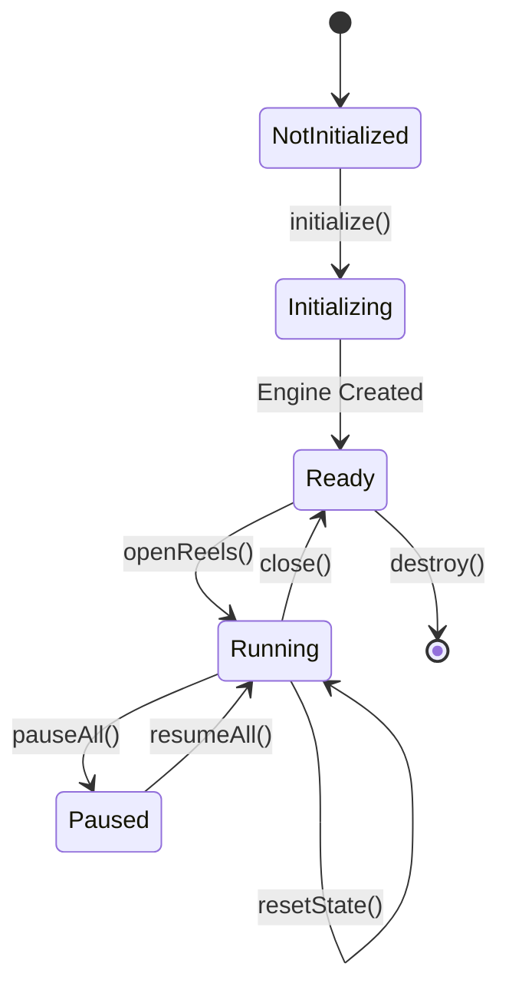

## Platform Communication

See [Platform Communication](./01-Platform-Communication.md) for details.

### Communication Types

```mermaid
graph TB
    subgraph "Host API (Flutter calls Native)"
        HOST1[getAccessToken]
        HOST2[getInitialCollect]
        HOST3[getCurrentGeneration]
        HOST4[isDebugMode]
    end

    subgraph "Flutter API (Native calls Flutter)"
        FLUTTER1[trackEvent]
        FLUTTER2[onLikeButtonClick]
        FLUTTER3[onShareButtonClick]
        FLUTTER4[onScreenStateChanged]
        FLUTTER5[onVideoStateChanged]
        FLUTTER6[onSwipeLeft/Right]
        FLUTTER7[onUserProfileClick]
        FLUTTER8[resetState/pauseAll/resumeAll]
    end

    PIGEON[Pigeon<br/>Code Generator]

    PIGEON -->|Generate| HOST1
    PIGEON -->|Generate| HOST2
    PIGEON -->|Generate| HOST3
    PIGEON -->|Generate| HOST4
    PIGEON -->|Generate| FLUTTER1
    PIGEON -->|Generate| FLUTTER2
    PIGEON -->|Generate| FLUTTER3
    PIGEON -->|Generate| FLUTTER4
    PIGEON -->|Generate| FLUTTER5
    PIGEON -->|Generate| FLUTTER6
    PIGEON -->|Generate| FLUTTER7
    PIGEON -->|Generate| FLUTTER8

    style PIGEON fill:#FFA500
    style HOST1 fill:#87CEEB
    style FLUTTER1 fill:#FFB6C1
```

## Key Architectural Decisions

### 1. Flutter Module (Not Plugin)

**Decision:** Use Flutter module, not Flutter plugin

**Rationale:**
- Full UI control
- Custom navigation
- Shared business logic
- Native wrapper flexibility

### 2. Pigeon for Platform Channels

**Decision:** Use Pigeon instead of MethodChannel directly

**Rationale:**
- Type safety
- Code generation
- Compile-time checks
- Better IDE support
- Reduced errors

### 3. Clean Architecture

**Decision:** Implement Clean Architecture in Flutter core

**Rationale:**
- Testability
- Maintainability
- Clear boundaries
- Platform independence
- Scalability

### 4. Separate Native Bridges

**Decision:** Maintain separate iOS and Android bridges

**Rationale:**
- Platform-specific patterns (Coordinator vs Module)
- Native performance
- Platform conventions
- Independent releases

### 5. Generation-Based State

**Decision:** Use generation IDs for state management

**Rationale:**
- Independent screen instances
- Resume capability
- Memory efficiency
- No state conflicts
- Clean lifecycle

## Architecture Diagrams

### Complete System Architecture

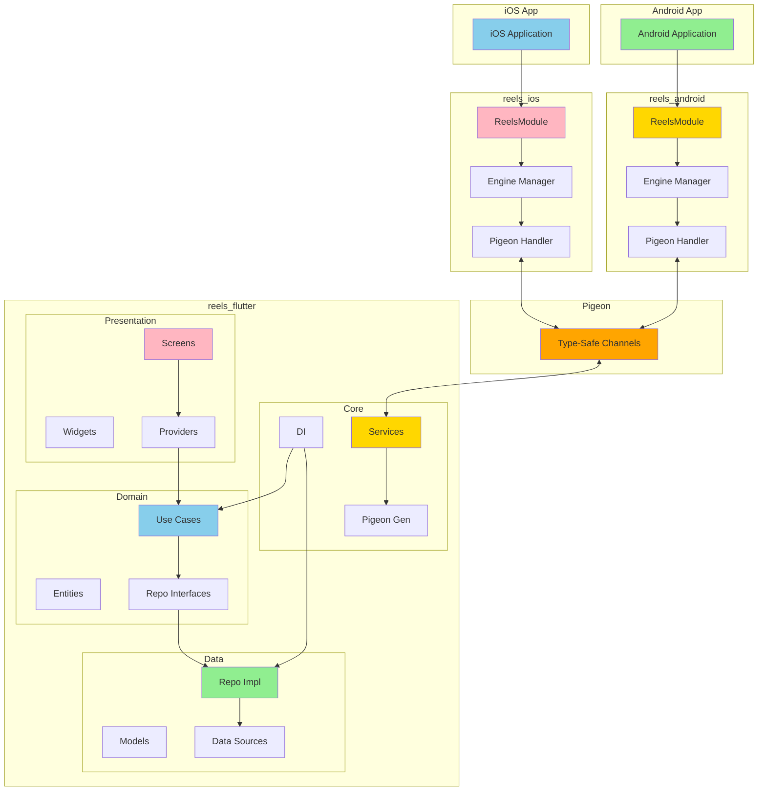

## Further Reading

- [Platform Communication](./01-Platform-Communication.md) - Detailed Pigeon API documentation
- [Flutter Engine Lifecycle](./02-Flutter-Engine-Lifecycle.md) - Engine management
- [Generation-Based State Management](./03-Generation-Based-State-Management.md) - State architecture
- [iOS Coordinator Pattern](./04-iOS-Coordinator-Pattern.md) - iOS integration patterns and coordinator architecture
- [Android Module Pattern](./05-Android-Module-Pattern.md) - Android integration patterns and multimodal navigation architecture
