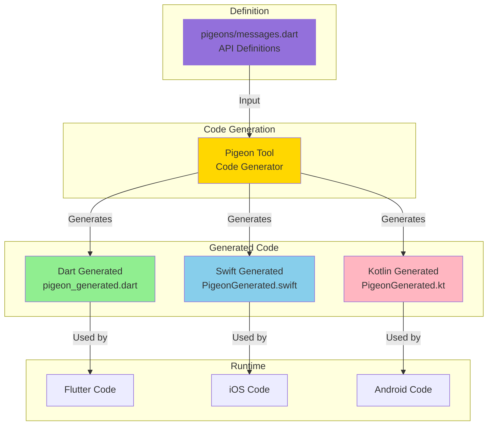
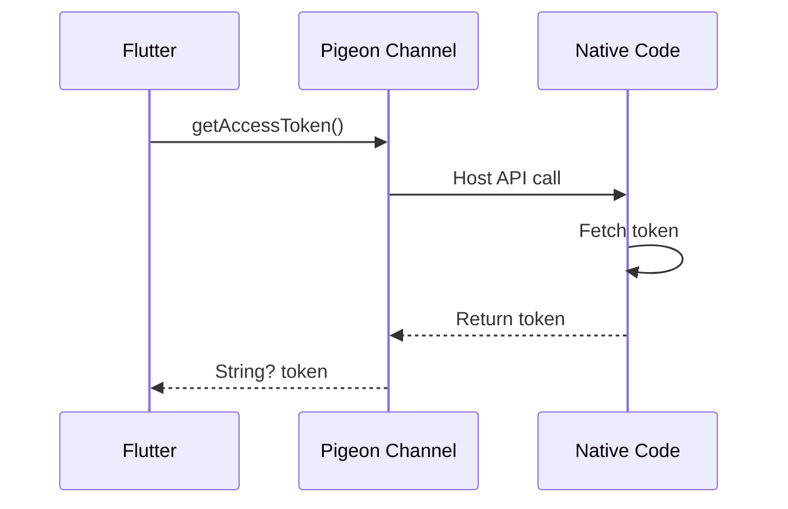
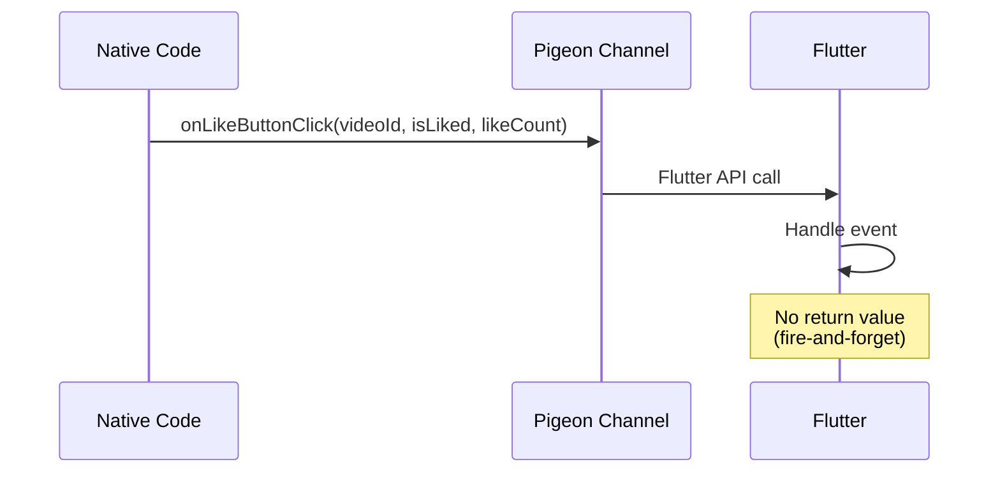
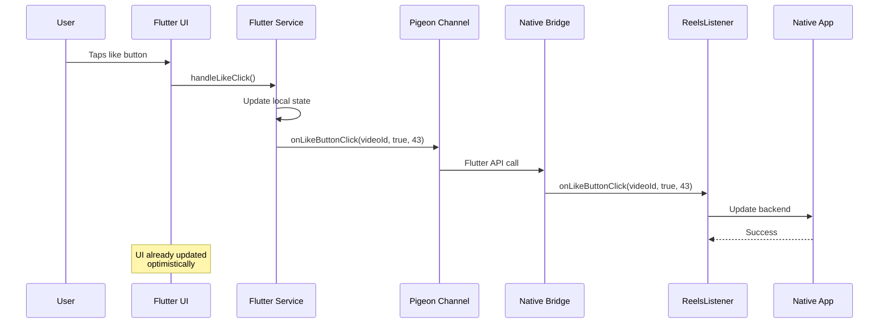

# 🔄 Platform Communication

> [!info] Type-Safe Platform Channels
> Understanding how Reels SDK uses Pigeon for type-safe communication between native platforms and Flutter

## Overview

The Reels SDK uses **[Pigeon](https://pub.dev/packages/pigeon)** to generate type-safe platform channel code for communication between native (iOS/Android) and Flutter. This eliminates runtime type errors and provides compile-time safety.

## Why Pigeon?

### Traditional Platform Channels (Manual)

```dart
// Manual, error-prone approach
const channel = MethodChannel('com.example/reels');

// Easy to make mistakes:
final result = await channel.invokeMethod('getAccessToken');
// What type is result? String? Map? null?
```

**Problems:**
- ❌ No type safety
- ❌ String-based method names (typo-prone)
- ❌ Runtime errors for type mismatches
- ❌ Manual serialization/deserialization
- ❌ No compile-time validation

### Pigeon Approach (Generated)

```dart
// Pigeon-generated, type-safe
abstract class ReelsHostApi {
  Future<String?> getAccessToken();
}

// Usage:
final token = await hostApi.getAccessToken();
// token is String? - fully typed!
```

**Benefits:**
- ✅ Full type safety
- ✅ Compile-time validation
- ✅ Auto-generated serialization
- ✅ No manual channel setup
- ✅ Clear API contracts

## Architecture Overview



## Communication Patterns

### Pattern 1: Host API (Flutter → Native)

Flutter calls native code to request data or perform actions.



**Example: Get Access Token**

**Definition** (`pigeons/messages.dart`):
```dart
@HostApi()
abstract class ReelsHostApi {
  @async
  String? getAccessToken();
}
```

**Flutter Usage:**
```dart
final hostApi = ReelsHostApi();
final token = await hostApi.getAccessToken();
print('Token: $token');
```

**iOS Implementation:**
```swift
class ReelsPigeonHandler: ReelsHostApi {
    func getAccessToken(completion: @escaping (Result<String?, Error>) -> Void) {
        // Call app's token provider
        accessTokenProvider { token in
            completion(.success(token))
        }
    }
}
```

**Android Implementation:**
```kotlin
class FlutterPigeonHandler : ReelsHostApi {
    override fun getAccessToken(result: ReelsHostApi.Result<String?>) {
        // Call app's token provider
        val token = accessTokenProvider?.invoke()
        result.success(token)
    }
}
```

### Pattern 2: Flutter API (Native → Flutter)

Native calls Flutter to send events or notifications.



**Example: Like Button Click**

**Definition** (`pigeons/messages.dart`):
```dart
@FlutterApi()
abstract class ReelsFlutterApi {
  void onLikeButtonClick(String videoId, bool isLiked, int likeCount);
}
```

**Flutter Implementation:**
```dart
class ReelsFlutterApiImpl extends ReelsFlutterApi {
  @override
  void onLikeButtonClick(String videoId, bool isLiked, int likeCount) {
    // Handle like event
    print('Video $videoId liked: $isLiked, count: $likeCount');

    // Update UI
    videoProvider.updateLikeStatus(videoId, isLiked, likeCount);
  }
}
```

**iOS Usage:**
```swift
// Get Flutter API
let flutterApi = ReelsFlutterApi(binaryMessenger: flutterViewController.binaryMessenger)

// Call Flutter
flutterApi.onLikeButtonClick(
    videoId: "video123",
    isLiked: true,
    likeCount: 42
) { error in
    if let error = error {
        print("Error: \(error)")
    }
}
```

**Android Usage:**
```kotlin
// Get Flutter API
val flutterApi = ReelsFlutterApi(flutterEngine.dartExecutor.binaryMessenger)

// Call Flutter
flutterApi.onLikeButtonClick("video123", true, 42L) { error ->
    error?.let { println("Error: $it") }
}
```

## Data Models

### CollectData Model

Used for passing collect/item context from native to Flutter.

**Definition:**
```dart
class CollectData {
  final String? collectId;
  final String? name;
  final String? content;
  final String? userId;
  final String? userName;
  final String? itemId;
  final String? itemUrl;
  final String? itemImageUrl;
  final String? itemName;
  final String? itemPrice;

  CollectData({
    this.collectId,
    this.name,
    this.content,
    this.userId,
    this.userName,
    this.itemId,
    this.itemUrl,
    this.itemImageUrl,
    this.itemName,
    this.itemPrice,
  });
}
```

**Generated Serialization:**
- Pigeon automatically generates encoding/decoding
- Binary format for efficiency
- Null-safe by default

### ShareData Model

Used for sharing video information.

**Definition:**
```dart
class ShareData {
  final String videoId;
  final String videoUrl;
  final String title;
  final String description;
  final String? thumbnailUrl;

  ShareData({
    required this.videoId,
    required this.videoUrl,
    required this.title,
    required this.description,
    this.thumbnailUrl,
  });
}
```

### AnalyticsEvent Model

Used for analytics tracking.

**Definition:**
```dart
class AnalyticsEvent {
  final String eventName;
  final Map<String, String> properties;

  AnalyticsEvent({
    required this.eventName,
    required this.properties,
  });
}
```

## Complete API Reference

### Host APIs (Flutter → Native)

| API | Method | Parameters | Return | Purpose |
|-----|--------|------------|--------|---------|
| **ReelsHostApi** | `getAccessToken()` | None | `String?` | Get user auth token |
| **ReelsContextApi** | `getInitialCollect()` | None | `CollectData?` | Get collect context (iOS) |

### Flutter APIs (Native → Flutter)

| API | Method | Parameters | Return | Purpose |
|-----|--------|------------|--------|---------|
| **ReelsFlutterApi** | `onLikeButtonClick()` | videoId, isLiked, likeCount | void | Like event |
| **ReelsFlutterApi** | `onShareButtonClick()` | shareData | void | Share event |
| **ReelsFlutterApi** | `onAnalyticsEvent()` | eventName, properties | void | Analytics event |
| **ReelsFlutterApi** | `onScreenStateChanged()` | screenState | void | Screen lifecycle |
| **ReelsFlutterApi** | `onVideoStateChanged()` | videoId, state | void | Video playback |
| **ReelsFlutterApi** | `onSwipeLeft()` | None | void | Navigation gesture |
| **ReelsFlutterApi** | `onSwipeRight()` | None | void | Navigation gesture |
| **ReelsFlutterApi** | `onUserProfileClick()` | userId | void | Profile navigation |

## Code Generation Workflow

### Step 1: Define APIs

Create or modify `reels_flutter/pigeons/messages.dart`:

```dart
import 'package:pigeon/pigeon.dart';

@ConfigurePigeon(PigeonOptions(
  dartOut: 'lib/core/pigeon_generated.dart',
  swiftOut: '../reels_ios/Sources/ReelsIOS/PigeonGenerated.swift',
  kotlinOut: '../reels_android/src/main/java/com/rakuten/room/reels/pigeon/PigeonGenerated.kt',
  kotlinOptions: KotlinOptions(package: 'com.eishon.reels.pigeon'),
))

// Data models
class CollectData {
  String? collectId;
  String? name;
  // ... other fields
}

// Host API (Flutter → Native)
@HostApi()
abstract class ReelsHostApi {
  @async
  String? getAccessToken();
}

// Flutter API (Native → Flutter)
@FlutterApi()
abstract class ReelsFlutterApi {
  void onLikeButtonClick(String videoId, bool isLiked, int likeCount);
}
```

### Step 2: Generate Code

```bash
cd reels_flutter
flutter pub run pigeon --input pigeons/messages.dart
```

### Step 3: Generated Files

**Output:**
- ✅ `lib/core/pigeon_generated.dart` - Flutter code
- ✅ `../reels_ios/Sources/ReelsIOS/PigeonGenerated.swift` - iOS code
- ✅ `../reels_android/.../PigeonGenerated.kt` - Android code

### Step 4: Implement Interfaces

**Flutter:**
```dart
// Implement Flutter API
class ReelsFlutterApiImpl extends ReelsFlutterApi {
  @override
  void onLikeButtonClick(String videoId, bool isLiked, int likeCount) {
    // Handle event
  }
}

// Set up
ReelsFlutterApi.setup(ReelsFlutterApiImpl());
```

**iOS:**
```swift
// Implement Host API
class Handler: ReelsHostApi {
    func getAccessToken(completion: @escaping (Result<String?, Error>) -> Void) {
        completion(.success("token"))
    }
}

// Set up
ReelsHostApiSetup.setUp(binaryMessenger: messenger, api: Handler())
```

**Android:**
```kotlin
// Implement Host API
class Handler : ReelsHostApi {
    override fun getAccessToken(result: ReelsHostApi.Result<String?>) {
        result.success("token")
    }
}

// Set up
ReelsHostApi.setUp(messenger, Handler())
```

## Communication Flow Example

### Complete Like Button Flow



## Best Practices

### ✅ Do's

1. **Use Pigeon for All Platform Communication**
   ```dart
   // Good: Use Pigeon
   await hostApi.getAccessToken();

   // Bad: Manual method channel
   await methodChannel.invokeMethod('getAccessToken');
   ```

2. **Define Clear Data Models**
   ```dart
   // Good: Structured model
   class ShareData {
     final String videoId;
     final String videoUrl;
     final String title;
   }

   // Bad: Generic map
   void share(Map<String, dynamic> data);
   ```

3. **Use Nullable Types Appropriately**
   ```dart
   // Good: Explicit nullability
   String? getAccessToken();

   // Bad: Non-null when it could be null
   String getAccessToken();
   ```

4. **Document APIs**
   ```dart
   /// Gets the current user's access token.
   /// Returns null if user is not logged in.
   @async
   String? getAccessToken();
   ```

### ❌ Don'ts

1. **Don't Modify Generated Code**
   - Generated code is overwritten on each run
   - Make changes in `messages.dart` instead

2. **Don't Mix Manual Channels**
   - Use Pigeon exclusively for consistency
   - Don't mix Pigeon with manual MethodChannel

3. **Don't Use Complex Nested Types**
   ```dart
   // Bad: Too complex
   Map<String, List<Map<String, dynamic>>> getData();

   // Good: Use data classes
   List<VideoData> getVideos();
   ```

## Error Handling

### Host API Errors (Flutter → Native)

```dart
try {
  final token = await hostApi.getAccessToken();
  if (token == null) {
    print('No token available');
  }
} catch (e) {
  print('Error getting token: $e');
}
```

### Flutter API Errors (Native → Flutter)

**iOS:**
```swift
flutterApi.onLikeButtonClick(videoId: id, isLiked: true, likeCount: 42) { error in
    if let error = error {
        print("Error calling Flutter: \(error)")
    }
}
```

**Android:**
```kotlin
flutterApi.onLikeButtonClick(id, true, 42L) { error ->
    error?.let { Log.e("Reels", "Error calling Flutter: $it") }
}
```

## Performance Considerations

### Serialization Overhead

- **Pigeon uses binary format** - More efficient than JSON
- **Direct field access** - No reflection overhead
- **Optimized for common types** - Strings, numbers, lists, maps

### Communication Cost

| Operation | Cost | Notes |
|-----------|------|-------|
| **Simple data (String, Int)** | ~0.1ms | Very fast |
| **Medium data (Object)** | ~0.5ms | Fast |
| **Large data (List of Objects)** | ~2ms | Still acceptable |
| **Very large data (>1MB)** | ~10ms+ | Consider chunking |

### Best Practices for Performance

1. **Batch Events When Possible**
   ```dart
   // Good: Send analytics in batches
   void sendAnalyticsBatch(List<AnalyticsEvent> events);

   // Less optimal: Send individually
   void sendAnalyticsEvent(AnalyticsEvent event);
   ```

2. **Use Primitives When Possible**
   ```dart
   // Better for performance
   void updateCount(int count);

   // vs. complex object
   void updateCount(CountData data);
   ```

## Debugging

### Enable Pigeon Logging

**Dart:**
```dart
// Add to main.dart
debugPrint('Pigeon call: getAccessToken()');
```

**iOS:**
```swift
print("Pigeon received: getAccessToken()")
```

**Android:**
```kotlin
Log.d("Pigeon", "Received: getAccessToken()")
```

### Common Issues

1. **"No implementation found"**
   - Ensure Host API is set up on native side
   - Check that `setUp()` was called

2. **Null pointer exceptions**
   - Verify nullable types match between definition and usage
   - Check that data is properly initialized

3. **Type mismatch errors**
   - Regenerate code after changing `messages.dart`
   - Ensure all platforms are using latest generated code

## Related Documentation

- [[02-Flutter-Module|Flutter Module Architecture]]
- [[03-iOS-Bridge|iOS Bridge Architecture]]
- [[04-Android-Bridge|Android Bridge Architecture]]
- [[../02-Integration/01-iOS-Integration-Guide|iOS Integration Guide]]
- [[../02-Integration/02-Android-Integration-Guide|Android Integration Guide]]

---

Back to [[../00-MOC-Reels-SDK|Main Hub]]

#architecture #pigeon #communication #platform-channels #type-safety
