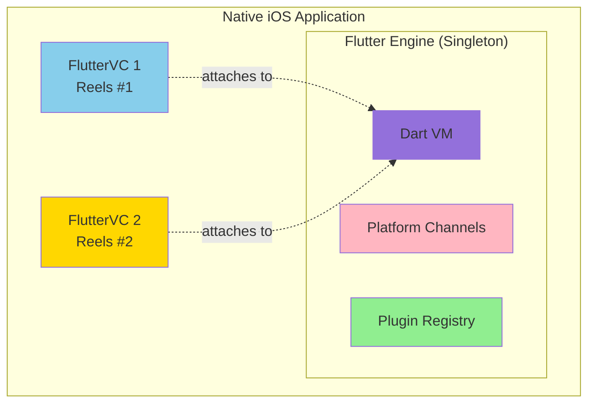
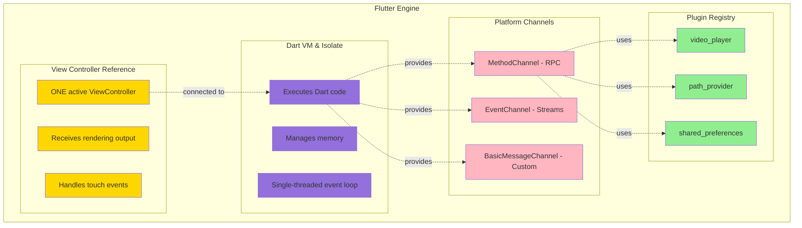
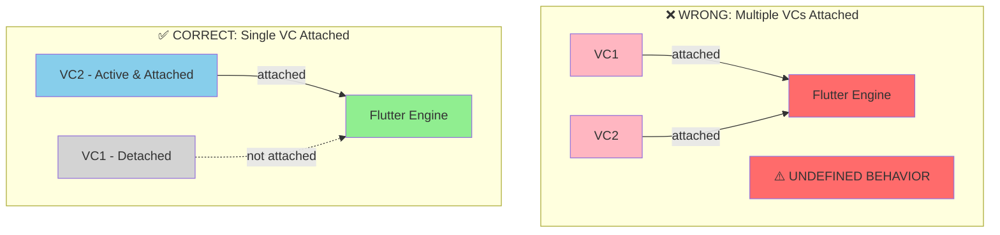
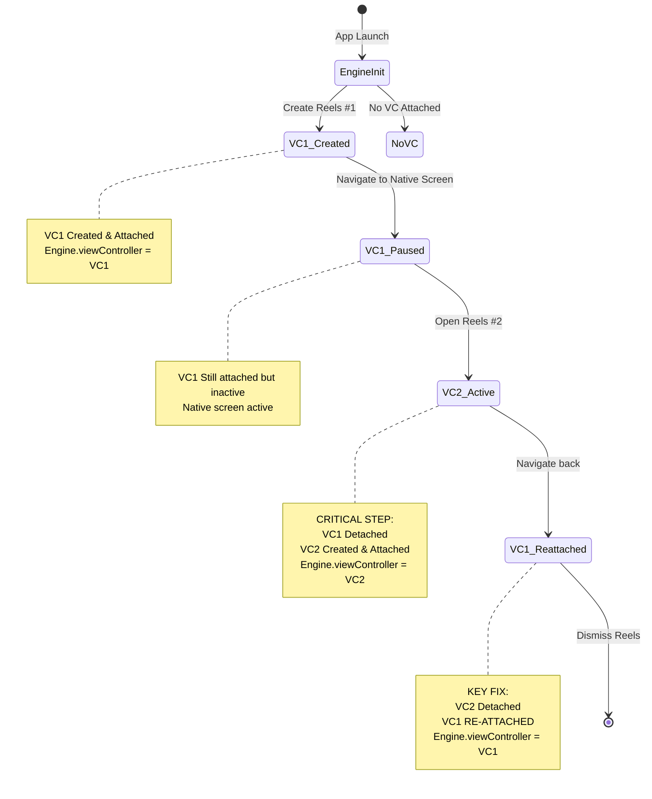
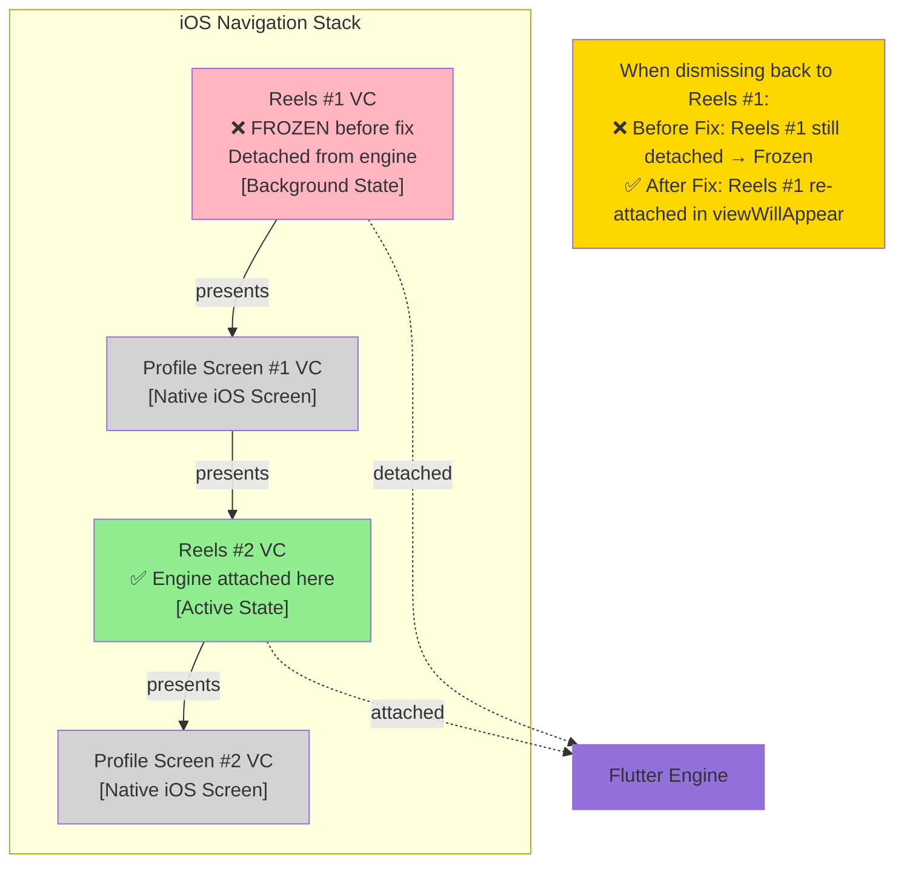

# Flutter Engine Lifecycle & Nested Modal Management

## Overview

This document provides an in-depth explanation of Flutter Add-to-App engine lifecycle management, specifically focusing on handling nested modal presentations in iOS. This knowledge is critical for both human developers and AI agents working with Flutter modules embedded in native iOS applications.

## Table of Contents

1. [Core Concepts](#core-concepts)
2. [Flutter Engine Architecture](#flutter-engine-architecture)
3. [Single Engine Pattern](#single-engine-pattern)
4. [View Controller Attachment](#view-controller-attachment)
5. [Lifecycle Management](#lifecycle-management)
6. [Nested Modal Challenges](#nested-modal-challenges)
7. [Implementation Details](#implementation-details)
8. [Troubleshooting Guide](#troubleshooting-guide)

---

## Core Concepts

### What is Flutter Add-to-App?

Flutter Add-to-App allows you to integrate Flutter modules into existing native iOS/Android applications. Unlike full Flutter apps, Add-to-App scenarios require careful management of engine lifecycle, view controller attachment, and platform channel communication.



### Key Terminology

- **Flutter Engine**: The runtime that executes Dart code and manages the Flutter framework
- **FlutterViewController**: iOS view controller that displays Flutter UI
- **View Attachment**: Process of connecting a FlutterViewController to the engine
- **Dart Isolate**: Isolated Dart execution context (one per engine)
- **Platform Channel**: Communication bridge between Flutter and native code
- **Modal Presentation**: iOS presentation style where views stack on top of each other

---

## Flutter Engine Architecture

### Engine Components



### Critical Constraint: Single Active View Controller

**The Flutter engine can only have ONE active view controller at a time.** This is a fundamental limitation that drives most lifecycle complexity in Add-to-App scenarios.



---

## Single Engine Pattern

### Why Single Engine?

Using a single persistent engine across multiple screen presentations provides:

1. **Fast Startup**: Engine initialization (~1-2 seconds) only happens once
2. **State Persistence**: Dart state survives across native navigation
3. **Memory Efficiency**: One Dart VM instead of multiple instances
4. **Plugin Sharing**: Plugins registered once and shared

### Engine Initialization

```swift
// ReelsEngineManager.swift
class ReelsEngineManager {
    static let shared = ReelsEngineManager()
    private var flutterEngine: FlutterEngine?

    func initializeFlutterEngine() {
        guard flutterEngine == nil else { return }

        // Create engine with unique name
        let engine = FlutterEngine(name: "reels_flutter_engine")

        // Start Dart VM and run main()
        engine.run(withEntrypoint: nil)

        // Setup Pigeon communication
        let handler = ReelsPigeonHandler(flutterEngine: engine)
        handler.setupPigeonApis()

        self.flutterEngine = engine
    }
}
```

**Lifecycle:**
```
App Launch
    ↓
[initializeFlutterEngine] called
    ↓
Create FlutterEngine instance
    ↓
Call engine.run() → Starts Dart VM
    ↓
Execute main() in Flutter app
    ↓
Engine ready for view controller attachment
    ↓
... (stays alive for app lifetime) ...
    ↓
App Termination → Engine destroyed
```

---

## View Controller Attachment

### Attachment Process

When presenting a Flutter screen, you must:

1. **Detach** any existing view controller from engine
2. **Create** new FlutterViewController with engine
3. **Attach** new view controller to engine (happens automatically)
4. **Reset** Flutter state for fresh screen

```swift
// ReelsEngineManager.swift
func createFlutterViewController() -> FlutterViewController {
    guard let engine = flutterEngine else {
        fatalError("Engine not initialized")
    }

    // STEP 1: Detach existing view controller
    if engine.viewController != nil {
        print("Detaching existing view controller")
        engine.viewController = nil
    }

    // STEP 2 & 3: Create and attach new view controller
    let viewController = FlutterViewController(
        engine: engine,
        nibName: nil,
        bundle: nil
    )
    // ^ Attachment happens automatically in init

    // STEP 4: Reset state for fresh presentation
    let lifecycleApi = ReelsFlutterLifecycleApi(
        binaryMessenger: engine.binaryMessenger
    )
    lifecycleApi.resetState { result in
        print("State reset complete")
    }

    return viewController
}
```

### Attachment State Diagram



---

## Lifecycle Management

### Three Lifecycle States

Our implementation manages three distinct lifecycle states:

```dart
// ReelsScreen State Management

1. PAUSED State
   - Screen not visible (navigated away)
   - Stop video playback
   - Dispose PageController
   - Release resources

2. ACTIVE State
   - Screen visible and interactive
   - Play videos
   - Handle user input
   - Track analytics

3. RESET State
   - Fresh screen presentation
   - Clear stale data
   - Reload content
   - Recreate UI components
```

### Lifecycle Callbacks

```dart
// Flutter Side - lifecycle_service.dart
class LifecycleService {
  VoidCallback? _onResetState;
  VoidCallback? _onPauseAll;
  VoidCallback? _onResumeAll;

  void setOnResetState(VoidCallback callback) {
    _onResetState = callback;
  }

  // Called by native via Pigeon
  void triggerResetState() {
    _onResetState?.call();
  }
}
```

```swift
// iOS Side - ReelsModule.swift
override func viewWillAppear(_ animated: Bool) {
    super.viewWillAppear(animated)

    // Re-attach if detached by nested modal
    if engine?.viewController !== flutterViewController {
        engine?.viewController = flutterViewController
    }

    // Resume resources when coming back
    if !isBeingPresented && hasBeenInitialized {
        ReelsModule.resumeFlutter()
    }
}

override func viewWillDisappear(_ animated: Bool) {
    super.viewWillDisappear(animated)

    // Pause when navigating away
    if !isBeingDismissed && !isMovingFromParent {
        ReelsModule.pauseFlutter()
    }
}
```

### Lifecycle Flow Diagram

```
┌──────────────────────────────────────────────────────┐
│          Complete Lifecycle Flow                     │
└──────────────────────────────────────────────────────┘

USER ACTION: Open Reels Screen
    │
    ↓
iOS: createFlutterViewController()
    │
    ├─→ Detach existing VC
    ├─→ Create new VC
    ├─→ Call resetState via Pigeon
    │
    ↓
Flutter: LifecycleService.triggerResetState()
    │
    ├─→ VideoProvider.reset()
    ├─→ Clear stale videos
    ├─→ Dispose PageController
    │
    ↓
Flutter: VideoProvider.loadVideos()
    │
    ├─→ Fetch collectData from native
    ├─→ Load videos from API
    ├─→ Create new PageController
    │
    ↓
iOS: viewDidAppear()
    │
    └─→ Mark hasBeenInitialized = true

═══════════════════════════════════════════════════════

USER ACTION: Navigate to MyRoom
    │
    ↓
iOS: viewWillDisappear()
    │
    └─→ Call pauseFlutter() via Pigeon
        │
        ↓
Flutter: LifecycleService.triggerPauseAll()
    │
    ├─→ Set _isScreenActive = false
    ├─→ Stop video playback
    ├─→ Dispose PageController
    └─→ Release video players

═══════════════════════════════════════════════════════

USER ACTION: Back to Reels
    │
    ↓
iOS: viewWillAppear()
    │
    ├─→ Re-attach VC to engine (if detached)
    └─→ Call resumeFlutter() via Pigeon
        │
        ↓
Flutter: LifecycleService.triggerResumeAll()
    │
    ├─→ Set _isScreenActive = true
    ├─→ Create new PageController
    ├─→ Increment _pageViewGeneration
    └─→ Resume video playback

═══════════════════════════════════════════════════════

USER ACTION: Dismiss Reels
    │
    ↓
Flutter: NavigationEventsService.dismissReels()
    │
    ↓
iOS: ReelsPigeonHandler.dismissReelsChannel
    │
    ├─→ Find current navigation controller
    │   (from engine.viewController.navigationController)
    ├─→ Dismiss modal presentation
    └─→ Call clearReferences()
```

---

## Nested Modal Challenges

### The Problem

When multiple Reels screens are stacked through nested modals, the Flutter engine must switch between view controllers. Without proper management, this causes:

1. **Frozen screens** - Detached view controllers show stale rendering
2. **Touch unresponsiveness** - Input events don't reach Flutter
3. **Video player crashes** - Multiple video instances accumulate
4. **Memory leaks** - Resources not properly released

### Nested Modal Scenario

```
USER FLOW:
Open Reels #1
   ↓
Swipe Left → Open User Profile Screen #1
   ↓
Tap User's Content → Open Reels #2
   ↓
Swipe Left → Open User Profile Screen #2
   ↓
Close User Profile Screen #2
   ↓
Close Reels #2
   ↓
Close User Profile Screen #1
   ↓
❌ BUG: Reels #1 is FROZEN (before fix)
✅ FIXED: Reels #1 works perfectly
```

### Visual Representation



### Root Cause Analysis

```
PROBLEM: View Controller Detachment

Timeline of Events:
═════════════════════════

T1: Reels #1 opens
    • VC1 created and attached to engine
    • Engine.viewController = VC1
    • Screen works perfectly

T2: Navigate to MyRoom #1
    • VC1.viewWillDisappear() called
    • pauseFlutter() stops video playback
    • VC1 still attached to engine (just paused)

T3: Open Reels #2 from MyRoom #1
    • createFlutterViewController() called
    • VC1 DETACHED: engine.viewController = nil
    • VC2 created and attached
    • Engine.viewController = VC2
    • ⚠️  VC1 is now orphaned!

T4: Navigate back to Reels #1
    • VC1.viewWillAppear() called
    • ❌ Before Fix: VC1 remains detached
         → Touch events don't reach Flutter
         → Rendering is stale
         → Screen appears frozen

    • ✅ After Fix: Re-attach VC1
         if engine.viewController !== flutterViewController {
             engine.viewController = flutterViewController
         }
         → Touch events work
         → Rendering updates
         → Screen fully functional
```

---

## Implementation Details

### Fix 1: View Controller Re-Attachment

**File**: `reels_ios/Sources/ReelsIOS/ReelsModule.swift`

```swift
override func viewWillAppear(_ animated: Bool) {
    super.viewWillAppear(animated)

    // Always hide navigation bar
    navigationController?.setNavigationBarHidden(true, animated: animated)

    // CRITICAL FIX FOR NESTED MODALS:
    // Re-attach this view controller to the engine if it was detached
    // This happens when another Reels modal was opened on top of this one
    let engine = ReelsEngineManager.shared.getEngine()
    if engine?.viewController !== flutterViewController {
        print("[ReelsSDK] Re-attaching view controller to engine")
        engine?.viewController = flutterViewController
    } else {
        print("[ReelsSDK] View controller already attached")
    }

    // Ensure Flutter view frame is correct
    flutterViewController.view.frame = view.bounds

    // Resume Flutter resources when navigating back
    // (but not on initial presentation)
    if isMovingToParent == false && isBeingPresented == false {
        if hasBeenInitialized {
            print("[ReelsSDK] Resuming Flutter resources")
            ReelsModule.resumeFlutter()
        } else {
            print("[ReelsSDK] Skipping resume - not yet initialized")
        }
    }
}
```

**Why This Works:**
- Checks if current VC is attached using identity operator `!==`
- Re-attaches if detached (happens in nested modal scenarios)
- Ensures Flutter rendering and touch events work correctly
- Called automatically by iOS when VC becomes visible

### Fix 2: Dynamic Navigation Controller Resolution

**File**: `reels_ios/Sources/ReelsIOS/ReelsPigeonHandler.swift`

```swift
dismissReelsChannel.setMessageHandler { [weak self] message, reply in
    print("[ReelsSDK] Received dismiss request")

    DispatchQueue.main.async {
        // CRITICAL FIX FOR NESTED MODALS:
        // Instead of using a shared static reference (becomes stale),
        // traverse from engine to find CURRENT navigation controller
        guard let strongSelf = self,
              let engine = strongSelf.flutterEngine,
              let flutterVC = engine.viewController,
              let navController = flutterVC.navigationController,
              let presentingVC = navController.presentingViewController else {
            print("[ReelsSDK] ⚠️  Cannot find components to dismiss")
            return
        }

        print("[ReelsSDK] ✅ Dismissing modal presentation...")
        presentingVC.dismiss(animated: true) {
            print("[ReelsSDK] ✅ Modal dismissed successfully")
            ReelsModule.clearReferences()
        }
    }

    reply(nil)
}
```

**Why This Works:**
- Traverses from `engine → viewController → navigationController`
- Always finds the CURRENT navigation controller
- Avoids stale references that point to already-dismissed VCs
- Works at any nesting level

### Fix 3: Stateless Screen Behavior

**File**: `reels_ios/Sources/ReelsIOS/ReelsEngineManager.swift`

```swift
func createFlutterViewController(initialRoute: String = "/") -> FlutterViewController {
    guard let engine = flutterEngine else {
        fatalError("Flutter engine not initialized")
    }

    // Detach any existing view controller from the engine
    if engine.viewController != nil {
        print("[ReelsSDK] Detaching existing view controller from engine")
        engine.viewController = nil
    }

    // Create view controller with the engine
    let viewController = FlutterViewController(
        engine: engine,
        nibName: nil,
        bundle: nil
    )

    // ALWAYS reset state for stateless behavior
    // Each screen presentation gets fresh data based on initial collectData
    print("[ReelsSDK] Triggering Flutter state reset")
    let lifecycleApi = ReelsFlutterLifecycleApi(binaryMessenger: engine.binaryMessenger)
    lifecycleApi.resetState { result in
        switch result {
        case .success:
            print("[ReelsSDK] ✅ State reset completed")
        case .failure(let error):
            print("[ReelsSDK] ❌ Error resetting state: \(error)")
        }
    }

    return viewController
}
```

**Why This Works:**
- Calls `resetState` on EVERY screen presentation
- Ensures fresh collectData is fetched each time
- Prevents stale data from previous presentations
- Makes screens independent and predictable

### Fix 4: Generation-Based Widget Keys

**File**: `reels_flutter/lib/presentation/screens/reels_screen.dart`

```dart
class _ReelsScreenState extends State<ReelsScreen> {
  int _pageViewGeneration = 0;  // Tracks PageController recreations

  // Increment generation when recreating PageController
  lifecycleService.setOnResetState(() {
    setState(() {
      _pageController?.dispose();
      _pageController = PageController();
      _pageViewGeneration++;  // Forces complete widget recreation
    });
  });

  @override
  Widget build(BuildContext context) {
    return PageView.builder(
      key: ValueKey('pageview_gen_$_pageViewGeneration'),  // Unique per generation
      controller: _pageController!,
      itemBuilder: (context, index) {
        return VideoReelItem(
          key: ValueKey('video_${video.id}_gen_$_pageViewGeneration'),  // Unique per generation
          video: video,
          isActive: index == _currentIndex && _isScreenActive,
        );
      },
    );
  }
}
```

**Why This Works:**
- Generation number changes on every PageController recreation
- Forces Flutter to dispose old widget tree completely
- Ensures video players are properly disposed before creating new ones
- Prevents video player accumulation and crashes
- Provides debug visibility into lifecycle state

---

## Troubleshooting Guide

### Common Issues & Solutions

#### Issue 1: Screen Freezes After Navigation

**Symptoms:**
- Screen appears but doesn't respond to touch
- UI shows old/stale content
- Console shows "View controller detached" warnings

**Diagnosis:**
```swift
// Check if VC is attached
if engine.viewController === myViewController {
    print("✅ VC is attached")
} else {
    print("❌ VC is detached - THIS IS THE PROBLEM")
}
```

**Solution:**
Add re-attachment logic in `viewWillAppear()`:
```swift
override func viewWillAppear(_ animated: Bool) {
    super.viewWillAppear(animated)

    let engine = ReelsEngineManager.shared.getEngine()
    if engine?.viewController !== flutterViewController {
        engine?.viewController = flutterViewController
    }
}
```

#### Issue 2: Dismiss Button Doesn't Work

**Symptoms:**
- Close button tap has no effect
- Console shows "Cannot find navigation controller"
- App appears stuck in Flutter screen

**Diagnosis:**
```swift
// Check navigation controller reference
print("Shared NC: \(ReelsModule.getFlutterNavigationController())")
print("Current NC: \(engine.viewController?.navigationController)")
// If these are different, dismiss will fail
```

**Solution:**
Traverse from engine to find current NC:
```swift
guard let engine = self.flutterEngine,
      let flutterVC = engine.viewController,
      let navController = flutterVC.navigationController else {
    print("Cannot find current navigation controller")
    return
}
navController.presentingViewController?.dismiss(animated: true)
```

#### Issue 3: Video Players Accumulate / Memory Leak

**Symptoms:**
- Memory usage increases with each screen open
- Console shows multiple "VideoPlayer CREATED" without "DISPOSED"
- App eventually crashes

**Diagnosis:**
```dart
// Add to VideoPlayerWidget
static int _instanceCount = 0;

@override
void initState() {
    super.initState();
    _instanceCount++;
    print('[VideoPlayer] CREATED - Total: $_instanceCount');
}

@override
void dispose() {
    _instanceCount--;
    print('[VideoPlayer] DISPOSED - Remaining: $_instanceCount');
    super.dispose();
}
```

**Solution:**
Use generation-based keys and proper disposal:
```dart
lifecycleService.setOnPauseAll(() {
  setState(() {
    _isScreenActive = false;
  });

  // CRITICAL: Dispose synchronously to prevent race conditions
  _pageController?.dispose();
  _pageController = null;
});
```

#### Issue 4: State Persists Between Opens

**Symptoms:**
- Old videos show when opening screen again
- Scroll position remembered from previous session
- Wrong collectData displayed

**Diagnosis:**
```dart
// Check if resetState is being called
print('[ReelsScreen] resetState called: ${wasResetCalled}');
```

**Solution:**
Always call resetState on screen presentation:
```swift
// iOS side
let lifecycleApi = ReelsFlutterLifecycleApi(binaryMessenger: engine.binaryMessenger)
lifecycleApi.resetState { result in
    // State will be fresh
}
```

```dart
// Flutter side
lifecycleService.setOnResetState(() {
  videoProvider.reset();  // Clear stale data
  videoProvider.loadVideos();  // Load fresh data
  _pageController?.dispose();
  _pageController = PageController();  // New controller
  _pageViewGeneration++;  // Increment generation
});
```

---

## Best Practices

### For Human Developers

1. **Always Re-attach on Appear**
   ```swift
   override func viewWillAppear(_ animated: Bool) {
       super.viewWillAppear(animated)
       if engine?.viewController !== flutterViewController {
           engine?.viewController = flutterViewController
       }
   }
   ```

2. **Use Identity Checks for Attachment**
   ```swift
   // ✅ CORRECT: Identity operator
   if engine?.viewController !== flutterViewController {
       // Re-attach needed
   }

   // ❌ WRONG: Equality operator
   if engine?.viewController != flutterViewController {
       // This checks value equality, not identity
   }
   ```

3. **Dispose Synchronously**
   ```dart
   lifecycleService.setOnPauseAll(() {
     _pageController?.dispose();  // Synchronous
     _pageController = null;
   });
   ```

4. **Use Generation Keys**
   ```dart
   PageView.builder(
     key: ValueKey('pageview_gen_$_pageViewGeneration'),
     // ...
   )
   ```

5. **Log Lifecycle Events**
   ```swift
   print("[ReelsSDK] viewWillAppear - isMovingToParent: \(isMovingToParent)")
   print("[ReelsSDK] viewWillAppear - isBeingPresented: \(isBeingPresented)")
   ```

### For AI Agents

When analyzing or modifying Flutter Add-to-App code:

1. **Check Engine Attachment State**
   - Look for `engine.viewController` references
   - Verify re-attachment in `viewWillAppear()`
   - Confirm identity checks use `===` not `==`

2. **Verify Lifecycle Callbacks**
   - Ensure `resetState`, `pauseAll`, `resumeAll` are implemented
   - Check callbacks are set up in `initState()`
   - Verify cleanup in `dispose()` (but not callback clearing)

3. **Trace Navigation Controller References**
   - Static/shared references become stale in nested scenarios
   - Always traverse from engine: `engine → viewController → navigationController`
   - Never cache navigation controllers

4. **Validate Resource Cleanup**
   - PageController disposed synchronously in `pauseAll`
   - Video players released before creating new ones
   - Generation counter incremented on recreation

5. **Test Nested Scenarios**
   - Test at least 3 levels deep: Reels → MyRoom → Reels
   - Verify dismiss works from any level
   - Check memory usage doesn't grow
   - Confirm no UI freezes when navigating back

---

## Testing Checklist

Use this checklist to verify lifecycle implementation:

- [ ] Single engine created and reused across presentations
- [ ] View controller re-attached in `viewWillAppear()`
- [ ] `resetState` called on every screen presentation
- [ ] `pauseAll` called when navigating away
- [ ] `resumeAll` called when returning to screen
- [ ] PageController disposed synchronously on pause
- [ ] Video players fully released before creating new ones
- [ ] Generation counter increments on PageController recreation
- [ ] Widget keys use generation number
- [ ] Dismiss traverses from engine to find current navigation controller
- [ ] No static/shared navigation controller references
- [ ] Logging shows correct lifecycle events
- [ ] Test: Open → Navigate → Return → Works
- [ ] Test: Open → Navigate → Open Again → Navigate → Return → Works
- [ ] Test: 5+ nested modals → All dismiss correctly
- [ ] Test: Memory usage stable across multiple open/close cycles
- [ ] Test: No video player accumulation (count matches expected)

---

## Appendix: Complete Lifecycle Sequence

This shows a complete trace of a nested modal scenario with all lifecycle events:

```
T=0: App Launch
   ↓
   [iOS] ReelsEngineManager.initializeFlutterEngine()
   [Flutter] main() executed
   [Flutter] App widget tree built

T=1: User taps "Open Reels"
   ↓
   [iOS] ReelsCoordinator.openReels()
   [iOS] ReelsEngineManager.createFlutterViewController()
   [iOS]   • engine.viewController = nil (no existing VC)
   [iOS]   • VC1 created
   [iOS]   • engine.viewController = VC1 (auto-attached)
   [iOS]   • lifecycleApi.resetState() called
   [Flutter] LifecycleService.triggerResetState()
   [Flutter]   • videoProvider.reset()
   [Flutter]   • videoProvider.loadVideos()
   [Flutter]   • _pageController = PageController()
   [Flutter]   • _pageViewGeneration = 1
   [iOS] VC1.viewDidAppear()
   [iOS]   • hasBeenInitialized = true
   [Flutter] Videos playing

T=2: User swipes left → Navigate to User Profile Screen #1
   ↓
   [iOS] VC1.viewWillDisappear(animated: true)
   [iOS]   • isBeingDismissed = false
   [iOS]   • isMovingFromParent = false
   [iOS]   • Call pauseFlutter()
   [Flutter] LifecycleService.triggerPauseAll()
   [Flutter]   • _isScreenActive = false
   [Flutter]   • Stop video playback
   [Flutter]   • _pageController.dispose()
   [Flutter]   • _pageController = null
   [iOS] ProfileVC presented
   [iOS] VC1 in background (still attached to engine)

T=3: User taps user's content → Open Reels #2
   ↓
   [iOS] ReelsCoordinator.openReels() (from Profile Screen)
   [iOS] ReelsEngineManager.createFlutterViewController()
   [iOS]   • engine.viewController = nil (detach VC1) ⚠️
   [iOS]   • VC2 created
   [iOS]   • engine.viewController = VC2 (attach VC2)
   [iOS]   • lifecycleApi.resetState() called
   [Flutter] LifecycleService.triggerResetState()
   [Flutter]   • videoProvider.reset()
   [Flutter]   • videoProvider.loadVideos() (different collectData)
   [Flutter]   • _pageController = PageController()
   [Flutter]   • _pageViewGeneration = 2
   [iOS] VC2.viewDidAppear()
   [Flutter] Videos playing in Reels #2

T=4: User swipes left → Navigate to User Profile Screen #2
   ↓
   [iOS] VC2.viewWillDisappear()
   [iOS]   • Call pauseFlutter()
   [Flutter] LifecycleService.triggerPauseAll()
   [Flutter]   • Pause videos in Reels #2
   [iOS] ProfileVC #2 presented

T=5: User closes User Profile Screen #2
   ↓
   [iOS] ProfileVC #2 dismissed
   [iOS] VC2.viewWillAppear()
   [iOS]   • engine.viewController === VC2? YES (already attached)
   [iOS]   • Call resumeFlutter()
   [Flutter] LifecycleService.triggerResumeAll()
   [Flutter]   • _isScreenActive = true
   [Flutter]   • _pageController = PageController()
   [Flutter]   • _pageViewGeneration = 3
   [Flutter] Videos resume in Reels #2

T=6: User closes Reels #2
   ↓
   [Flutter] User taps Close button
   [Flutter] NavigationEventsService.dismissReels()
   [iOS] ReelsPigeonHandler.dismissReelsChannel
   [iOS]   • engine.viewController → VC2
   [iOS]   • VC2.navigationController → Found
   [iOS]   • presentingViewController → ProfileVC #1
   [iOS]   • ProfileVC #1.dismiss(animated: true)
   [iOS] VC2 dismissed
   [iOS] VC2.viewWillDisappear()
   [iOS]   • isBeingDismissed = true
   [iOS]   • hasBeenInitialized = false
   [iOS] VC2.viewDidDisappear()
   [iOS] VC2 deallocated
   [iOS] Back to ProfileVC #1

T=7: User closes User Profile Screen #1
   ↓
   [iOS] ProfileVC #1 dismissed
   [iOS] VC1.viewWillAppear() ⚠️  CRITICAL MOMENT
   [iOS]   • engine.viewController === VC1? NO! (was VC2)
   [iOS]   • engine.viewController = VC1 (RE-ATTACH) ✅
   [iOS]   • isMovingToParent = false
   [iOS]   • isBeingPresented = false
   [iOS]   • hasBeenInitialized = true
   [iOS]   • Call resumeFlutter()
   [Flutter] LifecycleService.triggerResumeAll()
   [Flutter]   • _isScreenActive = true
   [Flutter]   • _pageController = PageController()
   [Flutter]   • _pageViewGeneration = 4
   [iOS] VC1.viewDidAppear()
   [Flutter] Videos resume in Reels #1
   [User] ✅ Screen works perfectly!
```

---

## Summary

This document covered:

- Flutter Add-to-App engine architecture and constraints
- Single engine pattern and view controller attachment
- Lifecycle management across native navigation
- Nested modal challenges and solutions
- Implementation details of all fixes
- Troubleshooting guide for common issues
- Best practices for developers and AI agents
- Complete lifecycle sequence traces

Key takeaways:

1. **Single engine, single active VC** - Fundamental constraint
2. **Re-attach on appear** - Critical fix for nested modals
3. **Traverse for current state** - Avoid stale references
4. **Synchronous disposal** - Prevent resource accumulation
5. **Generation-based keys** - Force complete widget recreation

This implementation supports unlimited nesting depth and ensures robust lifecycle management for Flutter modules embedded in native iOS apps.
