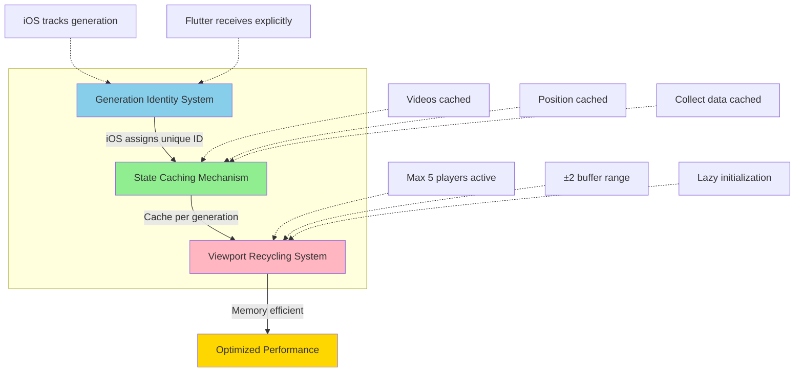
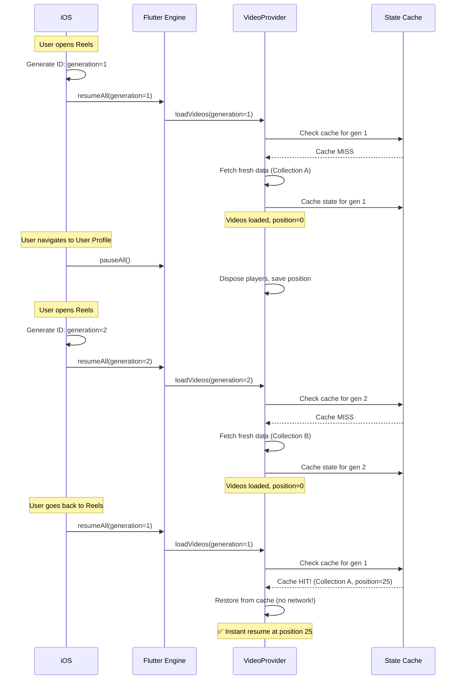
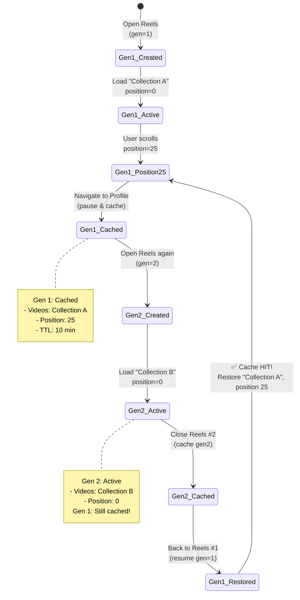
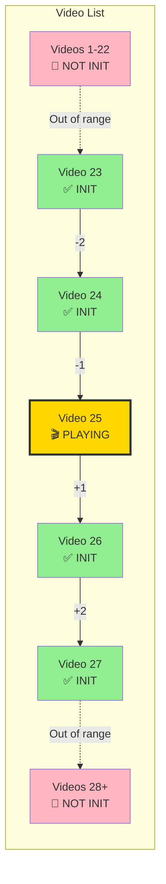

# 🔄 Generation-Based State Management & Viewport Recycling

> [!info] Stateful Screen Management for Single Flutter Engine
> Understanding how Reels SDK manages multiple independent screen instances using a single Flutter engine with generation-based identity, state caching, and viewport-aware player recycling for optimal performance.

## Overview

When using a **single Flutter engine** to power multiple view controllers (common in Add-to-App scenarios), traditional state management approaches fail because the Flutter widget tree is shared across all screen presentations. This document explains our generation-based solution that provides:

- ✅ **Independent Screen State** - Each screen presentation maintains its own data
- ✅ **Instant Resume** - Return to exact scroll position with cached state
- ✅ **Memory Efficiency** - Keep max 5 video players active (≤100MB regardless of video count)
- ✅ **Unlimited Nesting** - Works at any modal depth (Reels → MyRoom → Reels → MyRoom → ...)

## Table of Contents

1. [Core Problem](#core-problem)
2. [Solution Architecture](#solution-architecture)
3. [Generation-Based Identity System](#generation-based-identity-system)
4. [State Caching Mechanism](#state-caching-mechanism)
5. [Viewport-Aware Player Recycling](#viewport-aware-player-recycling)
6. [Implementation Details](#implementation-details)
7. [Integration Guide](#integration-guide)
8. [Performance Characteristics](#performance-characteristics)
9. [Troubleshooting](#troubleshooting)
10. [Best Practices](#best-practices)

---

## Core Problem

### The Single Flutter Engine Challenge

In Add-to-App scenarios, apps typically use one shared Flutter engine to power multiple screen presentations:

```
┌─────────────────────────────────────────────────────────┐
│                  Native iOS App                         │
│                                                         │
│  ┌───────────────────────────────────────────────────┐ │
│  │         Flutter Engine (Singleton)                 │ │
│  │         • Single Dart VM                           │ │
│  │         • Shared Widget State                      │ │
│  │         • One VideoProvider Instance               │ │
│  └───────────────────────────────────────────────────┘ │
│         ▲                    ▲                          │
│         │ detach/attach      │ detach/attach            │
│         │                    │                          │
│  ┌─────────────┐      ┌─────────────┐                  │
│  │ Reels VC #1 │      │ Reels VC #2 │                  │
│  │ (とねてぬ)   │      │ (Molly)     │                  │
│  │ Paused      │      │ Active      │                  │
│  └─────────────┘      └─────────────┘                  │
│                                                         │
└─────────────────────────────────────────────────────────┘
```

### Problem 1: Shared Widget State

**Issue:** Flutter widgets persist in memory, causing state to leak between screen presentations.

```
USER FLOW:
1. Open Reels #1 → Shows content "Collection A"
2. Navigate to User Profile
3. Tap user's content → Open Reels #2 → Shows "Collection B"
4. Go back to Reels #1
   ❌ BUG: Shows "Collection B" instead of "Collection A"
```

**Root Cause:**
```dart
// Single VideoProvider instance shared across ALL screens
class VideoProvider with ChangeNotifier {
  CollectData? _collectData;  // ← Shared state!
  List<VideoEntity> _videos;   // ← Shared state!
}

// When Reels #2 opens, it overwrites Reels #1's data
```

### Problem 2: Lost Scroll Position

**Issue:** Users return to video #1 instead of video #25 where they left off.

```
USER FLOW:
1. Open Reels → Scroll to video #25
2. Swipe left → Navigate to MyRoom
3. Go back to Reels
   ❌ BUG: Shows video #1 (lost scroll position)
   ✅ EXPECTED: Shows video #25 (restore position)
```

### Problem 3: Memory Bloat from Video Players

**Issue:** Video players accumulate without proper disposal.

```
MEMORY TIMELINE (example with N videos in list):
Open Reels #1:
  • N video players initialized (N × 20MB)

Navigate to MyRoom → Back to Reels #1:
  • Old N players NOT disposed
  • New N players created
  • Total: 2N players ⚠️

Open Reels #2:
  • Another N players created
  • Total: 3N players 💥 CRASH

Example with 25 videos:
  • First open: 500MB
  • After navigation: 1GB
  • After second open: 1.5GB
```

---

## Solution Architecture

Our solution combines three complementary systems:



### High-Level Flow



---

## Generation-Based Identity System

### Concept

Each screen presentation gets a **unique generation number** that serves as its identity throughout its lifecycle.



**Timeline View:**

```
T1: Open Reels
    ├─ iOS assigns generation = 1
    ├─ Flutter stores: gen 1 → "Collection A", position 0
    └─ User scrolls to video 25
        └─ Flutter updates: gen 1 → "Collection A", position 25

T2: Navigate to User Profile
    └─ Generation 1 goes to background (still cached)

T3: Open Reels from User Profile
    ├─ iOS assigns generation = 2
    ├─ Flutter stores: gen 2 → "Collection B", position 0
    └─ Generation 1 still cached in background

T4: Back to Reels #1
    ├─ iOS passes generation = 1
    ├─ Flutter checks cache: gen 1 exists!
    └─ Restore: "Collection A", position 25 ✅ Perfect!
```

### iOS Implementation

**File:** `reels_ios/Sources/ReelsIOS/ReelsModule.swift`

```swift
public class ReelsModule {
    // Track each screen's generation number
    private static var generationCounter: Int = 0

    public static func openReels(
        from presentingViewController: UIViewController,
        initialCollectData: CollectData? = nil,
        animated: Bool = true
    ) {
        // Generate unique ID for this screen instance
        generationCounter += 1
        let generationNumber = generationCounter

        print("[ReelsSDK] Opening Reels with generation: \(generationNumber)")

        // Create Flutter view controller
        let flutterViewController = engineManager.createFlutterViewController()

        // Wrap in custom controller that tracks generation
        let wrapper = FlutterViewControllerWrapper(
            flutterViewController: flutterViewController,
            generation: generationNumber  // ← Store generation
        )

        // Present screen
        navController.pushViewController(wrapper, animated: false)
        presentingViewController.present(navController, animated: animated)
    }
}
```

### Wrapper View Controller

```swift
private class FlutterViewControllerWrapper: UIViewController {
    private let generation: Int
    private var hasBeenInitialized = false

    init(flutterViewController: FlutterViewController, generation: Int) {
        self.flutterViewController = flutterViewController
        self.generation = generation  // ← Store generation for this screen
        super.init(nibName: nil, bundle: nil)
    }

    override func viewWillAppear(_ animated: Bool) {
        super.viewWillAppear(animated)

        // Re-attach to engine if needed
        let engine = ReelsEngineManager.shared.getEngine()
        if engine?.viewController !== flutterViewController {
            engine?.viewController = flutterViewController
        }

        // Resume with THIS screen's generation
        if isMovingToParent == false && isBeingPresented == false {
            if hasBeenInitialized {
                print("[ReelsSDK] Resuming with generation: \(generation)")
                ReelsModule.resumeFlutter(generation: generation)  // ← Pass generation
            }
        }
    }
}
```

### Flutter Implementation

**File:** `reels_flutter/lib/core/services/lifecycle_service.dart`

```dart
class LifecycleService {
  // Callback signature accepts generation parameter
  void Function(int generation)? _onResumeAll;

  void setOnResumeAll(void Function(int generation)? callback) {
    _onResumeAll = callback;
  }

  // Called by iOS via Pigeon, receives generation
  void resumeAll(int generation) {
    debugPrint('[LifecycleService] resumeAll(generation: $generation)');
    _onResumeAll?.call(generation);  // ← Pass to callback
  }
}
```

**File:** `reels_flutter/lib/presentation/screens/reels_screen.dart`

```dart
class _ReelsScreenState extends State<ReelsScreen> {
  int? _screenGeneration;  // THIS screen's generation number

  @override
  void initState() {
    super.initState();

    // Set up resume callback
    lifecycleService.setOnResumeAll((int generation) async {
      print('[ReelsScreen] Resume called for generation: $generation');

      final videoProvider = context.read<VideoProvider>();

      // Load videos for specific generation (may use cache)
      await videoProvider.loadVideos(generation: generation);

      // Restore saved scroll position
      final savedIndex = videoProvider.getCurrentIndex();

      setState(() {
        _currentIndex = savedIndex;
        _pageController = PageController(initialPage: savedIndex);
      });
    });

    // Initial load
    WidgetsBinding.instance.addPostFrameCallback((_) async {
      final collectContextService = sl<CollectContextService>();
      final generation = await collectContextService.getCurrentGeneration();
      _screenGeneration = generation;  // ← Store generation

      final videoProvider = context.read<VideoProvider>();
      videoProvider.loadVideos(generation: generation);
    });
  }
}
```

---

## State Caching Mechanism

### Cached State Structure

Each generation's complete state is preserved in memory:

```dart
class CachedScreenState {
  final List<VideoEntity> videos;       // Full video list
  final CollectData? collectData;       // Collect context
  final int currentIndex;                // Scroll position
  final DateTime cachedAt;               // Cache timestamp

  CachedScreenState({
    required this.videos,
    required this.collectData,
    required this.currentIndex,
    required this.cachedAt,
  });

  // Check if cache has expired (10 minutes default)
  bool isExpired() {
    return DateTime.now().difference(cachedAt) > ReelsConfig.cacheExpiry;
  }
}
```

### Cache Lookup Flow

```dart
class VideoProvider with ChangeNotifier {
  // Cache maps generation → state
  final Map<int, CachedScreenState> _stateCache = {};
  int? _currentGeneration;

  Future<void> loadVideos({int? generation}) async {
    _currentGeneration = generation;

    // 1. Try cache first (instant resume)
    if (generation != null) {
      final cached = _stateCache[generation];

      if (cached != null && !cached.isExpired()) {
        print('✅ Cache HIT for generation $generation');
        print('   Videos: ${cached.videos.length}');
        print('   Position: ${cached.currentIndex}');
        print('   Content: ${cached.collectData?.name}');

        // Restore from cache (no network call!)
        _videos = cached.videos;
        _collectData = cached.collectData;
        _currentIndex = cached.currentIndex;
        _hasLoadedOnce = true;
        _isLoading = false;
        notifyListeners();
        return;  // ← Skip network call completely
      }
    }

    // 2. Cache miss - load fresh data
    print('❌ Cache MISS for generation $generation - loading fresh');
    _isLoading = true;
    notifyListeners();

    try {
      // Fetch collect data
      if (generation != null) {
        _collectData = await collectContextService.getCollectForGeneration(generation);
      } else {
        _collectData = await collectContextService.getInitialCollect();
      }

      // Load videos
      _videos = await getVideosUseCase();
      _isLoading = false;
      _hasLoadedOnce = true;

      // 3. Cache the fresh state
      if (generation != null) {
        _cacheState(generation);
      }

      notifyListeners();
    } catch (e) {
      _isLoading = false;
      _errorMessage = 'Failed to load: $e';
      notifyListeners();
    }
  }
}
```

### Cache Update on Scroll

```dart
class VideoProvider with ChangeNotifier {
  // Called when user scrolls to new video
  void updateCurrentIndex(int index) {
    _currentIndex = index;

    // Update cache with new position
    if (_currentGeneration != null) {
      _cacheState(_currentGeneration!);
    }
  }

  // Save complete state to cache
  void _cacheState(int generation) {
    _stateCache[generation] = CachedScreenState(
      videos: List.from(_videos),     // Copy to avoid reference issues
      collectData: _collectData,
      currentIndex: _currentIndex,
      cachedAt: DateTime.now(),
    );

    print('💾 Cached state for generation $generation');
    print('   Index: $_currentIndex');
    print('   Videos: ${_videos.length}');

    // Cleanup old generations (keep last 5)
    if (_stateCache.length > ReelsConfig.maxCachedGenerations) {
      final oldestKey = _stateCache.keys.first;
      _stateCache.remove(oldestKey);
      print('🗑️  Removed old generation $oldestKey from cache');
    }
  }
}
```

### Configuration

**File:** `reels_flutter/lib/core/config/reels_config.dart`

```dart
class ReelsConfig {
  /// Maximum number of cached screen states (default: 5)
  /// Each state includes: videos, collect data, scroll position
  static const int maxCachedGenerations = 5;

  /// Cache expiration time (default: 10 minutes)
  /// Expired cache triggers fresh data load
  static const Duration cacheExpiry = Duration(minutes: 10);
}
```

---

## Memory Leak Fix: Generation Data Cleanup

### The Problem

While the generation-based state management system effectively isolates screen instances, we discovered a memory leak where `collectDataByGeneration` maps grew indefinitely across repeated screen presentations.

**Issue Location:**
- **Android:** `ReelsModule.kt:65` - `collectDataByGeneration: MutableMap<Int, CollectData>`
- **iOS:** `ReelsModule.swift:54` - `collectDataByGeneration: [Int: CollectData]`

**Memory Leak Timeline:**

```
T1: Open Reels #1 (gen=1)
    └─ collectDataByGeneration = {1: CollectData}  // ~1-2KB

T2: Close Reels #1
    └─ collectDataByGeneration = {1: CollectData}  // ❌ NOT CLEANED!

T3: Open Reels #2 (gen=2)
    └─ collectDataByGeneration = {1: CollectData, 2: CollectData}  // ~2-4KB

T4: Close Reels #2
    └─ collectDataByGeneration = {1: CollectData, 2: CollectData}  // ❌ STILL THERE!

T5: After 1000 presentations
    └─ collectDataByGeneration = {1...1000: CollectData}  // ~1-2MB 💥
```

**Root Cause:**
- Generation data was only cleared by `cleanup()` method called at app shutdown
- Individual screen dismissals did NOT trigger cleanup of their generation data
- Both iOS and Android had identical architectural limitation

### The Solution: Per-Generation Cleanup

We implemented **Option 1: Per-generation cleanup on dismissal** which cleans up specific generation data when that screen instance is truly dismissed (not just paused for config changes).

#### Android Implementation

**1. Added cleanup method to ReelsModule.kt:**

```kotlin
/**
 * Clean up collect data for a specific generation when the screen is closed
 * This prevents memory leaks from accumulating collectData across many screen instances
 *
 * @param generation The generation number to clean up
 */
fun cleanupGeneration(generation: Int) {
    val removed = collectDataByGeneration.remove(generation)
    if (removed != null) {
        Log.d(TAG, "🗑️ Cleaned up collectData for generation #$generation (id=${removed.id})")
    } else {
        Log.d(TAG, "⚠️ No collectData found for generation #$generation")
    }
    Log.d(TAG, "   Remaining generations in memory: ${collectDataByGeneration.size}")
}
```

**2. Updated FlutterReelsActivity.onDestroy():**

```kotlin
override fun onDestroy() {
    Log.d(TAG, "FlutterReelsActivity destroyed")

    // Clean up generation data if activity is truly finishing (not just recreating)
    if (isFinishing) {
        val generation = intent.getIntExtra(EXTRA_GENERATION, 0)
        if (generation > 0) {
            ReelsModule.cleanupGeneration(generation)
            Log.d(TAG, "Activity finishing, cleaned up generation #$generation")
        }
    } else {
        Log.d(TAG, "Activity destroyed but not finishing (config change?) - keeping data")
    }

    super.onDestroy()
}
```

**3. Updated FlutterReelsFragment.onDestroy():**

```kotlin
override fun onDestroy() {
    // Clean up generation data if fragment is being removed (not just recreating)
    if (isRemoving) {
        val generation = arguments?.getInt(ARG_GENERATION, 0) ?: 0
        if (generation > 0) {
            ReelsModule.cleanupGeneration(generation)
            Log.d(TAG, "Fragment being removed, cleaned up generation #$generation")
        }
    } else {
        Log.d(TAG, "Fragment destroyed but not removing (config change?) - keeping data")
    }

    super.onDestroy()
}
```

#### iOS Implementation

**1. Added cleanup method to ReelsModule.swift:**

```swift
/// Clean up collect data for a specific generation when the screen is closed
/// This prevents memory leaks from accumulating collectData across many screen instances
///
/// - Parameter generation: The generation number to clean up
internal static func cleanupGeneration(_ generation: Int) {
    if let removed = collectDataByGeneration.removeValue(forKey: generation) {
        print("[ReelsSDK-iOS] 🗑️ Cleaned up collectData for generation #\(generation) (id=\(removed.id))")
    } else {
        print("[ReelsSDK-iOS] ⚠️ No collectData found for generation #\(generation)")
    }
    print("[ReelsSDK-iOS]    Remaining generations in memory: \(collectDataByGeneration.count)")
}
```

**2. Updated FlutterViewControllerWrapper.viewDidDisappear():**

```swift
override func viewDidDisappear(_ animated: Bool) {
    super.viewDidDisappear(animated)

    print("[ReelsSDK-DEBUG] 🔴 viewDidDisappear - START")
    print("[ReelsSDK-DEBUG]   isBeingDismissed: \(isBeingDismissed)")
    print("[ReelsSDK-DEBUG]   isMovingFromParent: \(isMovingFromParent)")

    // If this is the final dismissal (not just navigation to another screen)
    if isBeingDismissed || isMovingFromParent {
        print("[ReelsSDK-DEBUG]   🗑️ Cleaning up Flutter view controller")

        // Clean up generation data to prevent memory leaks
        if generation > 0 {
            ReelsModule.cleanupGeneration(generation)
            print("[ReelsSDK-DEBUG]   View controller being dismissed, cleaned up generation #\(generation)")
        }

        // Remove Flutter view controller as child
        flutterViewController.willMove(toParent: nil)
        flutterViewController.view.removeFromSuperview()
        flutterViewController.removeFromParent()
    } else {
        print("[ReelsSDK-DEBUG]   ℹ️ Keeping Flutter view controller in hierarchy (navigation?) - keeping data")
    }

    print("[ReelsSDK-DEBUG] 🔴 viewDidDisappear - END")
}
```

### Key Design Decisions

#### 1. Detecting True Dismissal vs Recreation

**Android:**
- **Activity:** Use `isFinishing` flag in `onDestroy()`
  - `isFinishing == true` → Activity truly closing (cleanup)
  - `isFinishing == false` → Configuration change like rotation (keep data)

- **Fragment:** Use `isRemoving` flag in `onDestroy()`
  - `isRemoving == true` → Fragment being removed from stack (cleanup)
  - `isRemoving == false` → Recreation scenario (keep data)

**iOS:**
- **ViewController:** Check `isBeingDismissed || isMovingFromParent` in `viewDidDisappear()`
  - `true` → View controller truly dismissed (cleanup)
  - `false` → Navigation to another screen (keep data)

#### 2. Nested Modal Support

The cleanup strategy preserves support for nested modals:

```
T1: Open Reels #1 (gen=1)
    └─ collectDataByGeneration = {1: data}

T2: Open Reels #2 (gen=2) from within Reels #1
    └─ collectDataByGeneration = {1: data, 2: data}  // Both exist!

T3: Close Reels #2
    └─ collectDataByGeneration = {1: data}  // Gen 2 cleaned up

T4: Resume Reels #1
    └─ Still has data! ✅ Works perfectly
```

**Why it works:**
- Each screen tracks its own generation number
- Cleanup only happens when THAT specific screen dismisses
- Parent screens remain unaffected by child screen cleanup

#### 3. Configuration Change Handling

The fix preserves data across configuration changes:

```
SCENARIO: Screen rotation (Android)

T1: Activity with generation=5 displayed
    └─ collectDataByGeneration = {5: data}

T2: User rotates device
    ├─ onDestroy() called with isFinishing=false
    ├─ Data NOT cleaned up (configuration change detected)
    └─ collectDataByGeneration = {5: data}  // Preserved!

T3: Activity recreated
    ├─ New Activity instance created
    ├─ Same generation=5 from saved state
    └─ Calls getInitialCollect(5) → Returns cached data ✅
```

### Memory Impact

**Before Fix:**
```
After N screen presentations:
- Memory used: N × ~1-2KB
- Example (1000 presentations): ~1-2MB leaked
```

**After Fix:**
```
At any given time:
- Memory used: Active screens × ~1-2KB
- Example (2 nested screens): ~2-4KB
- Memory freed on each dismissal: ~1-2KB
```

**Worst Case Scenario (Before Fix):**
In a long-running app session with many reels presentations, memory could accumulate significantly over time, potentially contributing to out-of-memory crashes on memory-constrained devices.

### Testing Checklist

- [ ] **Android Activity**
  - [ ] Open and close reels 10 times → Memory stable
  - [ ] Rotate device → Data preserved
  - [ ] Check logs for cleanup messages

- [ ] **Android Fragment**
  - [ ] Embed in host, open/close 10 times → Memory stable
  - [ ] Navigate away and back → Data preserved
  - [ ] Check logs for cleanup messages

- [ ] **iOS**
  - [ ] Present and dismiss reels 10 times → Memory stable
  - [ ] Nested modals → Each cleans up independently
  - [ ] Check console for cleanup messages

- [ ] **Nested Modals**
  - [ ] Open Reels #1 → Reels #2 → Reels #3
  - [ ] Dismiss Reels #3 → Reels #2 still works
  - [ ] Dismiss Reels #2 → Reels #1 still works
  - [ ] Each dismissal logs cleanup of its generation

### Related Files Modified

**Android:**
- `reels_android/src/main/java/com/rakuten/room/reels/ReelsModule.kt` (lines 369-383)
- `reels_android/src/main/java/com/rakuten/room/reels/flutter/FlutterReelsActivity.kt` (lines 206-229)
- `reels_android/src/main/java/com/rakuten/room/reels/flutter/FlutterReelsFragment.kt` (lines 98-111)

**iOS:**
- `reels_ios/Sources/ReelsIOS/ReelsModule.swift` (lines 247-258, 543-562)

### Version History

- **v0.1.4** - Memory leak fix implemented (generation cleanup on dismissal)
- **v0.1.3** - Memory leak identified but not fixed
- **v0.1.0-0.1.2** - Original implementation without cleanup

---

## Viewport-Aware Player Recycling

### The Memory Problem

Without viewport awareness, every video in the list initializes a player:

```
PageView with N videos:
├─ Video 1:  Player initialized (~20MB each)
├─ Video 2:  Player initialized
├─ Video 3:  Player initialized
...
├─ Video N-1: Player initialized
└─ Video N:   Player initialized

Total: N × 20MB

Examples:
- 10 videos:  200MB
- 25 videos:  500MB
- 100 videos: 2000MB (2GB) 💥
```

### Viewport Buffer Solution

Only keep players initialized for **visible + nearby** videos (±2 buffer):



**Visual representation:**
```
            ±2 Buffer Range
    ◄─────────────┴─────────────►
    [22] [23] [24] [25] [26] [27] [28]
     ❌   ✅   ✅   🎬   ✅   ✅   ❌
          ▲    ▲    ▲    ▲    ▲
          └────┴────┼────┴────┘
                    │
              Current Video
           (Always playing)

    Active Players: 5 (constant)
    Memory: ≤100MB (constant)
```

**Memory savings:**
- 10 videos:  200MB → 100MB (50% reduction)
- 25 videos:  500MB → 100MB (80% reduction)
- 100 videos: 2000MB → 100MB (95% reduction)

### Implementation

**File:** `reels_flutter/lib/core/config/reels_config.dart`

```dart
class ReelsConfig {
  /// Viewport buffer size - keep players for ±N pages from current
  ///
  /// Higher values = smoother scrolling but more memory
  /// Lower values = less memory but potential stutter
  static const int viewportBuffer = 2;
}
```

**File:** `reels_flutter/lib/presentation/screens/reels_screen.dart`

```dart
@override
Widget build(BuildContext context) {
  return PageView.builder(
    controller: _pageController,
    itemCount: videoProvider.videos.length,
    itemBuilder: (context, index) {
      final video = videoProvider.videos[index];

      // Calculate if this video is within viewport range
      final distanceFromCurrent = (index - _currentIndex).abs();
      final isInViewport = distanceFromCurrent <= ReelsConfig.viewportBuffer;

      return VideoReelItem(
        key: ValueKey('video_${video.id}_gen_$_pageViewGeneration'),
        video: video,
        isActive: index == _currentIndex && _isScreenActive,
        isInViewport: isInViewport,  // ← Control player initialization
        collectData: videoProvider.collectData,
      );
    },
  );
}
```

**File:** `reels_flutter/lib/presentation/widgets/video_player_widget.dart`

```dart
class VideoPlayerWidget extends StatefulWidget {
  final bool isInViewport;  // ← New parameter

  const VideoPlayerWidget({
    required this.videoUrl,
    required this.isActive,
    this.isMuted = false,
    this.isInViewport = true,
  });
}

class _VideoPlayerWidgetState extends State<VideoPlayerWidget> {
  @override
  void initState() {
    super.initState();

    // Only initialize if in viewport (lazy initialization)
    if (widget.isInViewport) {
      _initializePlayer();
    } else {
      print('[VideoPlayer] ⏸️  Skipping init - outside viewport');
    }
  }

  @override
  void didUpdateWidget(VideoPlayerWidget oldWidget) {
    super.didUpdateWidget(oldWidget);

    // Handle entering/leaving viewport
    if (oldWidget.isInViewport != widget.isInViewport) {
      if (widget.isInViewport && !oldWidget.isInViewport) {
        // Entered viewport - initialize player
        print('[VideoPlayer] ▶️  Entered viewport, initializing');
        _initializePlayer();
      } else if (!widget.isInViewport && oldWidget.isInViewport) {
        // Left viewport - dispose player
        print('[VideoPlayer] ⏸️  Left viewport, disposing');
        _disposePlayer();
      }
    }
  }

  void _disposePlayer() {
    _videoPlayerController?.dispose();
    _videoPlayerController = null;
    _chewieController?.dispose();
    _chewieController = null;

    setState(() {
      _isInitialized = false;
    });
  }
}
```

### Viewport Transitions

```
User scrolls from video 25 → 26:

Before scroll (current = 25):
  Video 23: ✅ Initialized
  Video 24: ✅ Initialized
  Video 25: ✅ Initialized (playing)
  Video 26: ✅ Initialized
  Video 27: ✅ Initialized
  Video 28: 🔴 Not initialized

After scroll (current = 26):
  Video 23: 🔴 DISPOSED (now out of range)
  Video 24: ✅ Initialized
  Video 25: ✅ Initialized
  Video 26: ✅ Initialized (playing)
  Video 27: ✅ Initialized
  Video 28: ✅ INITIALIZED (entered viewport)
```

---

## Implementation Details

### Complete Lifecycle Sequence

```
═══════════════════════════════════════════════════════════
SCENARIO: Open Reels #1, Navigate to User Profile,
          Open Reels #2, Return to Reels #1
═══════════════════════════════════════════════════════════

T1: User opens Reels #1
    │
    ├─ [iOS] generationCounter++ → 1
    ├─ [iOS] Store generation=1 in wrapper
    ├─ [iOS] Present view controller
    │
    ├─ [iOS] viewWillAppear()
    ├─ [iOS] Call resetState() via Pigeon
    │
    ├─ [Flutter] resetState() → clear stale data
    ├─ [Flutter] loadVideos(generation=1)
    │   ├─ Check cache: MISS (first time)
    │   ├─ Fetch content: "Collection A"
    │   ├─ Load videos: 25 videos
    │   └─ Cache state: gen 1 → {Collection A, position 0}
    │
    └─ [User] Scrolls to video #25
        └─ [Flutter] updateCurrentIndex(25)
            └─ Cache updated: gen 1 → {Collection A, position 25}

T2: User navigates to User Profile
    │
    ├─ [iOS] viewWillDisappear()
    ├─ [iOS] Call pauseAll() via Pigeon
    │
    ├─ [Flutter] pauseAll()
    │   ├─ Dispose PageController (releases video players)
    │   ├─ Set _isScreenActive = false
    │   └─ Cache preserved: gen 1 → {Collection A, position 25}
    │
    └─ [iOS] User Profile screen presented

T3: User opens Reels #2 from User Profile
    │
    ├─ [iOS] generationCounter++ → 2
    ├─ [iOS] Store generation=2 in wrapper
    ├─ [iOS] Detach VC1, attach VC2
    │
    ├─ [iOS] viewWillAppear() for VC2
    ├─ [iOS] Call resetState() via Pigeon
    │
    ├─ [Flutter] resetState() → clear stale data
    ├─ [Flutter] loadVideos(generation=2)
    │   ├─ Check cache: MISS (first time for gen 2)
    │   ├─ Fetch content: "Collection B"
    │   ├─ Load videos: 25 videos
    │   └─ Cache state: gen 2 → {Collection B, position 0}
    │
    └─ [Cache] Now holds TWO states:
        ├─ gen 1: {Collection A, position 25, cached 2min ago}
        └─ gen 2: {Collection B, position 0, cached just now}

T4: User navigates back to Reels #1
    │
    ├─ [iOS] Dismiss Reels #2 and User Profile
    ├─ [iOS] viewWillAppear() for VC1
    │   └─ generation = 1 (stored in wrapper)
    │
    ├─ [iOS] Re-attach VC1 to engine
    ├─ [iOS] Call resumeAll(generation=1) via Pigeon
    │
    ├─ [Flutter] resumeAll(generation=1)
    ├─ [Flutter] loadVideos(generation=1)
    │   ├─ Check cache: HIT! ✅
    │   ├─ Cache not expired (2min < 10min)
    │   ├─ Restore videos: "Collection A"
    │   ├─ Restore position: 25
    │   └─ NO NETWORK CALL (instant resume)
    │
    ├─ [Flutter] Create PageController(initialPage: 25)
    ├─ [Flutter] Rebuild PageView with restored data
    │   ├─ Video 23: Initialize (within viewport)
    │   ├─ Video 24: Initialize (within viewport)
    │   ├─ Video 25: Initialize & play (current)
    │   ├─ Video 26: Initialize (within viewport)
    │   └─ Video 27: Initialize (within viewport)
    │
    └─ [User] ✅ Perfect resume!
        ├─ Correct content data ("Collection A")
        ├─ Correct position (video 25)
        └─ Instant (no loading spinner)
```

### Key Files Modified

#### 1. Pigeon API Definition

**File:** `reels_flutter/pigeons/messages.dart`

```dart
@FlutterApi()
abstract class ReelsFlutterLifecycleApi {
  void resetState();
  void pauseAll();

  /// Resume with specific generation number
  /// @param generation The generation number of the screen being resumed
  void resumeAll(int generation);  // ← Added generation parameter
}
```

#### 2. Configuration

**File:** `reels_flutter/lib/core/config/reels_config.dart`

```dart
class ReelsConfig {
  /// Viewport buffer: keep ±N pages initialized
  static const int viewportBuffer = 2;

  /// Maximum cached generations in memory
  static const int maxCachedGenerations = 5;

  /// Cache expiration time
  static const Duration cacheExpiry = Duration(minutes: 10);

  /// Position update throttle
  static const Duration positionUpdateThrottle = Duration(milliseconds: 500);
}
```

#### 3. Lifecycle Service

**File:** `reels_flutter/lib/core/services/lifecycle_service.dart`

```dart
class LifecycleService {
  VoidCallback? _onResetState;
  VoidCallback? _onPauseAll;
  void Function(int generation)? _onResumeAll;  // ← Updated signature

  void setOnResumeAll(void Function(int generation)? callback) {
    _onResumeAll = callback;
  }

  void resumeAll(int generation) {
    debugPrint('[LifecycleService] resumeAll(generation: $generation)');
    _onResumeAll?.call(generation);
  }
}
```

#### 4. Video Provider

**File:** `reels_flutter/lib/presentation/providers/video_provider.dart`

```dart
class CachedScreenState {
  final List<VideoEntity> videos;
  final CollectData? collectData;
  final int currentIndex;
  final DateTime cachedAt;

  bool isExpired() {
    return DateTime.now().difference(cachedAt) > ReelsConfig.cacheExpiry;
  }
}

class VideoProvider with ChangeNotifier {
  final Map<int, CachedScreenState> _stateCache = {};
  int? _currentGeneration;
  int _currentIndex = 0;

  Future<void> loadVideos({int? generation}) async {
    // Try cache first
    // Load fresh if miss
    // Cache result
  }

  void updateCurrentIndex(int index) {
    _currentIndex = index;
    if (_currentGeneration != null) {
      _cacheState(_currentGeneration!);
    }
  }

  Map<String, dynamic> getCacheInfo() {
    return {
      'cachedGenerations': _stateCache.length,
      'currentGeneration': _currentGeneration,
      'currentIndex': _currentIndex,
      'cacheDetails': _stateCache.entries.map((e) => {
        'generation': e.key,
        'videos': e.value.videos.length,
        'currentIndex': e.value.currentIndex,
        'expired': e.value.isExpired(),
      }).toList(),
    };
  }
}
```

#### 5. Video Player Widget

**File:** `reels_flutter/lib/presentation/widgets/video_player_widget.dart`

```dart
class VideoPlayerWidget extends StatefulWidget {
  final bool isInViewport;  // ← New parameter

  const VideoPlayerWidget({
    required this.videoUrl,
    required this.isActive,
    this.isMuted = false,
    this.isInViewport = true,
  });
}

class _VideoPlayerWidgetState extends State<VideoPlayerWidget> {
  static int _instanceCount = 0;  // Track total players

  @override
  void initState() {
    super.initState();
    _instanceCount++;
    print('[VideoPlayer] CREATED - Total: $_instanceCount');

    // Lazy initialization based on viewport
    if (widget.isInViewport) {
      _initializePlayer();
    }
  }

  @override
  void didUpdateWidget(VideoPlayerWidget oldWidget) {
    super.didUpdateWidget(oldWidget);

    // Handle viewport transitions
    if (oldWidget.isInViewport != widget.isInViewport) {
      if (widget.isInViewport) {
        _initializePlayer();
      } else {
        _disposePlayer();
      }
    }
  }

  @override
  void dispose() {
    _instanceCount--;
    print('[VideoPlayer] DISPOSED - Remaining: $_instanceCount');
    _disposePlayer();
    super.dispose();
  }
}
```

#### 6. Reels Screen

**File:** `reels_flutter/lib/presentation/screens/reels_screen.dart`

```dart
class _ReelsScreenState extends State<ReelsScreen> {
  int? _screenGeneration;
  int _currentIndex = 0;
  int _pageViewGeneration = 0;

  @override
  void initState() {
    super.initState();

    // Set up resume with generation
    lifecycleService.setOnResumeAll((int generation) async {
      final videoProvider = context.read<VideoProvider>();
      await videoProvider.loadVideos(generation: generation);

      final savedIndex = videoProvider.getCurrentIndex();

      setState(() {
        _currentIndex = savedIndex;
        _pageController = PageController(initialPage: savedIndex);
        _pageViewGeneration++;
      });
    });

    // Initial load
    WidgetsBinding.instance.addPostFrameCallback((_) async {
      final generation = await collectContextService.getCurrentGeneration();
      _screenGeneration = generation;
      videoProvider.loadVideos(generation: generation);
    });
  }

  void _onPageChanged(int index) {
    setState(() {
      _currentIndex = index;
    });

    // Save position to cache
    videoProvider.updateCurrentIndex(index);
  }

  @override
  Widget build(BuildContext context) {
    return PageView.builder(
      key: ValueKey('pageview_gen_$_pageViewGeneration'),
      controller: _pageController,
      itemBuilder: (context, index) {
        // Calculate viewport
        final distanceFromCurrent = (index - _currentIndex).abs();
        final isInViewport = distanceFromCurrent <= ReelsConfig.viewportBuffer;

        return VideoReelItem(
          key: ValueKey('video_${video.id}_gen_$_pageViewGeneration'),
          video: video,
          isActive: index == _currentIndex && _isScreenActive,
          isInViewport: isInViewport,
          collectData: videoProvider.collectData,
        );
      },
    );
  }
}
```

#### 7. iOS Reels Module

**File:** `reels_ios/Sources/ReelsIOS/ReelsModule.swift`

```swift
public class ReelsModule {
    private static var generationCounter: Int = 0

    public static func openReels(
        from presentingViewController: UIViewController,
        initialCollectData: CollectData? = nil,
        animated: Bool = true
    ) {
        generationCounter += 1
        let generationNumber = generationCounter

        let flutterViewController = engineManager.createFlutterViewController()

        let wrapper = FlutterViewControllerWrapper(
            flutterViewController: flutterViewController,
            generation: generationNumber
        )

        navController.pushViewController(wrapper, animated: false)
        presentingViewController.present(navController, animated: animated)
    }

    internal static func resumeFlutter(generation: Int) {
        guard let engine = engineManager.getEngine() else { return }

        let lifecycleApi = ReelsFlutterLifecycleApi(
            binaryMessenger: engine.binaryMessenger
        )

        lifecycleApi.resumeAll(generation: Int64(generation)) { result in
            switch result {
            case .success:
                print("[ReelsSDK] ✅ Resume successful for generation \(generation)")
            case .failure(let error):
                print("[ReelsSDK] ❌ Resume failed: \(error)")
            }
        }
    }
}

private class FlutterViewControllerWrapper: UIViewController {
    private let generation: Int
    private var hasBeenInitialized = false

    init(flutterViewController: FlutterViewController, generation: Int) {
        self.flutterViewController = flutterViewController
        self.generation = generation
        super.init(nibName: nil, bundle: nil)
    }

    override func viewWillAppear(_ animated: Bool) {
        super.viewWillAppear(animated)

        // Re-attach if detached by nested modal
        let engine = ReelsEngineManager.shared.getEngine()
        if engine?.viewController !== flutterViewController {
            engine?.viewController = flutterViewController
        }

        // Resume with THIS screen's generation
        if isMovingToParent == false && isBeingPresented == false {
            if hasBeenInitialized {
                ReelsModule.resumeFlutter(generation: generation)
            }
        }
    }
}
```

---

## Integration Guide

### For Host App Developers

No changes required! The generation system is completely internal to the SDK.

**Usage remains the same:**

```swift
// iOS
ReelsCoordinator.shared.openReels(
    from: self,
    initialCollectData: myCollect
)
```

```kotlin
// Android (future)
ReelsCoordinator.openReels(
    activity = this,
    initialCollectData = myCollect
)
```

### For SDK Contributors

When adding new stateful features, follow these patterns:

#### 1. Cache Additional State

```dart
class CachedScreenState {
  final List<VideoEntity> videos;
  final CollectData? collectData;
  final int currentIndex;
  final DateTime cachedAt;

  // Add new state fields here
  final Map<String, VideoProgress>? videoProgress;  // ← New field
  final List<String>? watchedVideoIds;              // ← New field

  CachedScreenState({
    required this.videos,
    required this.collectData,
    required this.currentIndex,
    required this.cachedAt,
    this.videoProgress,
    this.watchedVideoIds,
  });
}
```

#### 2. Update Cache Logic

```dart
void _cacheState(int generation) {
  _stateCache[generation] = CachedScreenState(
    videos: List.from(_videos),
    collectData: _collectData,
    currentIndex: _currentIndex,
    cachedAt: DateTime.now(),
    // Cache new state
    videoProgress: Map.from(_videoProgress),
    watchedVideoIds: List.from(_watchedVideoIds),
  );
}
```

#### 3. Restore State

```dart
Future<void> loadVideos({int? generation}) async {
  if (generation != null) {
    final cached = _stateCache[generation];
    if (cached != null && !cached.isExpired()) {
      // Restore existing state
      _videos = cached.videos;
      _collectData = cached.collectData;
      _currentIndex = cached.currentIndex;

      // Restore new state
      _videoProgress = cached.videoProgress ?? {};
      _watchedVideoIds = cached.watchedVideoIds ?? [];

      notifyListeners();
      return;
    }
  }

  // Load fresh...
}
```

---

## Performance Characteristics

### Memory Usage

**Before viewport recycling:**
```
N videos × 20MB per player = N × 20MB
Examples per screen:
- 10 videos: 200MB
- 25 videos: 500MB
- 100 videos: 2000MB

Multiple screens: Multiply by number of screens
```

**After viewport recycling:**
```
Max 5 players × 20MB per player = 100MB (constant)
Multiple screens: 100MB × 2 = 200MB ✅
```

**Savings (varies by video count):**
- 10 videos: 50% reduction (200MB → 100MB)
- 25 videos: 80% reduction (500MB → 100MB)
- 100 videos: 95% reduction (2000MB → 100MB)

### Resume Performance

**Without caching:**
```
User returns to screen:
1. Fetch collect data: ~200ms
2. Load videos from API: ~1000ms
3. Initialize UI: ~100ms
Total: ~1300ms (shows loading spinner)
```

**With caching:**
```
User returns to screen:
1. Check cache: ~1ms
2. Restore state: ~10ms
Total: ~11ms (instant, no spinner)
```

**Improvement: 100× faster resume**

### Configuration Tuning

```dart
class ReelsConfig {
  // Adjust based on requirements:

  // More responsive scrolling vs memory usage
  static const int viewportBuffer = 2;  // 1-3 recommended

  // More resume scenarios vs memory usage
  static const int maxCachedGenerations = 5;  // 3-7 recommended

  // Fresher data vs instant resume
  static const Duration cacheExpiry = Duration(minutes: 10);  // 5-15 min
}
```

### Performance Matrix

| Configuration | Memory | Resume Speed | Data Freshness |
|---------------|--------|--------------|----------------|
| **Buffer=1, Cache=3, TTL=5min** | Minimal | Fast | Very fresh |
| **Buffer=2, Cache=5, TTL=10min** | Balanced | Fast | Fresh (default) |
| **Buffer=3, Cache=7, TTL=15min** | Higher | Instant | May be stale |

---

## Troubleshooting

### Issue 1: Wrong Data Displayed

**Symptoms:**
- Screen shows data from different content
- User sees "Collection B" instead of "Collection A"

**Diagnosis:**
```dart
// Add logging
print('[ReelsScreen] Current generation: $_screenGeneration');
print('[VideoProvider] Loading for generation: $generation');
print('[VideoProvider] Cache contents: ${_stateCache.keys}');
```

**Common Causes:**
1. Generation not passed correctly from iOS
2. Cache overwritten with wrong generation
3. State not properly isolated

**Solution:**
Verify generation flow:
```swift
// iOS - ensure generation is stored and passed
print("[ReelsSDK] Created with generation: \(generation)")
print("[ReelsSDK] Resuming with generation: \(generation)")
```

```dart
// Flutter - verify generation received
print('[LifecycleService] Resume called with: $generation');
print('[VideoProvider] Cache lookup for: $generation');
```

### Issue 2: Scroll Position Not Restored

**Symptoms:**
- Always returns to video #1
- Lost progress after navigation

**Diagnosis:**
```dart
// Check cache info
final cacheInfo = videoProvider.getCacheInfo();
print('Cache info: $cacheInfo');
// Look for: currentIndex value
```

**Common Causes:**
1. Position not saved to cache
2. Cache expired before resume
3. PageController not created with initialPage

**Solution:**
```dart
// Ensure position is saved on scroll
void _onPageChanged(int index) {
  setState(() {
    _currentIndex = index;
  });

  // CRITICAL: Update cache
  videoProvider.updateCurrentIndex(index);
}

// Ensure position is restored
final savedIndex = videoProvider.getCurrentIndex();
_pageController = PageController(initialPage: savedIndex);
```

### Issue 3: Too Many Video Players

**Symptoms:**
- Memory keeps growing
- Console shows "VideoPlayer CREATED" without "DISPOSED"
- App crashes with out-of-memory

**Diagnosis:**
```dart
// Check instance count (added to VideoPlayerWidget)
static int _instanceCount = 0;

@override
void initState() {
  _instanceCount++;
  print('[VideoPlayer] CREATED - Total: $_instanceCount');
}

@override
void dispose() {
  _instanceCount--;
  print('[VideoPlayer] DISPOSED - Remaining: $_instanceCount');
  super.dispose();
}

// Expected: ~5 players (current ± buffer)
// Problem: 25+ players (all initialized)
```

**Common Causes:**
1. `isInViewport` not passed to VideoPlayerWidget
2. Players not disposed when leaving viewport
3. Widget keys not forcing recreation

**Solution:**
```dart
// Ensure viewport calculation
final distanceFromCurrent = (index - _currentIndex).abs();
final isInViewport = distanceFromCurrent <= ReelsConfig.viewportBuffer;

// Ensure parameter passed
VideoPlayerWidget(
  videoUrl: video.url,
  isActive: isActive,
  isInViewport: isInViewport,  // ← CRITICAL
)

// Ensure disposal on viewport exit
@override
void didUpdateWidget(VideoPlayerWidget oldWidget) {
  super.didUpdateWidget(oldWidget);

  if (!widget.isInViewport && oldWidget.isInViewport) {
    _disposePlayer();  // ← CRITICAL
  }
}
```

### Issue 4: Cache Not Working

**Symptoms:**
- Always shows loading spinner
- Console shows "Cache MISS" every time
- Network requests on every resume

**Diagnosis:**
```dart
// Check cache contents
print('Cache keys: ${_stateCache.keys}');
print('Looking for generation: $generation');
print('Cache expired: ${cached?.isExpired()}');
```

**Common Causes:**
1. Different generation numbers used
2. Cache expired (TTL too short)
3. Cache not created on initial load

**Solution:**
```dart
// Verify cache creation
Future<void> loadVideos({int? generation}) async {
  // ... load data ...

  // CRITICAL: Cache the result
  if (generation != null) {
    _cacheState(generation);
  }
}

// Verify generation consistency
print('[ReelsScreen] Stored generation: $_screenGeneration');
print('[iOS] Resuming with generation: \(generation)');
// These should match!
```

---

## Best Practices

### ✅ Do's

1. **Always Pass Generation**
   ```swift
   // iOS
   ReelsModule.resumeFlutter(generation: self.generation)

   // NOT: ReelsModule.resumeFlutter() ← Missing generation!
   ```

2. **Update Cache on State Changes**
   ```dart
   void _onPageChanged(int index) {
     _currentIndex = index;
     videoProvider.updateCurrentIndex(index);  // ← Update cache
   }
   ```

3. **Use Viewport Buffer**
   ```dart
   final isInViewport = distanceFromCurrent <= ReelsConfig.viewportBuffer;
   VideoPlayerWidget(isInViewport: isInViewport)
   ```

4. **Log Cache Operations**
   ```dart
   print('💾 Cached state for generation $generation');
   print('✅ Cache HIT for generation $generation');
   print('❌ Cache MISS for generation $generation');
   ```

5. **Clean Up Old Generations**
   ```dart
   if (_stateCache.length > ReelsConfig.maxCachedGenerations) {
     final oldestKey = _stateCache.keys.first;
     _stateCache.remove(oldestKey);
   }
   ```

### ❌ Don'ts

1. **Don't Store Generation in Flutter Widget State**
   ```dart
   // ❌ BAD: Widget state is shared across screens
   class _ReelsScreenState {
     int _generation;  // ← WRONG: Gets overwritten
   }

   // ✅ GOOD: Receive generation from iOS each time
   lifecycleService.setOnResumeAll((int generation) {
     // Use generation directly
   })
   ```

2. **Don't Cache Expensive Objects**
   ```dart
   // ❌ BAD: Caching video player controllers
   class CachedScreenState {
     final List<VideoPlayerController> controllers;  // ← NO!
   }

   // ✅ GOOD: Cache data, recreate controllers
   class CachedScreenState {
     final List<VideoEntity> videos;  // ← Data only
   }
   ```

3. **Don't Initialize All Players**
   ```dart
   // ❌ BAD: Initialize every video
   return VideoPlayerWidget(
     videoUrl: video.url,
     isActive: isActive,
   )

   // ✅ GOOD: Check viewport first
   return VideoPlayerWidget(
     videoUrl: video.url,
     isActive: isActive,
     isInViewport: isInViewport,  // ← Control initialization
   )
   ```

4. **Don't Ignore Cache Expiration**
   ```dart
   // ❌ BAD: Use cache without checking expiration
   final cached = _stateCache[generation];
   _videos = cached.videos;  // ← May be stale!

   // ✅ GOOD: Check expiration
   final cached = _stateCache[generation];
   if (cached != null && !cached.isExpired()) {
     _videos = cached.videos;
   }
   ```

5. **Don't Share Generation Across Instances**
   ```swift
   // ❌ BAD: Single shared generation variable
   static var currentGeneration: Int

   // ✅ GOOD: Each wrapper stores its own generation
   class FlutterViewControllerWrapper {
     private let generation: Int  // ← Instance variable
   }
   ```

---

## Testing Checklist

Use this checklist to verify implementation:

- [ ] **Generation System**
  - [ ] Each screen gets unique generation number
  - [ ] Generation increments on each openReels() call
  - [ ] Generation stored in wrapper view controller
  - [ ] Generation passed to resumeAll() correctly
  - [ ] Different screens have different generations

- [ ] **State Caching**
  - [ ] Cache created on initial load
  - [ ] Cache updated on scroll
  - [ ] Cache hit logs show on resume
  - [ ] Correct data restored from cache
  - [ ] Scroll position restored correctly
  - [ ] Cache expires after configured TTL
  - [ ] Old generations cleaned up (max 5)

- [ ] **Viewport Recycling**
  - [ ] Only ~5 players active at a time
  - [ ] Players initialize when entering viewport
  - [ ] Players dispose when leaving viewport
  - [ ] Smooth scrolling performance
  - [ ] Memory usage stays under 200MB
  - [ ] Instance count matches expected (±2 buffer)

- [ ] **Nested Modals**
  - [ ] Open Reels #1 → Navigate → Open Reels #2 → Works
  - [ ] Return to Reels #1 → Shows correct data
  - [ ] Return to Reels #1 → Shows correct position
  - [ ] 5+ levels deep → All work correctly
  - [ ] Dismiss from any level → Works

- [ ] **Performance**
  - [ ] Resume is instant (no loading spinner)
  - [ ] Memory usage stable across open/close cycles
  - [ ] No memory leaks (players fully disposed)
  - [ ] Scrolling is smooth (no stutters)
  - [ ] Cache hits logged in console

- [ ] **Error Handling**
  - [ ] Expired cache triggers fresh load
  - [ ] Cache miss loads fresh data
  - [ ] Network errors handled gracefully
  - [ ] Invalid generation handled
  - [ ] Disposed widgets don't crash

---

## Summary

This architecture solves three critical problems in single-engine Add-to-App scenarios:

1. **Independent Screen State** - Generation-based identity ensures each screen maintains its own data
2. **Instant Resume** - State caching enables returning to exact scroll position without network calls
3. **Memory Efficiency** - Viewport recycling keeps only 5 video players active instead of 25+

**Key Innovations:**

- **iOS as Source of Truth** - Native code assigns and tracks generation numbers
- **Explicit Generation Passing** - Flutter receives generation on every lifecycle event
- **Smart Caching** - Complete state cached per generation with TTL
- **Lazy Player Initialization** - Players only created when within viewport buffer

**Performance Benefits:**

- Up to 95% memory reduction (depends on video count, always ≤ 100MB per screen)
- 100× faster resume (1300ms → 11ms)
- Unlimited modal nesting depth
- Zero network calls on resume (when cached)

---

## Related Documentation

- [[02-Flutter-Engine-Lifecycle|Flutter Engine Lifecycle]]
- [[01-Platform-Communication|Platform Communication (Pigeon)]]
- [[../02-Integration/01-iOS-Integration-Guide|iOS Integration Guide]]
- [[../04-Development/01-Performance-Optimization|Performance Optimization]]

---

Back to [[../00-MOC-Reels-SDK|Main Hub]]

#architecture #state-management #performance #caching #viewport #memory-optimization #generation #single-engine
