# Android Module Pattern & Multimodal Navigation

Complete guide to the Android bridge architecture, ReelsModule pattern, and multimodal navigation implementation for nested native/Flutter screens.

## Overview

The Android bridge (`reels_android`) implements a **Module Pattern** for SDK integration, providing a simple singleton API surface while managing complex Flutter engine lifecycle and multimodal navigation flows.


## Module Pattern Architecture

### ReelsModule - Singleton API

The `ReelsModule` serves as the **single entry point** for all SDK operations:

```kotlin
object ReelsModule {

    // Initialization
    fun initialize(
        context: Context,
        accessTokenProvider: () -> String?
    )

    // Listener Management
    fun setListener(listener: ReelsListener)

    // Open Reels Screens
    fun openReels(
        activity: Activity,
        collectData: CollectData?,
        animated: Boolean = true
    )

    fun createReelsFragment(
        collectData: CollectData? = null,
        initialRoute: String = "/"
    ): Fragment

    // Lifecycle Management
    fun cleanup()
}
```

**Key Design Principles:**
- **Singleton Pattern**: Single instance manages all state
- **Simple API Surface**: Hide complexity from host app
- **Lifecycle Management**: Automatic Flutter engine management
- **Thread Safe**: All operations synchronized appropriately

### FlutterEngineManager - Lifecycle Orchestration

Manages Flutter engine lifecycle and state across navigation levels:

```kotlin
class FlutterEngineManager private constructor(
    private val context: Context
) {
    companion object {
        @Volatile
        private var instance: FlutterEngineManager? = null

        fun getInstance(context: Context): FlutterEngineManager {
            return instance ?: synchronized(this) {
                instance ?: FlutterEngineManager(context).also { instance = it }
            }
        }
    }

    private var flutterEngine: FlutterEngine? = null
    private var currentGeneration: Int = 0

    fun getOrCreateEngine(): FlutterEngine
    fun incrementGeneration(): Int
    fun getCurrentGeneration(): Int
    fun resetState()
    fun cleanup()
}
```

**Responsibilities:**
- Flutter engine singleton management
- Generation-based state tracking
- Method channel lifecycle
- Memory management

## Multimodal Navigation Architecture

### What is Multimodal Navigation?

**Multimodal navigation** refers to the ability to seamlessly navigate between native Android screens and Flutter screens in a nested, hierarchical manner.

**Example Flow:**
```
Native Screen A (CollectList)
  → Flutter Screen 1 (Reels for User A's content)
    → Native Screen B (User B's Profile - opened from Flutter)
      → Flutter Screen 2 (Reels for User B's content)
        → Native Screen C (User C's Profile)
          → Flutter Screen 3 (Reels for User C's content)
```

Each Flutter screen instance maintains independent state (video position, playback state) using generation-based state management.

### Navigation Stack Management


### Generation-Based State Isolation

Each time a Flutter screen is opened, it gets a unique **generation ID**:

```kotlin
class FlutterEngineManager {
    private var currentGeneration: Int = 0

    fun incrementGeneration(): Int {
        currentGeneration++
        Timber.d("🔢 Generation incremented: $currentGeneration")
        return currentGeneration
    }

    fun getCurrentGeneration(): Int = currentGeneration
}
```

**Flutter Side** (`reels_flutter`):
```dart
class ReelsProvider extends ChangeNotifier {
    final int generation;
    final Map<String, VideoPlayerController> _controllers = {};
    final Map<String, Duration> _savedPositions = {};

    ReelsProvider(this.generation) {
        print('📱 ReelsProvider initialized for generation $generation');
    }

    void savePositionForGeneration(String videoId, Duration position) {
        final key = '${generation}_$videoId';
        _savedPositions[key] = position;
    }

    Duration? getSavedPosition(String videoId) {
        final key = '${generation}_$videoId';
        return _savedPositions[key];
    }
}
```

**Benefits:**
- **State Isolation**: Each screen has independent playback state
- **Resume Capability**: Return to previous screen resumes from saved position
- **Memory Efficiency**: Old generations can be cleaned up
- **No State Conflicts**: Prevents state leaking between screens

## ReelsControllerImpl - Coordinator Pattern

Host apps use `ReelsControllerImpl` to implement a coordinator-like pattern:

```kotlin
class ReelsControllerImpl(
    private val activity: Activity,
    private val collect: CollectModel?,
    private val listener: ReelsController? = null
) {

    fun start(animated: Boolean = true) {
        if (collect == null) {
            Timber.w("Cannot start without collect")
            return
        }

        val collectData = collect.toCollectData()
        setupReelsListener()

        ReelsModule.openReels(
            activity = activity,
            collectData = collectData,
            animated = animated
        )
    }

    private fun setupReelsListener() {
        ReelsModule.setListener(object : ReelsListener {
            override fun onReelViewed(videoId: String) {
                listener?.onReelViewed(videoId)
            }

            override fun onUserProfileClick(userId: String, userName: String) {
                // ✅ CRITICAL: Use event parameters, not cached data
                listener?.onUserProfileClick(userId, userName)
            }

            // ... other callbacks
        })
    }
}
```

**Pattern Comparison:**

| iOS Coordinator | Android Controller |
|-----------------|-------------------|
| `ReelsCoordinator.startReels()` | `ReelsControllerImpl.start()` |
| `ReelsCoordinatorDelegate` | `ReelsListener` |
| Protocol-based | Interface-based |
| Static utility + delegate | Instance-based wrapper |
| Lifecycle tied to ViewController | Lifecycle tied to Activity |

## Root Listener Pattern

### Problem: Multi-Level Navigation Callbacks

When navigating multiple levels deep:
```
Native Screen 1 → Flutter 1 → Native Screen 2 → Flutter 2 → Native Screen 3 → Flutter 3
```

Each Flutter screen needs to notify the **current** native screen, not the original listener.

### Solution: Root Listener Pattern

```kotlin
object ReelsModule {

    @Volatile
    private var rootListener: ReelsListener? = null

    fun setListener(listener: ReelsListener) {
        synchronized(this) {
            rootListener = listener
        }
    }

    internal fun getRootListener(): ReelsListener? {
        synchronized(this) {
            return rootListener
        }
    }
}
```

**FlutterMethodChannelHandler** uses root listener:
```kotlin
class FlutterMethodChannelHandler(
    private val flutterEngine: FlutterEngine
) : ReelsFlutterApi {

    override fun onUserProfileClick(userId: String, userName: String) {
        // ✅ Always use ROOT listener (current screen's listener)
        val listener = ReelsModule.getRootListener()

        runOnMainThread {
            listener?.onUserProfileClick(userId, userName)
        }
    }
}
```

**Flow Diagram:**

```mermaid
sequenceDiagram
    participant N1 as Native Screen 1
    participant F1 as Flutter Screen 1
    participant N2 as Native Screen 2
    participant F2 as Flutter Screen 2
    participant Module as ReelsModule

    N1->>Module: setListener(Listener1)
    N1->>Module: openReels()
    Module->>F1: Create & Show

    F1->>Module: onUserProfileClick()
    Module->>N1: Listener1.onUserProfileClick()
    N1->>N2: Navigate to Profile

    N2->>Module: setListener(Listener2)
    Note over Module: Root listener now Listener2
    N2->>Module: openReels()
    Module->>F2: Create & Show

    F2->>Module: onUserProfileClick()
    Module->>N2: Listener2.onUserProfileClick()
    Note over N2: ✅ Correct! N2 receives callback
    Note over N1: ❌ N1 does NOT receive callback
```


**Key Points:**
- ✅ Each native screen sets its own listener before opening Flutter
- ✅ Flutter always calls the **most recently set** listener (root listener)
- ✅ Ensures callbacks go to the correct screen in the navigation stack
- ✅ No need to track navigation stack manually

## Profile Navigation - Critical Implementation

### The Problem: Using Cached Data

```kotlin
class MyFragment : Fragment(), ReelsListener {

    private var currentItemData: ItemModel? = null  // Cached

    fun openReelsForItem(item: ItemModel) {
        currentItemData = item  // Cache the initial item

        ReelsModule.setListener(this)
        ReelsModule.openReels(
            activity = requireActivity(),
            collectData = item.toCollectData()
        )
    }

    // ❌ WRONG: Uses cached data
    override fun onUserProfileClick(userId: String, userName: String) {
        // This opens the WRONG profile!
        currentItemData?.owner?.let {
            navigateToUserProfile(it.id, it.name)  // Opens initial item owner!
        }
    }
}
```

**Navigation Flow with Bug:**
```
1. User opens reels for content owned by User A
   → currentItemData.owner = User A
2. In Flutter, user sees video by User B
3. User clicks User B's profile button
4. onUserProfileClick(userId="B", userName="User B") is called
5. ❌ Code uses currentItemData.owner (User A)
6. ❌ Opens User A's profile instead of User B's!
```

### The Solution: Use Event Parameters

```kotlin
class MyFragment : Fragment(), ReelsListener {

    private var currentItemData: ItemModel? = null

    fun openReelsForItem(item: ItemModel) {
        currentItemData = item  // OK to cache for other purposes

        ReelsModule.setListener(this)
        ReelsModule.openReels(
            activity = requireActivity(),
            collectData = item.toCollectData()
        )
    }

    // ✅ CORRECT: Uses event parameters
    override fun onUserProfileClick(userId: String, userName: String) {
        // Always use the event parameters!
        navigateToUserProfile(userId.toLong(), userName)
    }
}
```

**Corrected Navigation Flow:**
```
1. User opens reels for content owned by User A
   → currentItemData.owner = User A (ignored in callback)
2. In Flutter, user sees video by User B
3. User clicks User B's profile button
4. onUserProfileClick(userId="B", userName="User B") is called
5. ✅ Code uses userId parameter (User B)
6. ✅ Opens User B's profile correctly!
```

### Why This Matters

| Cached Data | Event Parameters |
|-------------|------------------|
| Refers to initial content owner | Refers to actual clicked user |
| Stale as navigation proceeds | Always current and correct |
| Causes wrong profile opens | Always opens correct profile |
| Hard to debug | Explicit and traceable |

**Testing Checklist:**
- [ ] Open reels for User A's content
- [ ] View video by User B
- [ ] Click User B's profile → Should open User B, not User A
- [ ] From User B's profile, open reels
- [ ] View video by User C
- [ ] Click User C's profile → Should open User C, not User B
- [ ] Multi-level navigation: A → B → C → D all work correctly

## Flutter Engine Lifecycle

### Initialization

```kotlin
class FlutterEngineManager {

    fun getOrCreateEngine(): FlutterEngine {
        return flutterEngine ?: synchronized(this) {
            flutterEngine ?: createEngine().also {
                flutterEngine = it
                setupMethodChannels(it)
            }
        }
    }

    private fun createEngine(): FlutterEngine {
        return FlutterEngine(context.applicationContext).apply {
            dartExecutor.executeDartEntrypoint(
                DartExecutor.DartEntrypoint.createDefault()
            )
        }
    }

    private fun setupMethodChannels(engine: FlutterEngine) {
        val handler = FlutterMethodChannelHandler(engine)
        ReelsHostApi.setUp(engine.dartExecutor, handler)
        ReelsFlutterApi.setUp(engine.dartExecutor, handler)
    }
}
```

### State Management

```kotlin
fun resetState() {
    synchronized(this) {
        val generation = incrementGeneration()

        runOnMainThread {
            flutterEngine?.let { engine ->
                val flutterApi = ReelsFlutterApi(engine.dartExecutor.binaryMessenger)
                flutterApi.resetState(generation.toLong()) { }
            }
        }
    }
}
```

### Cleanup

```kotlin
fun cleanup() {
    synchronized(this) {
        flutterEngine?.destroy()
        flutterEngine = null
        currentGeneration = 0
    }
}
```

## Communication Patterns

### Native → Flutter (HostApi)

```kotlin
class ReelsHostApiImpl : ReelsHostApi {

    override fun getAccessToken(): String? {
        return ReelsModule.getAccessTokenProvider()?.invoke()
    }

    override fun getInitialCollect(): CollectData? {
        return ReelsModule.getCurrentCollectData()
    }

    override fun getCurrentGeneration(): Long {
        return engineManager.getCurrentGeneration().toLong()
    }

    override fun isDebugMode(): Boolean {
        return BuildConfig.DEBUG
    }
}
```

### Flutter → Native (FlutterApi)

```kotlin
class FlutterMethodChannelHandler(
    private val flutterEngine: FlutterEngine
) : ReelsFlutterApi {

    override fun onUserProfileClick(userId: String, userName: String) {
        val listener = ReelsModule.getRootListener()

        runOnMainThread {
            listener?.onUserProfileClick(userId, userName)
        }
    }

    override fun onReelsClosed() {
        val listener = ReelsModule.getRootListener()

        runOnMainThread {
            listener?.onReelsClosed()
        }
    }

    // ... other callbacks
}
```

## Presentation Layer

### FlutterReelsActivity - Full Screen

```kotlin
class FlutterReelsActivity : AppCompatActivity() {

    private lateinit var flutterView: FlutterView
    private lateinit var engineManager: FlutterEngineManager

    override fun onCreate(savedInstanceState: Bundle?) {
        super.onCreate(savedInstanceState)

        engineManager = FlutterEngineManager.getInstance(this)
        val flutterEngine = engineManager.getOrCreateEngine()

        flutterView = FlutterView(this)
        flutterView.attachToFlutterEngine(flutterEngine)

        setContentView(flutterView)

        // Increment generation for new screen instance
        val generation = engineManager.incrementGeneration()
    }

    override fun onDestroy() {
        flutterView.detachFromFlutterEngine()
        super.onDestroy()
    }
}
```

### FlutterReelsFragment - Embeddable

```kotlin
class FlutterReelsFragment : Fragment() {

    private lateinit var flutterView: FlutterView
    private lateinit var engineManager: FlutterEngineManager

    override fun onCreateView(
        inflater: LayoutInflater,
        container: ViewGroup?,
        savedInstanceState: Bundle?
    ): View {
        engineManager = FlutterEngineManager.getInstance(requireContext())
        val flutterEngine = engineManager.getOrCreateEngine()

        flutterView = FlutterView(requireContext())
        flutterView.attachToFlutterEngine(flutterEngine)

        return flutterView
    }

    override fun onDestroyView() {
        flutterView.detachFromFlutterEngine()
        super.onDestroyView()
    }
}
```

## Comparison with iOS

| Aspect | iOS (Coordinator) | Android (Module) |
|--------|------------------|------------------|
| **Entry Point** | `ReelsCoordinator` (static) | `ReelsModule` (singleton object) |
| **Lifecycle** | ViewController-based | Activity/Fragment-based |
| **State Management** | `ReelsEngineManager` | `FlutterEngineManager` |
| **Delegate Pattern** | `ReelsCoordinatorDelegate` protocol | `ReelsListener` interface |
| **Navigation** | `UINavigationController` | `Activity` intents/fragments |
| **Memory Model** | ARC (automatic) | Garbage collection |
| **Thread Safety** | `@MainActor` / `DispatchQueue.main` | `runOnUiThread` / `synchronized` |
| **Presentation** | `UIViewController` | `Activity` / `Fragment` |

## Best Practices

### ✅ Do's

1. **Always use event parameters in callbacks**
   ```kotlin
   override fun onUserProfileClick(userId: String, userName: String) {
       navigateToUserProfile(userId.toLong(), userName)  // ✅
   }
   ```

2. **Set listener before opening Flutter**
   ```kotlin
   ReelsModule.setListener(this)  // First
   ReelsModule.openReels(activity, collectData)  // Then
   ```

3. **Use application context for initialization**
   ```kotlin
   ReelsModule.initialize(
       context = applicationContext,  // ✅ Not activity context
       accessTokenProvider = { /* ... */ }
   )
   ```

4. **Clean up when appropriate**
   ```kotlin
   override fun onDestroy() {
       if (isFinishing) {
           ReelsModule.cleanup()
       }
       super.onDestroy()
   }
   ```

### ❌ Don'ts

1. **Don't use cached item/content data in callbacks**
   ```kotlin
   override fun onUserProfileClick(userId: String, userName: String) {
       currentItem?.owner?.let {
           navigateToUserProfile(it.id, it.name)  // ❌ WRONG!
       }
   }
   ```

2. **Don't open Flutter without setting listener**
   ```kotlin
   ReelsModule.openReels(activity, collectData)  // ❌ No listener set!
   ```

3. **Don't initialize multiple times**
   ```kotlin
   // ❌ Only initialize ONCE in Application.onCreate()
   ReelsModule.initialize(context, provider)
   ```

4. **Don't modify Pigeon generated code**
   ```kotlin
   // ❌ Never edit files in pigeon/ directory
   // Regenerate with: flutter pub run pigeon --input pigeons/messages.dart
   ```

## Further Reading

- [[01-Platform-Communication|Platform Communication]] - Pigeon API details
- [[02-Flutter-Engine-Lifecycle|Flutter Engine Lifecycle]] - Engine management
- [[03-Generation-Based-State-Management|Generation-Based State Management]] - State architecture
- [[04-iOS-Coordinator-Pattern|iOS Coordinator Pattern]] - iOS comparison
- [[../02-Integration/02-Android-Integration-Guide|Android Integration Guide]] - Integration steps

---

Back to [[00-Overview|Architecture Overview]]

#android #architecture #module-pattern #multimodal-navigation #flutter-engine
