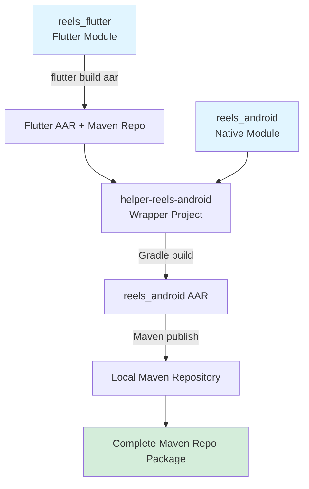
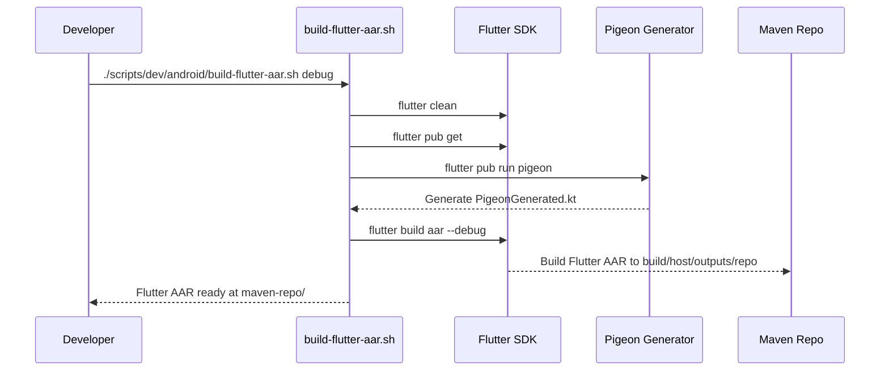
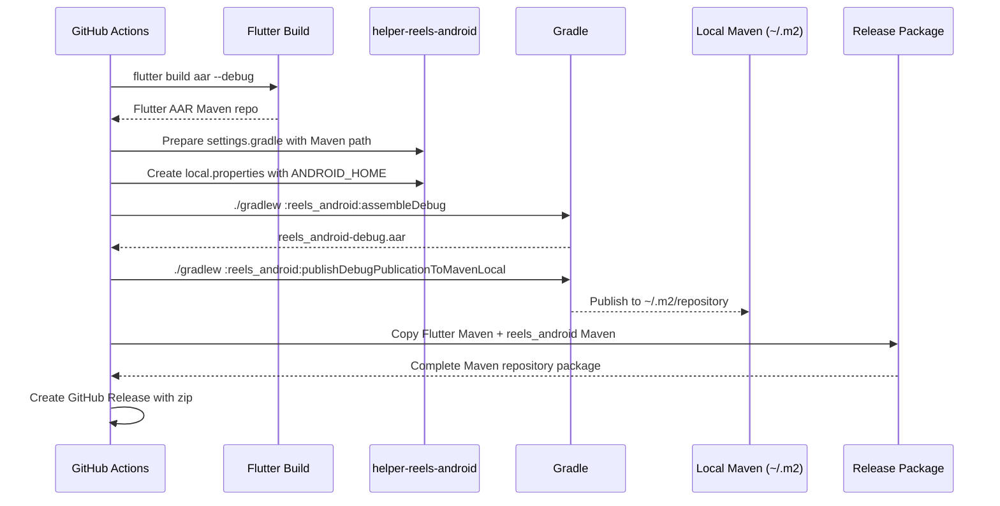
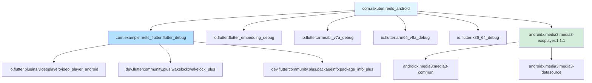
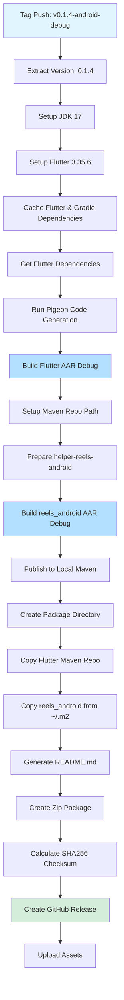

# Android Build Architecture

This document describes the build architecture, process, and tooling for the ReelsSDK Android implementation.

## Table of Contents

- [Overview](#overview)
- [Project Structure](#project-structure)
- [Build Process Flow](#build-process-flow)
- [Module Dependencies](#module-dependencies)
- [Maven Publication](#maven-publication)
- [Helper Project Pattern](#helper-project-pattern)
- [Build Scripts](#build-scripts)
- [GitHub Actions Workflow](#github-actions-workflow)

## Overview

The ReelsSDK for Android uses a **two-module architecture** with Maven-based distribution:

1. **reels_flutter**: Flutter module that builds the UI and video player functionality
2. **reels_android**: Native Android wrapper that provides Kotlin/Java APIs via Pigeon

The build process produces a complete Maven repository containing:
- Native Android AAR (`com.rakuten:reels_android`)
- Flutter module AAR (`com.example.reels_flutter:flutter_debug/release`)
- Flutter engine artifacts (architecture-specific)
- All transitive dependencies



## Project Structure

```
reels-sdk/
├── reels_flutter/              # Flutter module
│   ├── lib/                    # Flutter UI code
│   ├── pigeons/                # Pigeon interface definitions
│   ├── android/                # Android embedding config
│   └── build/host/outputs/repo # Flutter AAR Maven output
│
├── reels_android/              # Native Android module
│   ├── src/main/java/          # Kotlin source code
│   │   └── com/rakuten/room/reels/
│   │       ├── ReelsModule.kt
│   │       └── pigeon/         # Pigeon-generated platform channels
│   ├── build.gradle            # Gradle build & Maven publish config
│   └── build/outputs/aar/      # AAR build output
│
├── helper-reels-android/       # Wrapper project for building reels_android
│   ├── settings.gradle.template
│   ├── local.properties.template
│   └── build.gradle
│
├── gradle/libs.versions.toml   # Centralized dependency versions
└── scripts/
    ├── dev/android/
    │   └── build-flutter-aar.sh    # Local Flutter AAR build
    └── sdk/android/
        └── test-helper-build.sh     # Test complete build process
```

## Build Process Flow

### Local Development Build



**Steps:**
1. Clean previous Flutter build artifacts
2. Get Flutter dependencies (`flutter pub get`)
3. Generate Pigeon platform channel code from `pigeons/messages.dart`
4. Build Flutter AAR using `flutter build aar --debug` or `--release`
5. Output complete Maven repository to `reels_flutter/build/host/outputs/repo`

**Key Files Generated:**
- `reels_flutter/lib/core/pigeon_generated.dart` - Flutter side of platform channels
- `reels_android/src/main/java/com/rakuten/room/reels/pigeon/PigeonGenerated.kt` - Android side
- `reels_flutter/build/host/outputs/repo/` - Complete Maven repository with Flutter AAR

### CI/CD Build (GitHub Actions)



## Module Dependencies

### reels_flutter Dependencies

From `reels_flutter/pubspec.yaml`:

```yaml
dependencies:
  flutter:
    sdk: flutter
  video_player: ^2.10.0
  wakelock_plus: ^1.2.8
  package_info_plus: ^8.1.1
  get_it: ^7.7.0
```

These Flutter dependencies are automatically included in the Maven repository when building the Flutter AAR.

### reels_android Dependencies

From `reels_android/build.gradle:70-109`:

**API Dependencies** (exposed to consumers):
```gradle
// Flutter module
debugApi 'com.example.reels_flutter:flutter_debug:1.0'
releaseApi 'com.example.reels_flutter:flutter_release:1.0'

// Flutter engine embedding
debugApi 'io.flutter:flutter_embedding_debug:1.0.0-b45fa18946'
releaseApi 'io.flutter:flutter_embedding_release:1.0.0-b45fa18946'

// Architecture-specific Flutter engines
debugApi 'io.flutter:armeabi_v7a_debug:1.0.0-b45fa18946'
debugApi 'io.flutter:arm64_v8a_debug:1.0.0-b45fa18946'
debugApi 'io.flutter:x86_64_debug:1.0.0-b45fa18946'
releaseApi 'io.flutter:armeabi_v7a_release:1.0.0-b45fa18946'
releaseApi 'io.flutter:arm64_v8a_release:1.0.0-b45fa18946'
releaseApi 'io.flutter:x86_64_release:1.0.0-b45fa18946'

// Media3 dependencies (required by video_player plugin)
api 'androidx.media3:media3-exoplayer:1.1.1'
api 'androidx.media3:media3-common:1.1.1'
api 'androidx.media3:media3-datasource:1.1.1'

// ReLinker (required by Flutter embedding)
api 'com.getkeepsafe.relinker:relinker:1.4.5'
```

**Implementation Dependencies** (internal only):
```gradle
implementation(libs.androidx.appcompat)           // 1.7.0
implementation(libs.androidx.fragment.ktx)        // 1.8.5
implementation(libs.androidx.activity.ktx)        // 1.9.3
implementation(libs.androidx.constraintlayout)    // 2.2.0
implementation(libs.google.material.design)       // 1.12.0
implementation(libs.jetbrains.kotlin.stdlib)      // 2.1.0
```

Versions are centralized in `gradle/libs.versions.toml`.

### Dependency Graph



## Maven Publication

### Publication Configuration

From `reels_android/build.gradle:141-155`:

```gradle
publishing {
    publications {
        debug(MavenPublication) {
            groupId = 'com.rakuten'
            artifactId = 'reels_android'
            version = getVersionName()  // Read from ../VERSION file

            afterEvaluate {
                from components.debug
            }

            pom {
                name = 'Reels SDK for Android - Debug'
                description = 'Flutter-based video reels SDK for Android applications (Debug build)'
                url = 'https://github.com/ahmed-eishon/Reels-SDK'
            }
        }
    }
}
```

### Maven Coordinates

- **Debug**: `com.rakuten:reels_android:VERSION` (e.g., `0.1.4`)
- **Release**: `com.rakuten:reels_android:VERSION`

### Generated POM Structure

The generated POM file (`reels_android-0.1.4.pom`) declares all dependencies with proper scopes:

- `compile` scope: Flutter module, Flutter engine, Media3, ReLinker
- `runtime` scope: AndroidX libraries, Kotlin stdlib

This allows Gradle to automatically resolve all transitive dependencies when consumers add the SDK.

## Helper Project Pattern

### Why Helper Project?

The `helper-reels-android` project solves a critical build problem:

**Problem**: `reels_android` cannot be built directly because:
1. It depends on Flutter AAR from `reels_flutter` build output
2. Gradle needs a valid project context to resolve dependencies
3. The Flutter AAR is in a local Maven repository path that changes

**Solution**: A minimal wrapper project that:
1. Includes `reels_android` as a subproject
2. Configures Maven repository pointing to Flutter AAR output
3. Provides build context for Gradle dependency resolution

### Helper Project Structure

```
helper-reels-android/
├── build.gradle                    # Minimal root build config
├── settings.gradle.template        # Template with MAVEN_REPO_PLACEHOLDER
├── local.properties.template       # Template with ANDROID_SDK_PLACEHOLDER
└── gradle/
    └── wrapper/                    # Gradle wrapper files
```

**settings.gradle.template**:
```gradle
rootProject.name = "ReelsSDKBuild"
include ':reels_android'
project(':reels_android').projectDir = new File('../reels_android')

dependencyResolutionManagement {
    repositories {
        google()
        mavenCentral()
        maven {
            url "file://MAVEN_REPO_PLACEHOLDER"  // Replaced at build time
        }
        maven {
            url "https://storage.googleapis.com/download.flutter.io"
        }
    }
}
```

### Build-Time Configuration

From `scripts/sdk/android/test-helper-build.sh:51-85`:

```bash
# Step 3: Prepare helper project
cd "$PROJECT_ROOT/helper-reels-android"

# Create settings.gradle from template
cp settings.gradle.template settings.gradle
sed -i "s|MAVEN_REPO_PLACEHOLDER|${MAVEN_REPO}|g" settings.gradle

# Create local.properties with ANDROID_HOME
cp local.properties.template local.properties
sed -i "s|ANDROID_SDK_PLACEHOLDER|${ANDROID_HOME}|g" local.properties
```

This pattern allows the same build approach locally and in CI, with dynamic Maven repository paths.

## Build Scripts

### scripts/dev/android/build-flutter-aar.sh

**Purpose**: Build only the Flutter AAR for local development

**Usage**:
```bash
./scripts/dev/android/build-flutter-aar.sh [debug|release]
```

**Process** (from `build-flutter-aar.sh:23-197`):
1. Verify Flutter installation
2. Clean Flutter build artifacts (`flutter clean`)
3. Remove `.android` directory
4. Run `flutter pub get`
5. Verify Android platform files generated
6. Generate Pigeon platform channel code
7. Verify Pigeon files for Android generated
8. Verify `reels_android` module structure
9. Setup `local.properties` for `.android` build
10. Build Flutter AAR (`flutter build aar --debug` or `--release`)
11. Verify AAR output in `reels_flutter/build/host/outputs/repo`

**Output**:
- `reels_flutter/build/host/outputs/repo/` - Complete Maven repository

### scripts/sdk/android/test-helper-build.sh

**Purpose**: Test the complete build process (Flutter + Native) locally

**Usage**:
```bash
export ANDROID_HOME=/path/to/android/sdk
./scripts/sdk/android/test-helper-build.sh
```

**Process** (from `test-helper-build.sh:1-100`):
1. Build Flutter AAR (Step 1)
2. Setup Maven repository path (Step 2)
3. Prepare helper project with templated config (Step 3)
4. Build `reels_android` AAR using helper project (Step 4)
5. Publish to local Maven repository (Step 5)
6. Verify published artifacts (Step 6)

**Output**:
- `~/.m2/repository/com/rakuten/reels_android/VERSION/` - Published Maven artifacts

## GitHub Actions Workflow

### Workflow: release-android-debug.yml

**Trigger**: Tag push matching `v*.*.*-android-debug` (e.g., `v0.1.4-android-debug`)

**Process** (from `.github/workflows/release-android-debug.yml:15-149`):



**Key Steps**:

1. **Setup** (lines 16-40):
   - JDK 17 (Temurin distribution)
   - Flutter 3.35.6 stable
   - Cache Flutter & Gradle dependencies

2. **Build Flutter AAR** (lines 67-80):
   ```bash
   flutter pub get
   flutter pub run pigeon --input pigeons/messages.dart
   flutter build aar --debug --no-release --no-profile
   ```

3. **Build reels_android AAR** (lines 97-117):
   ```bash
   # Prepare helper project
   cp settings.gradle.template settings.gradle
   sed -i "s|MAVEN_REPO_PLACEHOLDER|${MAVEN_REPO}|g" settings.gradle
   cp local.properties.template local.properties
   sed -i "s|ANDROID_SDK_PLACEHOLDER|${ANDROID_HOME}|g" local.properties

   # Build and publish
   ./gradlew :reels_android:clean :reels_android:assembleDebug --stacktrace
   ./gradlew :reels_android:publishDebugPublicationToMavenLocal --stacktrace
   ```

4. **Create Release Package** (lines 136-246):
   ```bash
   # Create package directory
   mkdir -p ReelsSDK-Android-Debug-0.1.4/maven-repo

   # Copy Flutter Maven repo
   cp -r reels_flutter/build/host/outputs/repo/* ReelsSDK-Android-Debug-0.1.4/maven-repo/

   # Copy reels_android from local Maven
   cp -r ~/.m2/repository/com/rakuten/reels ReelsSDK-Android-Debug-0.1.4/maven-repo/com/rakuten/

   # Create README with integration instructions
   cat > ReelsSDK-Android-Debug-0.1.4/README.md <<EOF
   # Integration instructions...
   EOF

   # Create zip and checksum
   zip -r ReelsSDK-Android-Debug-0.1.4.zip ReelsSDK-Android-Debug-0.1.4
   shasum -a 256 ReelsSDK-Android-Debug-0.1.4.zip > ReelsSDK-Android-Debug-0.1.4.zip.sha256
   ```

5. **Create GitHub Release** (lines 248-346):
   - Create release with tag name
   - Attach zip package
   - Attach SHA256 checksum file
   - Add detailed release notes with integration instructions

**Release Artifacts**:
- `ReelsSDK-Android-Debug-0.1.4.zip` - Complete Maven repository
- `ReelsSDK-Android-Debug-0.1.4.zip.sha256` - Checksum file
- Release notes with integration guide

## Build Requirements

### Local Development

- **macOS** or **Linux**
- **Flutter SDK**: 3.35.6 or compatible
- **Android SDK**: API 21-35
- **JDK**: 17
- **Gradle**: 8.7 (via wrapper)
- **Kotlin**: 2.1.0

### Environment Variables

- `ANDROID_HOME` or `ANDROID_SDK_ROOT`: Path to Android SDK
- `FLUTTER_ROOT` (optional): Path to Flutter SDK (auto-detected if not set)

### CI/CD Requirements

- **Runner**: Ubuntu latest
- **JDK**: 17 (Temurin distribution)
- **Flutter**: 3.35.6 stable channel
- **Gradle caching**: Enabled for faster builds
- **Flutter dependency caching**: Enabled for faster builds

## Build Outputs

### Flutter AAR Build Output

```
reels_flutter/build/host/outputs/repo/
├── com/example/reels_flutter/
│   └── flutter_debug/1.0/
│       ├── flutter_debug-1.0.aar
│       └── flutter_debug-1.0.pom
├── io/flutter/
│   ├── flutter_embedding_debug/1.0.0-xxx/
│   ├── armeabi_v7a_debug/1.0.0-xxx/
│   ├── arm64_v8a_debug/1.0.0-xxx/
│   └── x86_64_debug/1.0.0-xxx/
├── io/flutter/plugins/videoplayer/
│   └── video_player_android_debug/1.0/
├── dev/fluttercommunity/plus/wakelock/
│   └── wakelock_plus_debug/1.0/
└── dev/fluttercommunity/plus/packageinfo/
    └── package_info_plus_debug/1.0/
```

### reels_android Build Output

```
reels_android/build/outputs/aar/
└── reels_android-debug.aar
```

### Published Maven Output

```
~/.m2/repository/com/rakuten/reels_android/0.1.4/
├── reels_android-0.1.4.aar
├── reels_android-0.1.4.pom
├── reels_android-0.1.4.module (Gradle metadata)
└── reels_android-0.1.4.pom.sha256
```

### Release Package Structure

```
ReelsSDK-Android-Debug-0.1.4/
├── maven-repo/
│   ├── com/rakuten/reels_android/0.1.4/    # Native Android API
│   ├── com/example/reels_flutter/          # Flutter module
│   ├── io/flutter/                          # Flutter engine artifacts
│   └── androidx/media3/                     # Media player dependencies
└── README.md                                # Integration instructions
```

## Troubleshooting

### Common Build Issues

**Issue**: `ANDROID_HOME environment variable not set`
```bash
# Solution: Set ANDROID_HOME
export ANDROID_HOME=/path/to/android/sdk
# or
export ANDROID_SDK_ROOT=/path/to/android/sdk
```

**Issue**: `Flutter AAR not found`
```bash
# Solution: Build Flutter AAR first
cd reels_flutter
flutter build aar --debug
```

**Issue**: `PigeonGenerated.kt not found`
```bash
# Solution: Run Pigeon code generation
cd reels_flutter
flutter pub run pigeon --input pigeons/messages.dart
```

**Issue**: `Dependency resolution failed`
```bash
# Solution: Verify Maven repository path in settings.gradle
# Check that the path points to reels_flutter/build/host/outputs/repo
```

### Verification Commands

```bash
# Verify Flutter AAR was built
find reels_flutter/build/host/outputs/repo -name "*.aar"

# Verify reels_android AAR was built
ls -lh reels_android/build/outputs/aar/

# Verify Maven publication
ls -lh ~/.m2/repository/com/rakuten/reels_android/*/

# List all dependencies from POM
cat ~/.m2/repository/com/rakuten/reels_android/0.1.4/reels_android-0.1.4.pom
```

## Version Management

Version is stored in root `VERSION` file:
```
reels-sdk/VERSION
```

The `getVersionName()` function in `reels_android/build.gradle:112-115` reads this file:

```gradle
ext.getVersionName = { ->
    def versionFile = new File(projectDir.parentFile, 'VERSION')
    return versionFile.exists() ? versionFile.text.trim() : '1.0.0'
}
```

To release a new version:
1. Update `VERSION` file (e.g., `0.1.5`)
2. Create tag: `git tag v0.1.5-android-debug` or `v0.1.5-android`
3. Push tag: `git push origin v0.1.5-android-debug`
4. GitHub Actions workflow will build and create release automatically

## References

- **Pigeon Documentation**: Platform channel code generation
- **Flutter AAR Documentation**: `flutter build aar` command
- **Gradle Maven Publish Plugin**: Maven publication configuration
- **GitHub Actions**: CI/CD workflow automation

---

Last Updated: 2025-11-20
