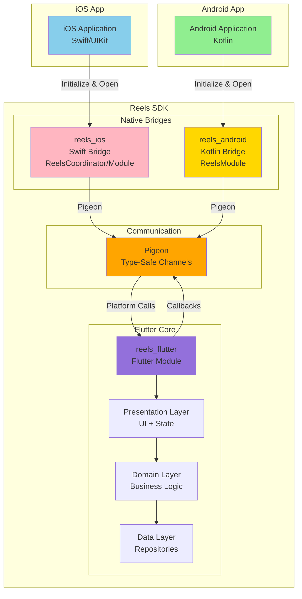
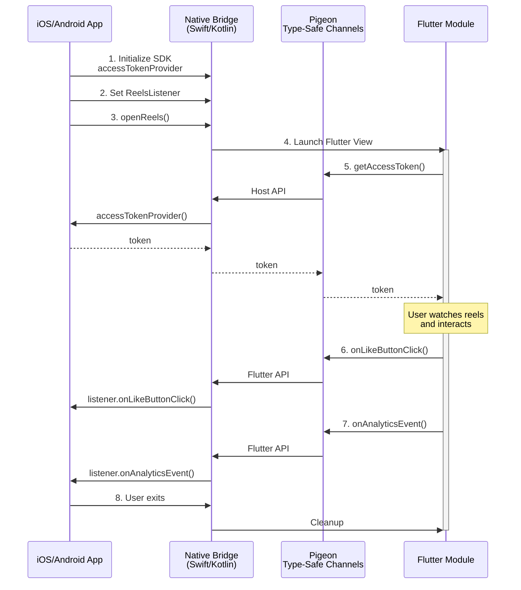
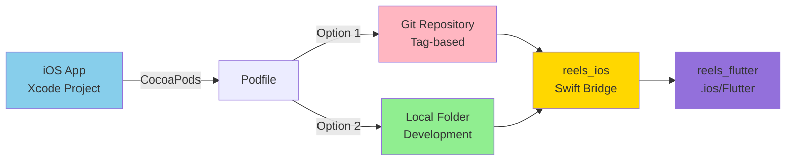
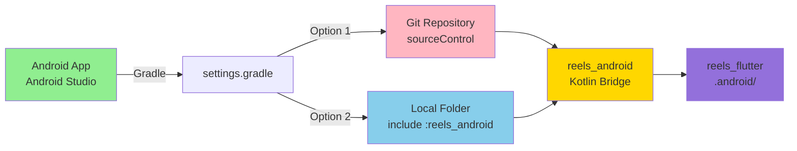
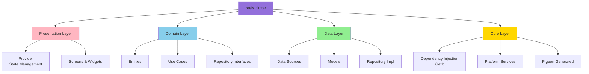

# 🎥 Reels SDK - Quick Overview

> [!info] Presentation Guide
> **Target Audience:** Mobile Engineers | **Duration:** 10 minutes
> **Last Updated:** November 11, 2025

---

## 📊 SDK at a Glance

### Quick Stats

| Metric | Value | Details |
|--------|-------|---------|
| **SDK Version** | 1.0.0 | Production ready |
| **Platforms** | iOS 16.0+, Android 21+ | Modern support |
| **Core Technology** | Flutter 3.9.2+ | Shared codebase |
| **iOS Bridge** | Swift 5.9+ | Native wrapper |
| **Android Bridge** | Kotlin 1.9+ | Native wrapper |
| **Communication** | Pigeon | Type-safe channels |
| **Architecture** | Clean Architecture | Domain-driven design |
| **Integration** | Git + Local Folder | Flexible options |
| **SDK Size (iOS)** | ~300 KB | Minimal footprint |
| **SDK Size (Android)** | ~370 KB | Minimal footprint |

📖 **Full Details:** [[01-Overview/01-SDK-Overview|SDK Overview]]

---

## 🏗️ Architecture Overview

### High-Level Architecture



### Component Layers

| Component | Technology | Purpose | Lines of Code |
|-----------|-----------|---------|---------------|
| **reels_flutter** | Flutter/Dart | Shared UI & logic | ~5,000 LOC |
| **reels_ios** | Swift | iOS integration | ~800 LOC |
| **reels_android** | Kotlin | Android integration | ~900 LOC |
| **pigeon** | Code Gen | Type-safe channels | Auto-generated |

📖 **Architecture:** [[03-Architecture/01-Clean-Architecture|Clean Architecture]]

---

## 🔄 Communication Flow

### Platform Communication



### Communication APIs

**Flutter → Native (Host API):**
- `getAccessToken()` - Request authentication token from native
- `getInitialCollect()` - Get collect context (iOS only)

**Native → Flutter (Flutter API):**
- `onLikeButtonClick(videoId, isLiked, likeCount)`
- `onShareButtonClick(shareData)`
- `onAnalyticsEvent(eventName, properties)`
- `onScreenStateChanged(state)`
- `onVideoStateChanged(videoId, state)`
- `onSwipeLeft()` / `onSwipeRight()`
- `onUserProfileClick(userId)`

📖 **Communication:** [[03-Architecture/05-Platform-Communication|Platform Communication]]

---

## 📱 Integration Overview

### iOS Integration



**Integration Steps:**

1. **Clone SDK:**
   ```bash
   git clone https://gitpub.rakuten-it.com/scm/~ahmed.eishon/reels-sdk.git
   cd reels-sdk
   ```

2. **Run Init Script:**
   ```bash
   ./scripts/init-ios.sh /path/to/reels-sdk /path/to/your-ios-app
   ```

3. **Update Podfile:**
   ```ruby
   # Flutter module
   flutter_application_path = '/path/to/reels-sdk/reels_flutter'
   load File.join(flutter_application_path, '.ios', 'Flutter', 'podhelper.rb')

   target 'YourApp' do
     install_all_flutter_pods(flutter_application_path)
   end
   ```

4. **Add reels_ios to Xcode:**
   - Add files from `/path/to/reels-sdk/reels_ios/Sources/ReelsIOS`
   - Create groups, select target

5. **Install:**
   ```bash
   pod install
   ```

📖 **iOS Guide:** [[02-Integration/01-iOS-Integration-Guide|iOS Integration Guide]]

### Android Integration



**Integration Steps:**

1. **Clone SDK:**
   ```bash
   git clone https://gitpub.rakuten-it.com/scm/~ahmed.eishon/reels-sdk.git
   cd reels-sdk
   ```

2. **Run Init Script:**
   ```bash
   ./scripts/init-android.sh /path/to/reels-sdk
   ```

3. **Update settings.gradle:**
   ```gradle
   include ':reels_android'
   project(':reels_android').projectDir = new File('/path/to/reels-sdk/reels_android')

   setBinding(new Binding([gradle: this]))
   evaluate(new File('/path/to/reels-sdk/reels_flutter/.android/include_flutter.groovy'))
   ```

4. **Update app/build.gradle:**
   ```gradle
   dependencies {
       implementation project(':reels_android')
   }
   ```

5. **Sync:**
   ```bash
   ./gradlew clean build
   ```

📖 **Android Guide:** [[02-Integration/05-Android-Integration-Guide|Android Integration Guide]]

---

## 💻 Usage Examples

### iOS Usage (Swift)

```swift
import ReelsIOS

class MyViewController: UIViewController, ReelsListener {

    override func viewDidLoad() {
        super.viewDidLoad()

        // 1. Initialize SDK (once, on app startup)
        ReelsCoordinator.initialize(accessTokenProvider: { completion in
            // Async token fetch
            LoginManager.shared.getRoomAccessToken { token in
                completion(token)
            }
        })

        // 2. Set listener
        ReelsCoordinator.setListener(self)
    }

    @IBAction func openReelsTapped() {
        // 3. Open reels screen
        ReelsCoordinator.openReels(
            from: self,
            itemId: "video123",
            animated: true
        )
    }

    // MARK: - ReelsListener

    func onLikeButtonClick(videoId: String, isLiked: Bool, likeCount: Int64) {
        print("Video \(videoId) liked: \(isLiked)")
        // Update backend
        VideoAPI.updateLike(videoId: videoId, liked: isLiked)
    }

    func onShareButtonClick(
        videoId: String,
        videoUrl: String,
        title: String,
        description: String,
        thumbnailUrl: String?
    ) {
        // Show native share sheet
        let activityVC = UIActivityViewController(
            activityItems: [title, URL(string: videoUrl)!],
            applicationActivities: nil
        )
        present(activityVC, animated: true)
    }

    func onAnalyticsEvent(eventName: String, properties: [String: String]) {
        // Track analytics
        Analytics.track(eventName, properties: properties)
    }
}
```

📖 **iOS Examples:** [[02-Integration/04-iOS-Usage-Examples|iOS Usage Examples]]

### Android Usage (Kotlin)

```kotlin
import com.rakuten.room.reels.ReelsModule
import com.rakuten.room.reels.flutter.ReelsListener

class MainActivity : AppCompatActivity(), ReelsListener {

    override fun onCreate(savedInstanceState: Bundle?) {
        super.onCreate(savedInstanceState)
        setContentView(R.layout.activity_main)

        // 1. Initialize SDK (in Application.onCreate or Activity)
        ReelsModule.initialize(
            context = applicationContext,
            accessTokenProvider = {
                // Synchronous or async token fetch
                UserSession.instance.accessToken
            }
        )

        // 2. Set listener
        ReelsModule.setListener(this)

        // 3. Open reels screen
        findViewById<Button>(R.id.openReelsButton).setOnClickListener {
            ReelsModule.openReels(context = this, itemId = "video123")
        }
    }

    // MARK: - ReelsListener

    override fun onLikeButtonClick(videoId: String, isLiked: Boolean, likeCount: Long) {
        Log.d("Reels", "Video $videoId liked: $isLiked")
        // Update backend
        VideoAPI.updateLike(videoId, isLiked)
    }

    override fun onShareButtonClick(shareData: ShareData) {
        // Show native share dialog
        val shareIntent = Intent(Intent.ACTION_SEND).apply {
            type = "text/plain"
            putExtra(Intent.EXTRA_TEXT, "${shareData.title}\n${shareData.videoUrl}")
        }
        startActivity(Intent.createChooser(shareIntent, "Share Video"))
    }

    override fun onAnalyticsEvent(eventName: String, properties: Map<String, String>) {
        // Track analytics
        Analytics.track(eventName, properties)
    }
}
```

📖 **Android Examples:** [[02-Integration/08-Android-Usage-Examples|Android Usage Examples]]

---

## 🎯 Key Features

### Video Reels Features

| Feature | Description | Status |
|---------|-------------|--------|
| **Vertical Swipe** | TikTok-style vertical video feed | ✅ |
| **Like Button** | Like/unlike videos | ✅ |
| **Share Button** | Share videos to social media | ✅ |
| **Comment Button** | Comment on videos | ✅ |
| **User Profiles** | Navigate to user profiles | ✅ |
| **Product Tags** | Shopping integration | ✅ |
| **Autoplay** | Automatic video playback | ✅ |
| **Analytics** | Event tracking | ✅ |
| **State Monitoring** | Screen/video state tracking | ✅ |

### Technical Features

| Feature | Description | Status |
|---------|-------------|--------|
| **Type-Safe Communication** | Pigeon-generated channels | ✅ |
| **Clean Architecture** | Separation of concerns | ✅ |
| **Dependency Injection** | GetIt for DI | ✅ |
| **State Management** | Provider pattern | ✅ |
| **Async Tokens** | Async access token provider | ✅ |
| **Full-Screen Mode** | Activity/ViewController | ✅ |
| **Embedded Mode** | Fragment (Android only) | ✅ |
| **Mock Data** | Development/testing | ✅ |

---

## 🛠️ Technology Stack

### Flutter Core (reels_flutter)



### Technology Breakdown

| Layer | Technologies | Purpose |
|-------|-------------|---------|
| **UI** | Flutter, Dart, Provider | Video reels interface |
| **Video** | video_player, chewie | Video playback |
| **State** | Provider | State management |
| **DI** | GetIt | Dependency injection |
| **Platform** | Pigeon | Type-safe channels |
| **iOS Bridge** | Swift 5.9+ | Native iOS integration |
| **Android Bridge** | Kotlin 1.9+ | Native Android integration |

📖 **Tech Stack:** [[01-Overview/03-Technology-Stack|Technology Stack]]

---

## 📦 Integration Comparison

### iOS Options

| Aspect | Git + CocoaPods | Local Folder Import |
|--------|----------------|---------------------|
| **Use Case** | Production releases | Active development |
| **Setup Complexity** | Medium | Low |
| **Version Control** | ✅ Tag-based | ⚠️ Manual |
| **Git Authentication** | ⚠️ Required | ✅ Not needed |
| **Code Updates** | ⚠️ Pod update | ✅ Immediate |
| **Debugging** | ⚠️ Limited | ✅ Full access |
| **Corporate Firewall** | ⚠️ May block | ✅ Works |
| **Recommended For** | CI/CD, Production | Local dev, Testing |

### Android Options

| Aspect | Git + Gradle | Local Folder Import |
|--------|-------------|---------------------|
| **Use Case** | Production releases | Active development |
| **Setup Complexity** | Medium | Low |
| **Version Control** | ✅ Gradle managed | ⚠️ Manual |
| **Git Authentication** | ⚠️ Required | ✅ Not needed |
| **Code Updates** | ⚠️ Gradle sync | ✅ Immediate |
| **Build Speed** | ⚠️ Slower | ✅ Faster |
| **Debugging** | ⚠️ Limited | ✅ Full access |
| **Corporate Firewall** | ⚠️ May block | ✅ Works |
| **Recommended For** | CI/CD, Production | Local dev, Testing |

---

## 🔧 Development Workflow

### Regenerating Pigeon Code

When modifying platform APIs in `pigeons/messages.dart`:

```bash
cd /path/to/reels-sdk/reels_flutter
flutter pub run pigeon --input pigeons/messages.dart
```

**Generated Files:**
- ✅ `lib/core/pigeon_generated.dart` (Flutter)
- ✅ `../reels_ios/Sources/ReelsIOS/PigeonGenerated.swift` (iOS)
- ✅ `../reels_android/.../PigeonGenerated.kt` (Android)

### Helper Scripts

| Script | Purpose |
|--------|---------|
| **init-ios.sh** | Initialize iOS integration |
| **init-android.sh** | Initialize Android integration |
| **verify-ios.sh** | Verify iOS SDK integrity |
| **verify-android.sh** | Verify Android SDK integrity |
| **clean-install-ios.sh** | Clean iOS setup |
| **clean-install-android.sh** | Clean Android setup |
| **release.sh** | Version management |

📖 **Development:** [[04-Development/01-Development-Setup|Development Setup]]

---

## 📊 SDK Metrics Summary

### Size & Performance

| Metric | iOS | Android |
|--------|-----|---------|
| **Bridge Size** | ~300 KB | ~370 KB |
| **Flutter Engine** | Shared | Shared |
| **Min Platform** | iOS 16.0 | Android 5.0 (SDK 21) |
| **Target Platform** | iOS 18 | Android 15 (SDK 35) |
| **Initialization** | ~500ms | ~600ms |
| **Memory Overhead** | ~50 MB | ~60 MB |

### Requirements

| Requirement | Version | Notes |
|-------------|---------|-------|
| **Flutter SDK** | 3.9.2+ | Required for development |
| **iOS** | 16.0+ | Modern iOS support |
| **Swift** | 5.9+ | Native bridge |
| **Android SDK** | 21+ | Android 5.0+ |
| **Kotlin** | 1.9+ | Native bridge |
| **Gradle** | 8.0+ | Build tool |
| **CocoaPods** | Latest | iOS dependency manager |

---

## ✅ Best Practices

### Integration Best Practices

1. **Initialize Early:** Initialize SDK in Application/AppDelegate
2. **Set Listener:** Always set listener before opening reels
3. **Handle Callbacks:** Implement all ReelsListener methods
4. **Token Provider:** Use async provider for better UX
5. **Analytics:** Track events for insights
6. **Error Handling:** Handle edge cases (no token, network errors)

### Development Best Practices

1. **Local Development:** Use local folder import for development
2. **Production Builds:** Use Git-based integration for releases
3. **Version Tags:** Use Git tags for version control
4. **Testing:** Test on real devices, not just simulators
5. **Pigeon Changes:** Regenerate code after modifying messages.dart
6. **Flutter Clean:** Re-run `flutter pub get` after `flutter clean`

---

## 🔗 Complete Documentation

### Main Documentation Hub
📖 **[[00-MOC-Reels-SDK|Full Technical Documentation Hub]]**

### Quick Links

**Integration:**
- [[02-Integration/01-iOS-Integration-Guide|iOS Integration Guide]]
- [[02-Integration/05-Android-Integration-Guide|Android Integration Guide]]

**API Reference:**
- [[05-API/01-iOS-API-Reference|iOS API Reference]]
- [[05-API/02-Android-API-Reference|Android API Reference]]

**Architecture:**
- [[03-Architecture/01-Clean-Architecture|Clean Architecture]]
- [[03-Architecture/05-Platform-Communication|Platform Communication]]

---

**Version:** 1.0.0 | **Last Updated:** November 11, 2025 | **Maintained by:** ROOM Team
